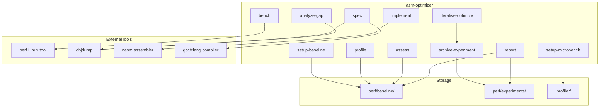
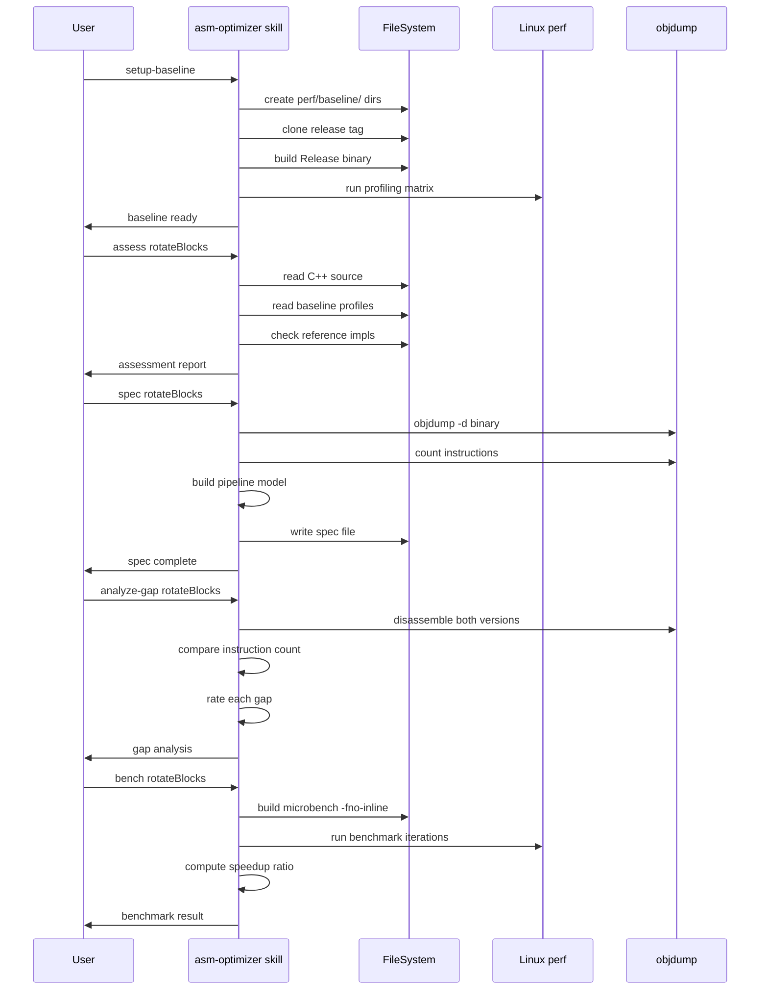

# SKILL.spec.md — asm-optimizer

## 1. Overview

**Role**: Evaluate and optimize hot functions through assembly translation — perf-based baseline profiling, microbenchmark validation, and iterative improvement.

**Persona**: Senior performance engineer with deep expertise in x86 assembly optimization, microarchitecture analysis, and SIMD kernel optimization.

**Activation Behavior**: Present sorted list of hot functions ranked by optimization potential; check for existing baseline profiles in `perf/baseline/profiles/`; check for existing ASM reference implementations; show available commands.

**Commands**:

| Command | Description |
|---------|-------------|
| `setup-baseline` | Create baseline directory, clone release, build Release, run profiling matrix |
| `profile <name> [--config CONFIG] [--frames N]` | Run maximal perf counter dump against baseline binary |
| `assess <entry>` | Evaluate one function for ASM optimization potential |
| `assess all` | Run assessment on all candidate functions, produce ranked priority list |
| `setup-microbench <entry>` | Create isolated microbenchmark for one function |
| `spec <entry>` | Generate technical specification of C++ reference implementation |
| `analyze-gap <entry>` | Compare ASM implementation against C++ spec baseline |
| `bench <entry>` | Run microbenchmark and compare against C++ SIMD baseline |
| `implement <entry> [--ref asm-path]` | Generate implementation following spec-first process |
| `iterative-optimize <entry> [--iter N]` | Full optimization pipeline with experiment archiving |
| `archive-experiment <entry>` | Save complete experiment record when hypothesis fails |
| `report [--format markdown\|json]` | Generate optimization report of all assessed entries |

## 2. Component Specifications

### `OptimizationPipeline`

```
CLASS OptimizationPipeline
  METHODS:
    setupBaseline(project: str, version: str) -> void
    profile(name: str, config: str, frames: int) -> ProfileData
    assess(entry: str) -> Assessment
    assessAll() -> Assessment[]
    setupMicrobench(entry: str) -> void
    spec(entry: str) -> void
    analyzeGap(entry: str) -> GapAnalysis
    bench(entry: str) -> BenchmarkResult
    implement(entry: str, ref: str) -> void
    iterativeOptimize(entry: str, iterations: int) -> void
    archiveExperiment(entry: str) -> void
    report(format: str) -> void
```

### `Assessment`

| Field | Source | Weight |
|-------|--------|--------|
| perfShare | Baseline profile flamegraph | Primary sort key |
| ipc | `perf stat` on microbench | ipc < 1.5 = high potential |
| llcMissRate | `perf stat LLC-load-misses / LLC-loads` | > 5% = high potential |
| branchMispredictRate | `perf stat branch-misses / branches` | > 2% = high potential |
| frontendBound | `perf stat --topdown` | > 15% = can improve |
| compilerGap | Instruction count diff from C++ baseline | > 20% more instr = high potential |
| score | Low / Medium / High / Critical | Overall optimization potential |

## 3. System Architecture



## 4. Detailed Data Flow



## 5. Visualization

```html
<!DOCTYPE html>
<html>
<head>
<meta charset="utf-8">
<title>asm-optimizer Flow</title>
<script src="https://d3js.org/d3.v7.min.js"></script>
</head>
<body>
<div id="animation" style="width:720px;height:480px;font-family:sans-serif;background:#f8f9fa;position:relative;overflow:hidden;">
  <div id="title" style="position:absolute;top:10px;left:20px;font-size:18px;font-weight:bold;color:#333;">asm-optimizer Pipeline</div>
  <div id="flow" style="position:absolute;top:50px;left:20px;width:680px;height:360px;"></div>
  <div id="controls" style="position:absolute;bottom:10px;left:0;width:100%;text-align:center;">
    <button data-testid="play-pause" id="play-btn" style="margin:0 5px;padding:4px 16px;cursor:pointer;">Play</button>
    <button id="replay-btn" style="margin:0 5px;padding:4px 16px;cursor:pointer;">Replay</button>
    <span id="kf-counter" style="margin-left:10px;font-size:14px;">0/<span id="kf-total">7</span></span>
  </div>
</div>
<script>
(function() {
  var totalDuration = 14000;
  var keyframes = [
    { time: 0, label: "setup-baseline" },
    { time: 2000, label: "profile" },
    { time: 4000, label: "assess" },
    { time: 6000, label: "spec" },
    { time: 8000, label: "analyze-gap" },
    { time: 10000, label: "bench" },
    { time: 12000, label: "implement" },
    { time: 14000, label: "report" }
  ];

  window.ANIMATION_DURATION_MS = totalDuration;
  window.ANIMATION_KEYFRAMES = keyframes;
  window.ANIMATION_VERIFICATION = keyframes.map(function(kf) {
    return { label: kf.label, hor: 0, ver: 0, precision: 1, logCount: 0 };
  });

  var steps = [
    { label: "Setup Baseline", x: 340, y: 20, color: "#4caf50" },
    { label: "Profile Function", x: 340, y: 65, color: "#2196f3" },
    { label: "Assess Potential", x: 340, y: 110, color: "#ff9800" },
    { label: "Generate Spec", x: 340, y: 155, color: "#9c27b0" },
    { label: "Analyze Gap", x: 340, y: 200, color: "#f44336" },
    { label: "Benchmark", x: 340, y: 245, color: "#00bcd4" },
    { label: "Implement ASM", x: 340, y: 290, color: "#607d8b" },
    { label: "Report", x: 340, y: 335, color: "#795548" }
  ];

  var svg = d3.select("#flow").append("svg")
    .attr("width", 680).attr("height", 360);

  var arrows = svg.append("g").attr("class", "arrows");
  var boxes = svg.append("g").attr("class", "boxes");
  var label = svg.append("text")
    .attr("x", 340).attr("y", 15)
    .attr("text-anchor", "middle")
    .attr("font-size", "12")
    .attr("fill", "#666");

  var rects = boxes.selectAll("rect")
    .data(steps).enter()
    .append("rect")
    .attr("x", function(d) { return d.x - 80; })
    .attr("y", function(d) { return d.y; })
    .attr("width", 160)
    .attr("height", 34)
    .attr("rx", 6)
    .attr("ry", 6)
    .attr("fill", function(d) { return d.color; })
    .attr("opacity", 0.15)
    .attr("stroke", function(d) { return d.color; })
    .attr("stroke-width", 1.5);

  boxes.selectAll("text")
    .data(steps).enter()
    .append("text")
    .attr("x", function(d) { return d.x; })
    .attr("y", function(d) { return d.y + 22; })
    .attr("text-anchor", "middle")
    .attr("font-size", "11")
    .attr("fill", "#333")
    .text(function(d) { return d.label; });

  arrows.selectAll("line")
    .data(steps.slice(0, -1)).enter()
    .append("line")
    .attr("x1", function(d) { return d.x; })
    .attr("y1", function(d) { return d.y + 34; })
    .attr("x2", function(d) { return d.x; })
    .attr("y2", function(d, i) { return steps[i + 1].y; })
    .attr("stroke", "#999")
    .attr("stroke-width", 1.5)
    .attr("stroke-dasharray", "4,2")
    .attr("opacity", 0.3);

  var currentFrame = 0;
  var isPlaying = false;
  var timer = null;

  function updateFrame(idx) {
    currentFrame = Math.max(0, Math.min(idx, keyframes.length - 1));
    var kfLabel = keyframes[currentFrame].label;
    label.text(kfLabel.replace(/-/g, " "));
    rects.attr("opacity", function(d, i) { return i < currentFrame ? 0.85 : 0.15; });
    document.getElementById("kf-counter").textContent = currentFrame + "/";
  }

  window.jumpToKeyframe = function(idx) {
    if (isPlaying) togglePlay();
    updateFrame(idx);
  };

  window.resetAnimation = function() {
    if (isPlaying) togglePlay();
    updateFrame(0);
    rects.attr("opacity", 0.15);
    label.text("ready");
  };

  window.getAnimationState = function() {
    return {
      hor: currentFrame,
      ver: 0,
      precision: 1,
      logCount: currentFrame,
      keyframeIdx: currentFrame,
      keyframeLabel: keyframes[currentFrame] ? keyframes[currentFrame].label : ""
    };
  };

  function togglePlay() {
    isPlaying = !isPlaying;
    document.getElementById("play-btn").textContent = isPlaying ? "Pause" : "Play";
    if (isPlaying) {
      timer = setInterval(function() {
        currentFrame++;
        if (currentFrame >= keyframes.length) {
          currentFrame = keyframes.length - 1;
          togglePlay();
          return;
        }
        updateFrame(currentFrame);
      }, totalDuration / keyframes.length);
    } else {
      clearInterval(timer);
    }
  }

  document.getElementById("play-btn").addEventListener("click", togglePlay);
  document.getElementById("replay-btn").addEventListener("click", function() {
    window.resetAnimation();
    setTimeout(togglePlay, 300);
  });
})();
</script>
</body>
</html>
```

## 6. Testing Requirements

| Test ID | Description | Verification |
|---------|-------------|--------------|
| ASM-001 | Mermaid architecture diagram renders to PNG | `npm run test-artifacts --file source/.opencode/skills/asm-optimizer/SKILL.spec.md` passes |
| ASM-002 | Mermaid sequence diagram renders to PNG | Same command shows both diagrams rendered |
| ASM-003 | D3 animation has ANIMATION_KEYFRAMES with 8 entries | `test-artifacts.js` captures 8 filmstrip frames |
| ASM-004 | Animation globals are set | `getAnimationState` returns expected shape |

## 7. Cross-References

- **Dependencies**: `.profiler/perf_archives/`, `perf/baseline/`, `scripts/asm-optimizer/`, `scripts/extract-artifacts.js`, `scripts/test-artifacts.js`, `scripts/verify-animation.js`, `scripts/install/`
- **Loaded by**: `AGENTS.md` (on demand via `skill asm-optimizer`)
- **Uses**: system-design skill's `generate from source` approach for spec generation
- **Related**: profiler skill (perf tooling overlap), git skill (experiment commit workflow)
