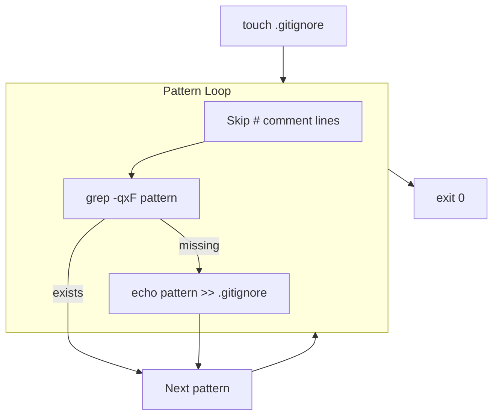
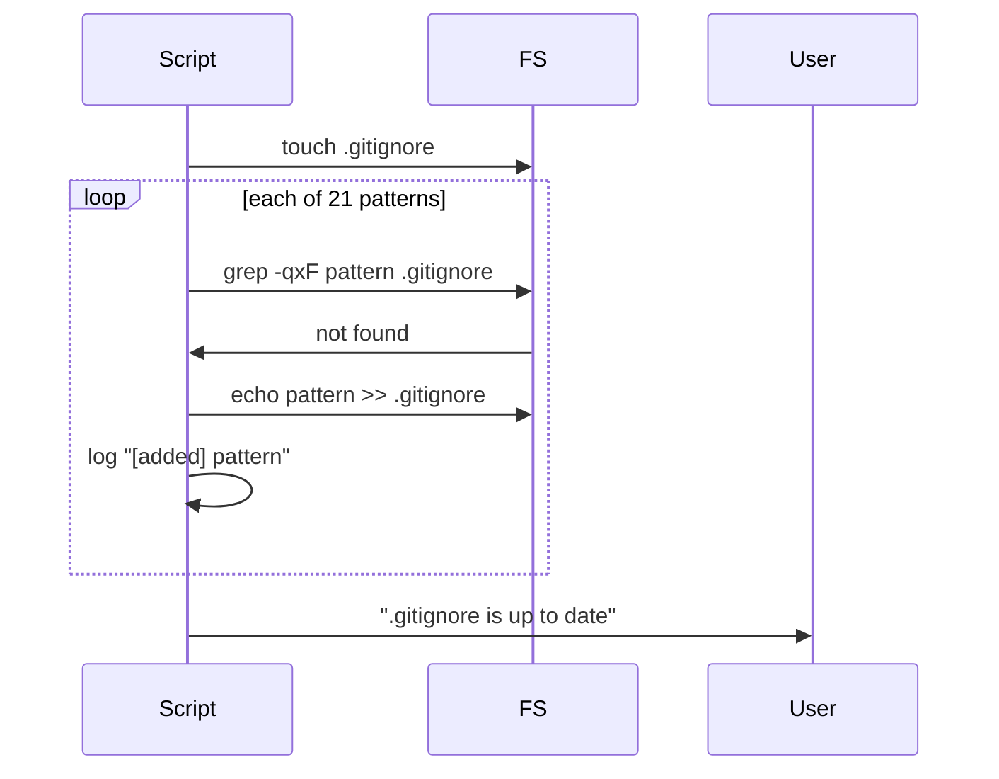

# ensure-gitignore.sh spec

## 1. Overview

**Role**: Idempotent `.gitignore` pattern enforcer. Reads a predefined list of standard gitignore patterns (build dirs, IDE files, dependencies, artifacts, profiling data, sessions, test data) and appends any that are missing from the project's `.gitignore`.

**Language**: Shell (Bash, `set -euo pipefail`)

**Lifecycle**: Touch .gitignore → iterate pattern list → `grep -qxF` check → `echo >>` append if missing → done

**Cross-references**: Consumed by all other opensassi scripts (ensures git ignores node_modules/, .profiler/, .artifacts/, etc.). Patches .gitignore patterns used by `install-npm-deps.sh`, `install-flamegraph.sh`, and profiler scripts.

## 2. Component Specifications

```
Usage: bash ensure-gitignore.sh
```

### Internal Functions

| Function | Description |
|----------|-------------|
| `ensure_pattern(p)` | Checks if pattern exists in .gitignore (exact match or with leading `/`); appends if missing. Skips comment lines. |

### Pattern List (21 patterns)

Build: `/build*/`, `/bin/`, `/lib/`, `/install/` — IDE: `.vscode/`, `.idea/`, `*.swp`, `*.swo` — Dependencies: `node_modules/` — Artifacts: `.artifacts/`, `src/**/.artifacts/` — FlameGraph: `scripts/FlameGraph/` — Browser: `.playwright-mcp/` — Profiler: `.profiler/` — Sessions: `sessions/` (with `!sessions/export-session.sh`, `!sessions/.gitkeep`, `!sessions/daily/.gitkeep`) — Experiments: `perf/experiments/`, `perf/baseline/` — Test: `test/data/` — CTest: `Testing/` — External: `/external/` — OS: `.DS_Store`, `Thumbs.db` — Core: `core`

### Exit Codes

| Code | Condition |
|------|-----------|
| 0 | All patterns ensured (file created/updated) |

## 3. System Architecture



## 4. Detailed Data Flow



## 5. Visualization

### Animation Source

```html
<!DOCTYPE html><html><head><meta charset="utf-8"><title>Gitignore Enforcer</title>
<script src="https://d3js.org/d3.v7.min.js"></script>
<style>
body{font-family:monospace;background:#1e1e2e;color:#cdd6f4;margin:0;padding:20px}
.controls{margin-bottom:15px}.controls button{background:#45475a;color:#cdd6f4;border:1px solid #585b70;padding:6px 16px;cursor:pointer;font-family:monospace;font-size:13px}
.controls button:hover{background:#585b70}.controls span{margin:0 12px;font-size:13px;color:#a6adc8}
#vis{width:680px;height:360px;border:1px solid #45475a;background:#181825;overflow:hidden}
.log{margin-top:10px;max-height:80px;overflow-y:auto;font-size:11px;color:#a6adc8}.log div{padding:1px 0;border-bottom:1px solid #313244}
</style>
</head><body>
<div class="controls"><button id="play-pause" data-testid="play-pause">Play</button><button id="replay">Replay</button>
<span id="kf-label">0/<span id="kf-total">0</span></span></div>
<div id="vis"><svg width="680" height="360"><g id="m"></g></svg></div>
<div class="log" id="log"></div>
<script>
(function(){
const kf=[{time:0,label:'idle'},{time:600,label:'touching'},{time:1800,label:'checking'},{time:3500,label:'adding'},{time:5000,label:'done'}];
const vf=[{label:'idle',hor:0,ver:0,precision:0,logCount:0},{label:'touching',hor:1,ver:0,precision:0,logCount:1},{label:'checking',hor:3,ver:1,precision:0,logCount:2},{label:'adding',hor:5,ver:2,precision:1,logCount:3},{label:'done',hor:7,ver:3,precision:2,logCount:4}];
const T=5000;window.ANIMATION_DURATION_MS=T;window.ANIMATION_KEYFRAMES=kf;window.ANIMATION_VERIFICATION=vf;
let ck=0,pl=false,tm=null;
const sv=d3.select('#vis svg'),lg=document.getElementById('log'),pb=document.getElementById('play-pause'),rb=document.getElementById('replay'),kl=document.getElementById('kf-label'),kt=document.getElementById('kf-total');
kt.textContent=kf.length-1;
const pats=['/build*/','/bin/','.vscode/','node_modules/','.artifacts/','.profiler/','sessions/','test/data/'];
function jk(idx){if(idx<0||idx>=kf.length)return;pl=false;pb.textContent='Play';if(tm){clearInterval(tm);tm=null}ck=idx;kl.textContent=idx+'/'+(kf.length-1);const g=sv.select('#m');g.selectAll('*').remove();const e=['ensure-gitignore: waiting','ensure-gitignore: touched .gitignore','ensure-gitignore: checking patterns...','ensure-gitignore: added 5 new patterns','ensure-gitignore: done - 21/21 patterns present'];for(let i=0;i<=Math.min(idx,e.length-1);i++){const d=document.createElement('div');d.textContent=e[i];lg.appendChild(d)}if(idx>=2){const n=idx===2?3:idx===3?5:7;for(let j=0;j<n;j++){g.append('rect').attr('x',30+j*80).attr('y',40+Math.floor(j/7)*36).attr('width',70).attr('height',28).attr('fill','#313244').attr('stroke',j<n-1?'#a6e3a1':'#f9e2af').attr('rx',3);g.append('text').attr('x',65+j*80).attr('y',58+Math.floor(j/7)*36).attr('fill','#cdd6f4').attr('font-size','9').attr('text-anchor','middle').text(pats[j%pats.length])}}}
window.jumpToKeyframe=jk;window.resetAnimation=function(){jk(0)};window.getAnimationState=function(){const v=vf[ck]||vf[0];return{hor:v.hor,ver:v.ver,precision:v.precision,boundsOpacity:0,logCount:v.logCount,keyframeIdx:ck,keyframeLabel:kf[ck].label}};
jk(0);
pb.addEventListener('click',function(){if(pl){pl=false;pb.textContent='Play';if(tm){clearInterval(tm);tm=null}}else{pl=true;pb.textContent='Pause';if(ck>=kf.length-1)ck=0;const s=T/(kf.length-1);tm=setInterval(()=>{if(ck<kf.length-1)jk(ck+1);else{pl=false;pb.textContent='Play';clearInterval(tm);tm=null}},s)}});
rb.addEventListener('click',function(){jk(0);pl=true;pb.textContent='Pause';const s=T/(kf.length-1);tm=setInterval(()=>{if(ck<kf.length-1)jk(ck+1);else{pl=false;pb.textContent='Play';clearInterval(tm);tm=null}},s)});
})();
</script>
</body></html>
```

## 6. Testing Requirements

| Test ID | Scenario | Steps | Expected |
|---------|----------|-------|----------|
| EG01 | First run on clean project | Run ensure-gitignore.sh | Patterns appended, log shows added items |
| EG02 | Idempotent re-run | Run twice | Second run adds no new patterns |
| EG03 | Comment lines ignored | Comment `# Build dirs` in pattern list is skipped | No `#` line appended |

## 7. Cross-References

| Direction | Spec File | Relationship |
|-----------|-----------|--------------|
| Consumed by | `.opencode/skills/opensassi/scripts/install-npm-deps.spec.md` | Provides node_modules/ gitignore pattern |
| Consumed by | `.opencode/skills/opensassi/scripts/install-flamegraph.spec.md` | Provides scripts/FlameGraph/ gitignore pattern |
| Consumed by | `.opencode/skills/profiler/scripts/setup.spec.md` | Provides .profiler/ and test/data/ gitignore patterns |
