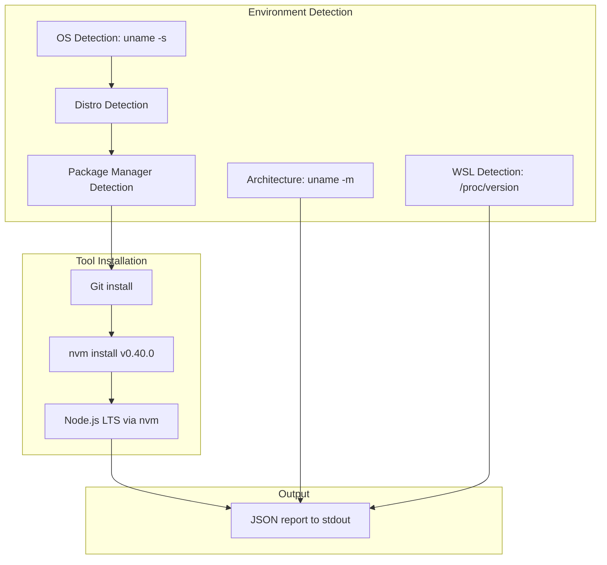
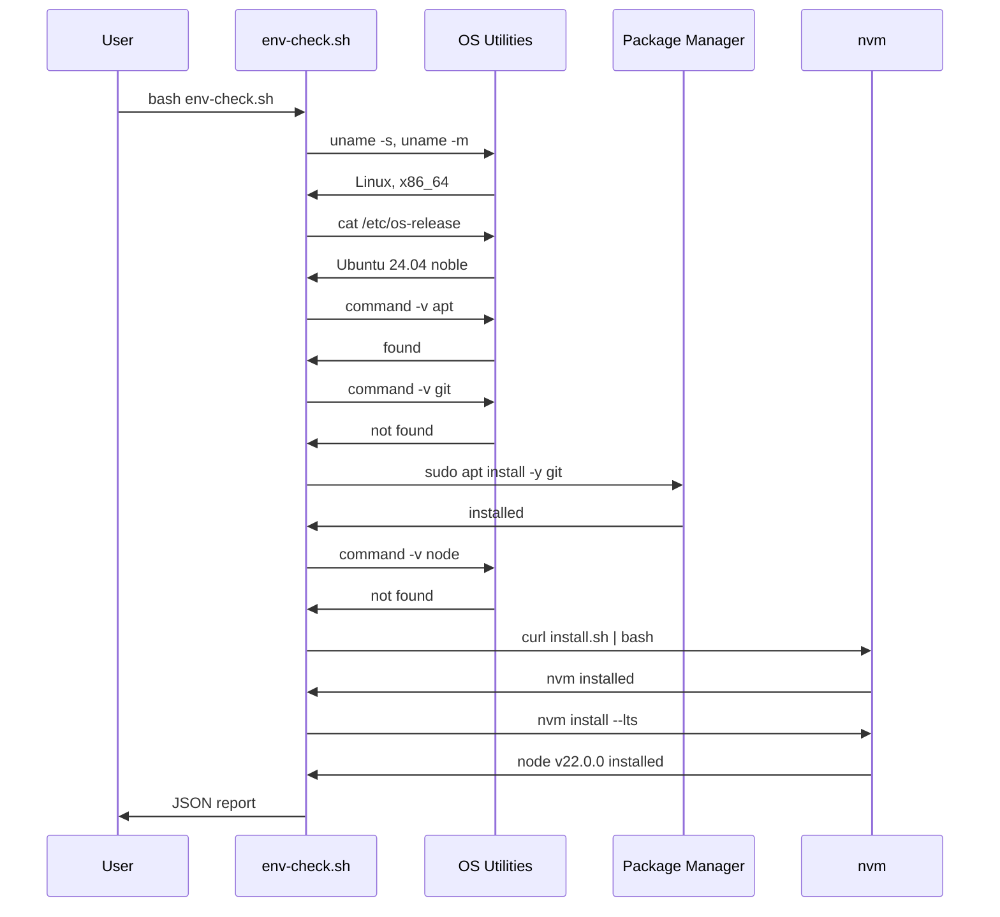

# env-check.sh spec

## 1. Overview

**Role**: Bootstrap environment detection for the opensassi skill. Detects OS (Linux/macOS/Windows), ensures git is installed, installs Node.js LTS via nvm if needed. Outputs a JSON environment report to stdout.

**Language**: Shell (Bash, `set -euo pipefail`)

**Lifecycle**: OS detection → distro detection → package manager detection → git install → node/nvm install → JSON output

**Cross-references**: PowerShell twin: `env-check.ps1` (same interface, Windows native). Prerequisite for `install-npm-deps.sh`. Depends on `ensure-gitignore.sh` for `.gitignore` patterns.

## 2. Component Specifications

### CLI Interface

```
Usage: bash env-check.sh
```
No arguments.

### Internal Functions

| Function | Description |
|----------|-------------|
| `detect_linux()` | Parses `/etc/os-release` or `/etc/lsb-release` for DISTRO, VERSION, CODENAME. Detects package manager (apt/dnf/yum/pacman/zypper). |
| `detect_macos()` | Uses `sw_vers` for macOS version/codename mapping. Detects Homebrew. |
| `setup_node()` | Checks node ≥18; if missing, installs nvm v0.40.0, then `nvm install --lts`. Writes `.nvmrc`. |

### Output JSON Format

```json
{
  "os": "Linux|Darwin|win32",
  "distro": "ubuntu|macos|windows|...",
  "version": "24.04|15.0|...",
  "codename": "noble|sequoia|...",
  "pkg_manager": "apt|brew|winget|...",
  "shell": "bash|zsh|powershell",
  "is_wsl": true|false,
  "arch": "x64|arm64",
  "node_version": "22.0.0",
  "nvm_version": "0.40.0",
  "git_version": "2.43.0"
}
```

## 3. System Architecture



## 4. Detailed Data Flow



## 5. Visualization

### Animation Source

```html
<!DOCTYPE html><html><head><meta charset="utf-8"><title>Environment Check</title>
<script src="https://d3js.org/d3.v7.min.js"></script>
<style>
body{font-family:monospace;background:#1e1e2e;color:#cdd6f4;margin:0;padding:20px}
.controls{margin-bottom:15px}.controls button{background:#45475a;color:#cdd6f4;border:1px solid #585b70;padding:6px 16px;cursor:pointer;font-family:monospace;font-size:13px}
.controls button:hover{background:#585b70}.controls span{margin:0 12px;font-size:13px;color:#a6adc8}
#vis{width:680px;height:380px;border:1px solid #45475a;background:#181825;overflow:hidden}
.log{margin-top:10px;max-height:80px;overflow-y:auto;font-size:11px;color:#a6adc8}.log div{padding:1px 0;border-bottom:1px solid #313244}
.box{fill:#313244;stroke:#585b70;rx:4}.lbl{fill:#cdd6f4;font-size:11px;text-anchor:middle;dominant-baseline:central}
</style>
</head><body>
<div class="controls"><button id="play-pause" data-testid="play-pause">Play</button><button id="replay">Replay</button>
<span id="kf-label">0/<span id="kf-total">0</span></span></div>
<div id="vis"><svg width="680" height="380"><g id="stages"></g></svg></div>
<div class="log" id="log"></div>
<script>
(function(){
const kf=[{time:0,label:'idle'},{time:600,label:'os-detect'},{time:1800,label:'distro-detect'},{time:2800,label:'pm-detect'},{time:3800,label:'install-git'},{time:5000,label:'install-nvm'},{time:6500,label:'install-node'},{time:7500,label:'output-json'},{time:8500,label:'done'}];
const vf=[{label:'idle',hor:0,ver:0,precision:0,logCount:0},{label:'os-detect',hor:1,ver:0,precision:0,logCount:1},{label:'distro-detect',hor:2,ver:1,precision:0,logCount:2},{label:'pm-detect',hor:3,ver:1,precision:0,logCount:3},{label:'install-git',hor:3,ver:2,precision:0,logCount:4},{label:'install-nvm',hor:4,ver:2,precision:1,logCount:5},{label:'install-node',hor:4,ver:3,precision:2,logCount:6},{label:'output-json',hor:5,ver:3,precision:2,logCount:7},{label:'done',hor:6,ver:3,precision:3,logCount:8}];
const T=8500;window.ANIMATION_DURATION_MS=T;window.ANIMATION_KEYFRAMES=kf;window.ANIMATION_VERIFICATION=vf;
let ck=0,pl=false,tm=null;
const sv=d3.select('#vis svg'),lg=document.getElementById('log'),pb=document.getElementById('play-pause'),rb=document.getElementById('replay'),kl=document.getElementById('kf-label'),kt=document.getElementById('kf-total');
kt.textContent=kf.length-1;
const st=[{l:'uname -s: Linux'},{l:'cat /etc/os-release: Ubuntu 24.04'},{l:'command -v apt'},{l:'sudo apt install -y git'},{l:'curl install.sh | bash (nvm)'},{l:'nvm install --lts'},{l:'JSON stdout: {os, distro, ...}'},{l:'done'}];
function ul(c){lg.innerHTML='';const e=['env-check: waiting...','env-check: detected Linux x86_64','env-check: distro = Ubuntu 24.04 noble','env-check: pkg_manager = apt','env-check: git not found, installing...','env-check: nvm v0.40.0 installed','env-check: Node.js v22.0.0 LTS ready','env-check: outputting JSON report','env-check: done'];for(let i=0;i<=Math.min(c,e.length-1);i++){const d=document.createElement('div');d.textContent=e[i];lg.appendChild(d)}}
function rs(i){ck=i;kl.textContent=i+'/'+(kf.length-1);const g=sv.select('#stages');g.selectAll('*').remove();const sh=Math.min(i,st.length);for(let j=0;j<sh;j++){const y=35+j*36;g.append('rect').attr('class','box').attr('x',30).attr('y',y).attr('width',380).attr('height',30).attr('stroke',j===sh-1&&i<st.length?'#f9e2af':'#585b70');g.append('text').attr('class','lbl').attr('x',220).attr('y',y+17).text(st[j].l);g.append('circle').attr('cx',430).attr('cy',y+15).attr('r',5).attr('fill',j<5?'#f9e2af':j<7?'#89b4fa':'#a6e3a1')}ul(i)}
function jk(idx){if(idx<0||idx>=kf.length)return;pl=false;pb.textContent='Play';if(tm){clearInterval(tm);tm=null}rs(idx)}
window.jumpToKeyframe=jk;
function ra(){jk(0)}window.resetAnimation=ra;
function gas(){const v=vf[ck]||vf[0];return{hor:v.hor,ver:v.ver,precision:v.precision,boundsOpacity:0,logCount:v.logCount,keyframeIdx:ck,keyframeLabel:kf[ck].label}}
window.getAnimationState=gas;
rs(0);
pb.addEventListener('click',function(){if(pl){pl=false;pb.textContent='Play';if(tm){clearInterval(tm);tm=null}}else{pl=true;pb.textContent='Pause';if(ck>=kf.length-1)ck=0;const stp=T/(kf.length-1);tm=setInterval(()=>{if(ck<kf.length-1)jk(ck+1);else{pl=false;pb.textContent='Play';clearInterval(tm);tm=null}},stp)}});
rb.addEventListener('click',function(){ra();pl=true;pb.textContent='Pause';const stp=T/(kf.length-1);tm=setInterval(()=>{if(ck<kf.length-1)jk(ck+1);else{pl=false;pb.textContent='Play';clearInterval(tm);tm=null}},stp)});
})();
</script>
</body></html>
```

## 6. Testing Requirements

| Test ID | Scenario | Steps | Expected |
|---------|----------|-------|----------|
| EC01 | Run on Linux | `bash env-check.sh` on Ubuntu | JSON with os=Linux, distro=ubuntu |
| EC02 | Run on macOS | `bash env-check.sh` on macOS | JSON with os=Darwin, distro=macos |
| EC03 | Git already installed | Run with git present | No install attempted, git_version populated |
| EC04 | Node ≥18 already installed | Run with node v20 | No nvm install attempted |
| EC05 | Output is valid JSON | Pipe output to `python3 -m json.tool` | Passes JSON validation |

## 7. Cross-References

| Direction | Spec File | Relationship |
|-----------|-----------|--------------|
| Twin (Windows) | `.opencode/skills/opensassi/scripts/env-check.ps1.spec.md` | Same JSON schema, Windows native |
| Consumed by | `.opencode/skills/opensassi/scripts/install-npm-deps.spec.md` | Ensures node is available before npm install |
| Depends on | `.opencode/skills/opensassi/scripts/ensure-gitignore.spec.md` | Ensures .gitignore patterns for node_modules/ etc. |
