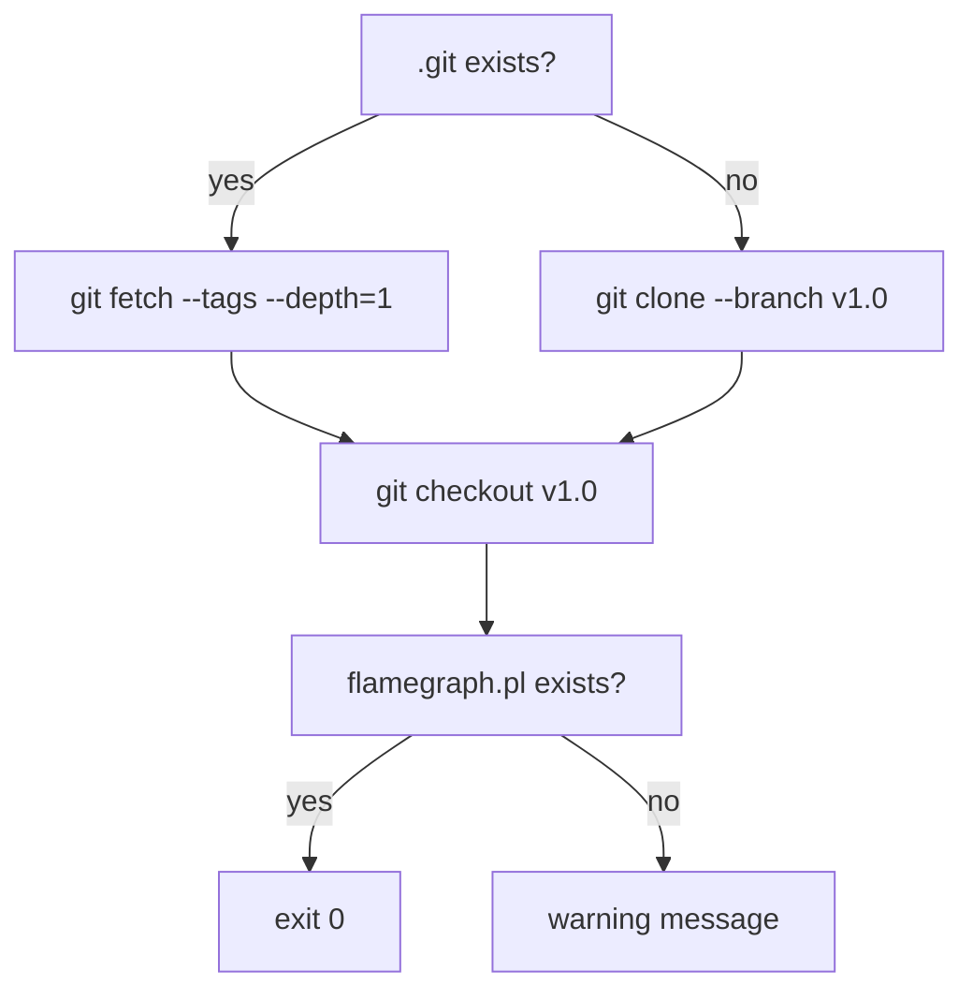
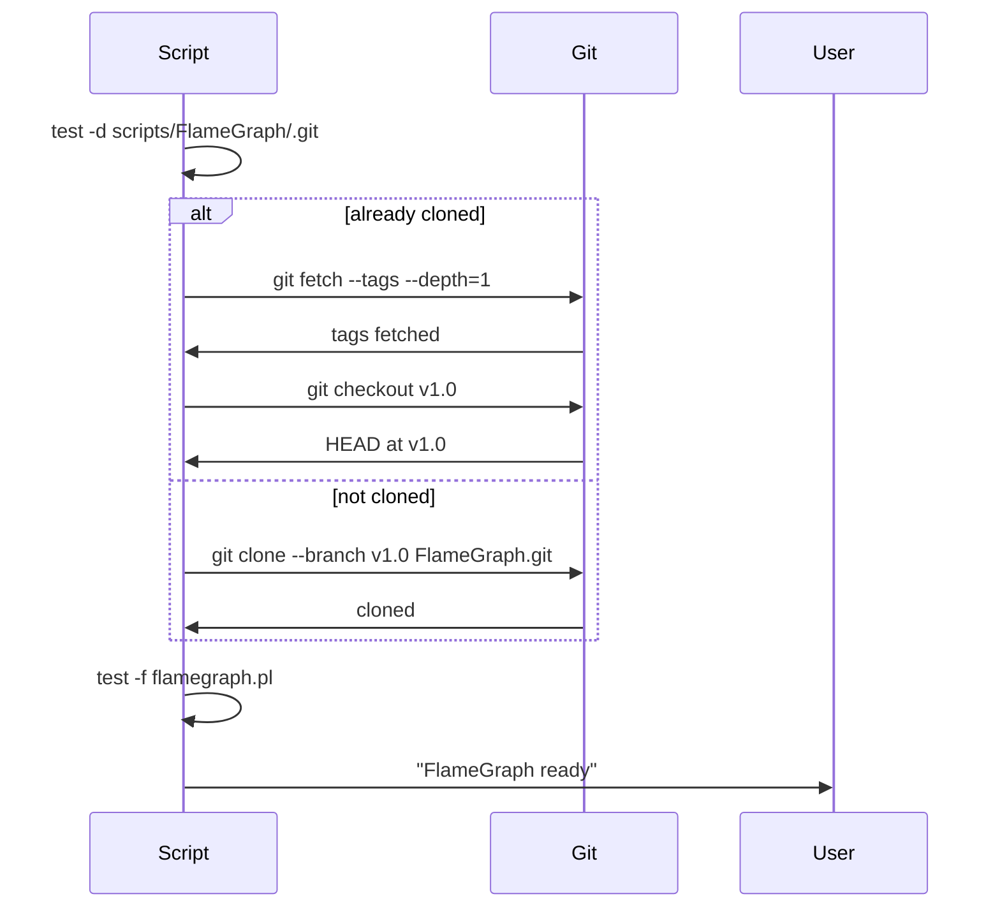

# install-flamegraph.sh spec

## 1. Overview

**Role**: Clones Brendan Gregg's FlameGraph repository at pinned tag v1.0 into `scripts/FlameGraph/`. Idempotent — if already cloned, updates the existing checkout to v1.0.

**Language**: Shell (Bash, `set -euo pipefail`)

**Lifecycle**: Detect existing clone → if present: fetch tags + checkout v1.0 → if absent: git clone depth=1 branch v1.0 → verify flamegraph.pl exists

**Cross-references**: Depends on `ensure-gitignore.sh` (`scripts/FlameGraph/` pattern in `.gitignore`). Consumed by profiler scripts (`profile.sh`). Twin of profiler's `setup.sh` (which also clones FlameGraph to same path).

## 2. Component Specifications

```
Usage: bash install-flamegraph.sh
```

### Exit Codes

| Code | Condition |
|------|-----------|
| 0 | Clone/update succeeded |
| 1 | Clone failed |

## 3. System Architecture



## 4. Detailed Data Flow



## 5. Visualization

### Animation Source

```html
<!DOCTYPE html><html><head><meta charset="utf-8"><title>FlameGraph Install</title>
<script src="https://d3js.org/d3.v7.min.js"></script>
<style>
body{font-family:monospace;background:#1e1e2e;color:#cdd6f4;margin:0;padding:20px}
.controls{margin-bottom:15px}.controls button{background:#45475a;color:#cdd6f4;border:1px solid #585b70;padding:6px 16px;cursor:pointer;font-family:monospace;font-size:13px}
.controls button:hover{background:#585b70}.controls span{margin:0 12px;font-size:13px;color:#a6adc8}
#vis{width:680px;height:300px;border:1px solid #45475a;background:#181825;overflow:hidden}
.log{margin-top:10px;max-height:80px;overflow-y:auto;font-size:11px;color:#a6adc8}.log div{padding:1px 0;border-bottom:1px solid #313244}
.s{fill:#313244;stroke:#585b70;rx:4}
</style>
</head><body>
<div class="controls"><button id="play-pause" data-testid="play-pause">Play</button><button id="replay">Replay</button>
<span id="kf-label">0/<span id="kf-total">0</span></span></div>
<div id="vis"><svg width="680" height="300"><g id="st"></g></svg></div>
<div class="log" id="log"></div>
<script>
(function(){
const kf=[{time:0,label:'idle'},{time:600,label:'check-existing'},{time:1800,label:'clone-or-update'},{time:3500,label:'verify'},{time:4500,label:'done'}];
const vf=[{label:'idle',hor:0,ver:0,precision:0,logCount:0},{label:'check-existing',hor:1,ver:0,precision:0,logCount:1},{label:'clone-or-update',hor:1,ver:1,precision:0,logCount:2},{label:'verify',hor:2,ver:1,precision:1,logCount:3},{label:'done',hor:3,ver:2,precision:2,logCount:4}];
const T=4500;window.ANIMATION_DURATION_MS=T;window.ANIMATION_KEYFRAMES=kf;window.ANIMATION_VERIFICATION=vf;
let ck=0,pl=false,tm=null;
const sv=d3.select('#vis svg'),lg=document.getElementById('log'),pb=document.getElementById('play-pause'),rb=document.getElementById('replay'),kl=document.getElementById('kf-label'),kt=document.getElementById('kf-total');
kt.textContent=kf.length-1;
function jk(idx){if(idx<0||idx>=kf.length)return;pl=false;pb.textContent='Play';if(tm){clearInterval(tm);tm=null}const g=sv.select('#st');g.selectAll('*').remove();const e=['install-flamegraph: waiting','install-flamegraph: checking scripts/FlameGraph/','install-flamegraph: cloning (depth=1, branch=v1.0)','install-flamegraph: verifying flamegraph.pl','install-flamegraph: done'];for(let i=0;i<=Math.min(idx,e.length-1);i++){const d=document.createElement('div');d.textContent=e[i];lg.appendChild(d)}ck=idx;kl.textContent=idx+'/'+(kf.length-1);const cols=['#45475a','#f9e2af','#89b4fa','#a6e3a1','#a6e3a1'];g.append('rect').attr('x',30).attr('y',40).attr('width',400).attr('height',28).attr('fill','#313244').attr('stroke',cols[Math.min(idx,4)]).attr('rx',4);g.append('text').attr('x',230).attr('y',58).attr('fill','#cdd6f4').attr('font-size','11').attr('text-anchor','middle').text(idx===0?'...':idx<2?'checking .git':idx<3?'git clone / git checkout v1.0':idx<4?'verifying flamegraph.pl':'FlameGraph ready')}
window.jumpToKeyframe=jk;window.resetAnimation=function(){jk(0)};window.getAnimationState=function(){const v=vf[ck]||vf[0];return{hor:v.hor,ver:v.ver,precision:v.precision,boundsOpacity:0,logCount:v.logCount,keyframeIdx:ck,keyframeLabel:kf[ck].label}};
jk(0);
pb.addEventListener('click',function(){if(pl){pl=false;pb.textContent='Play';if(tm){clearInterval(tm);tm=null}}else{pl=true;pb.textContent='Pause';if(ck>=kf.length-1)ck=0;const s=T/(kf.length-1);tm=setInterval(()=>{if(ck<kf.length-1)jk(ck+1);else{pl=false;pb.textContent='Play';clearInterval(tm);tm=null}},s)}});
rb.addEventListener('click',function(){jk(0);pl=true;pb.textContent='Pause';const s=T/(kf.length-1);tm=setInterval(()=>{if(ck<kf.length-1)jk(ck+1);else{pl=false;pb.textContent='Play';clearInterval(tm);tm=null}},s)});
})();
</script>
</body></html>
```

## 6. Testing Requirements

| Test ID | Scenario | Steps | Expected |
|---------|----------|-------|----------|
| IF01 | First clone | Run in clean project | scripts/FlameGraph/ created, flamegraph.pl exists |
| IF02 | Idempotent re-run | Run twice | Second run shows "already cloned" |
| IF03 | Clone failure | Run without network | Error + exit 1 |

## 7. Cross-References

| Direction | Spec File | Relationship |
|-----------|-----------|--------------|
| Depends on | `.opencode/skills/opensassi/scripts/ensure-gitignore.spec.md` | scripts/FlameGraph/ pattern in .gitignore |
| Consumed by | `.opencode/skills/profiler/scripts/profile.spec.md` | Provides stackcollapse-perf.pl + flamegraph.pl |
| Twin | `.opencode/skills/profiler/scripts/setup.spec.md` | setup.sh also clones FlameGraph (duplicate functionality) |
