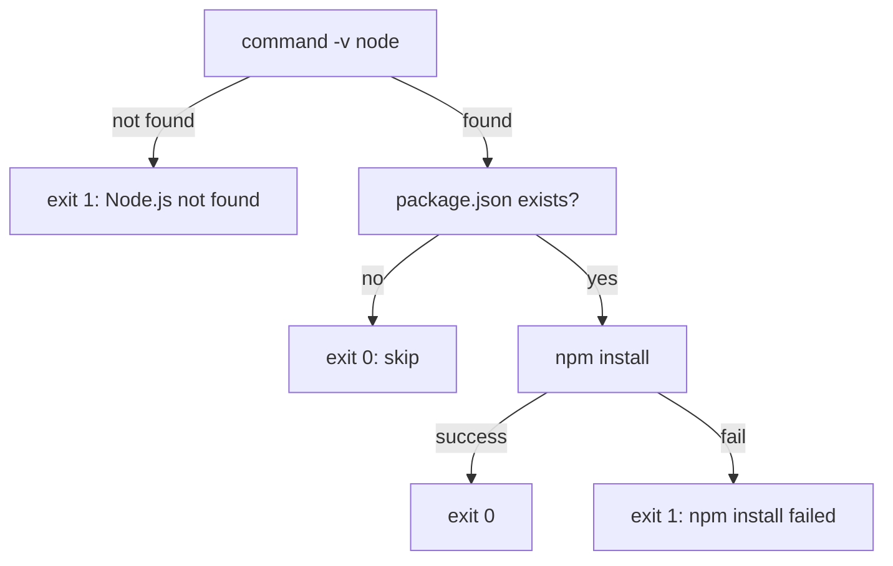
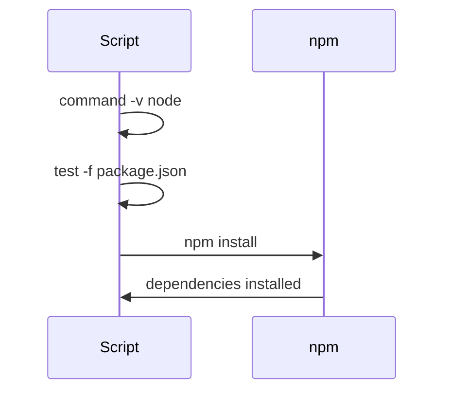

# install-npm-deps.sh spec

## 1. Overview

**Role**: Installs npm dependencies for the opencode project. Assumes Node.js is already available (run `env-check.sh` first). Errors if node is missing; silently exits if no `package.json` exists.

**Language**: Shell (Bash, `set -euo pipefail`)

**Lifecycle**: Verify node → verify package.json → `npm install` → confirm

**Cross-references**: Depends on `env-check.sh` (ensures node is available). Depends on `ensure-gitignore.sh` (`.gitignore` patterns for `node_modules/`).

## 2. Component Specifications

```
Usage: bash install-npm-deps.sh
```

### Exit Codes

| Code | Condition |
|------|-----------|
| 0 | npm install succeeded or no package.json |
| 1 | Node.js not found |
| 1 | npm install failed |

## 3. System Architecture



## 4. Detailed Data Flow



## 5. Visualization

### Animation Source

```html
<!DOCTYPE html><html><head><meta charset="utf-8"><title>npm Install</title>
<script src="https://d3js.org/d3.v7.min.js"></script>
<style>
body{font-family:monospace;background:#1e1e2e;color:#cdd6f4;margin:0;padding:20px}
.controls{margin-bottom:15px}.controls button{background:#45475a;color:#cdd6f4;border:1px solid #585b70;padding:6px 16px;cursor:pointer;font-family:monospace;font-size:13px}
.controls button:hover{background:#585b70}.controls span{margin:0 12px;font-size:13px;color:#a6adc8}
#vis{width:680px;height:280px;border:1px solid #45475a;background:#181825;overflow:hidden}
.log{margin-top:10px;max-height:80px;overflow-y:auto;font-size:11px;color:#a6adc8}.log div{padding:1px 0;border-bottom:1px solid #313244}
.s{fill:#313244;stroke:#585b70;rx:4}.st{fill:#cdd6f4;font-size:11px;text-anchor:middle;dominant-baseline:central}
</style>
</head><body>
<div class="controls"><button id="play-pause" data-testid="play-pause">Play</button><button id="replay">Replay</button>
<span id="kf-label">0/<span id="kf-total">0</span></span></div>
<div id="vis"><svg width="680" height="280"><g id="sg"></g></svg></div>
<div class="log" id="log"></div>
<script>
(function(){
const kf=[{time:0,label:'idle'},{time:600,label:'check-node'},{time:1800,label:'check-pj'},{time:3000,label:'npm-install'},{time:4500,label:'done'}];
const vf=[{label:'idle',hor:0,ver:0,precision:0,logCount:0},{label:'check-node',hor:1,ver:0,precision:0,logCount:1},{label:'check-pj',hor:2,ver:0,precision:0,logCount:2},{label:'npm-install',hor:2,ver:1,precision:1,logCount:3},{label:'done',hor:3,ver:2,precision:2,logCount:4}];
const T=4500;window.ANIMATION_DURATION_MS=T;window.ANIMATION_KEYFRAMES=kf;window.ANIMATION_VERIFICATION=vf;
let ck=0,pl=false,tm=null;
const sv=d3.select('#vis svg'),lg=document.getElementById('log'),pb=document.getElementById('play-pause'),rb=document.getElementById('replay'),kl=document.getElementById('kf-label'),kt=document.getElementById('kf-total');
kt.textContent=kf.length-1;
const sts=[{l:'check: node --version'},{l:'check: package.json'},{l:'npm install'},{l:'done'}];
function ul(c){lg.innerHTML='';const e=['install-npm-deps: waiting','install-npm-deps: node v22.0.0 found','install-npm-deps: package.json found','install-npm-deps: npm install completed','install-npm-deps: done'];[0,1,2,3,4].slice(c+1).forEach(i=>e[i]='');for(let i=0;i<=Math.min(c,e.length-1);i++){if(!e[i])continue;const d=document.createElement('div');d.textContent=e[i];lg.appendChild(d)}}
function rs(i){ck=i;kl.textContent=i+'/'+(kf.length-1);const g=sv.select('#sg');g.selectAll('*').remove();const sh=Math.min(i,sts.length);for(let j=0;j<sh;j++){const y=35+j*48;g.append('rect').attr('class','s').attr('x',40).attr('y',y).attr('width',350).attr('height',32).attr('stroke',j===sh-1&&i<sts.length?'#f9e2af':'#585b70');g.append('text').attr('class','st').attr('x',215).attr('y',y+18).text(sts[j].l);g.append('circle').attr('cx',410).attr('cy',y+16).attr('r',5).attr('fill','#a6e3a1')}ul(i)}
window.jumpToKeyframe=jk;function jk(idx){if(idx<0||idx>=kf.length)return;pl=false;pb.textContent='Play';if(tm){clearInterval(tm);tm=null}rs(idx)}
window.resetAnimation=function(){jk(0)};
window.getAnimationState=function(){const v=vf[ck]||vf[0];return{hor:v.hor,ver:v.ver,precision:v.precision,boundsOpacity:0,logCount:v.logCount,keyframeIdx:ck,keyframeLabel:kf[ck].label}};
rs(0);
pb.addEventListener('click',function(){if(pl){pl=false;pb.textContent='Play';if(tm){clearInterval(tm);tm=null}}else{pl=true;pb.textContent='Pause';if(ck>=kf.length-1)ck=0;const s=T/(kf.length-1);tm=setInterval(()=>{if(ck<kf.length-1)jk(ck+1);else{pl=false;pb.textContent='Play';clearInterval(tm);tm=null}},s)}});
rb.addEventListener('click',function(){jk(0);pl=true;pb.textContent='Pause';const s=T/(kf.length-1);tm=setInterval(()=>{if(ck<kf.length-1)jk(ck+1);else{pl=false;pb.textContent='Play';clearInterval(tm);tm=null}},s)});
})();
</script>
</body></html>
```

## 6. Testing Requirements

| Test ID | Scenario | Steps | Expected |
|---------|----------|-------|----------|
| ND01 | Node.js not found | Run in environment without node | Error + exit 1 |
| ND02 | No package.json | Run in empty directory | Exit 0, log: "skipping" |
| ND03 | Successful install | Run in project root with package.json | npm install runs, exit 0 |

## 7. Cross-References

| Direction | Spec File | Relationship |
|-----------|-----------|--------------|
| Depends on | `.opencode/skills/opensassi/scripts/env-check.sh.spec.md` | Requires node installed by env-check |
| Depends on | `.opencode/skills/opensassi/scripts/ensure-gitignore.spec.md` | node_modules/ pattern must be in .gitignore |
