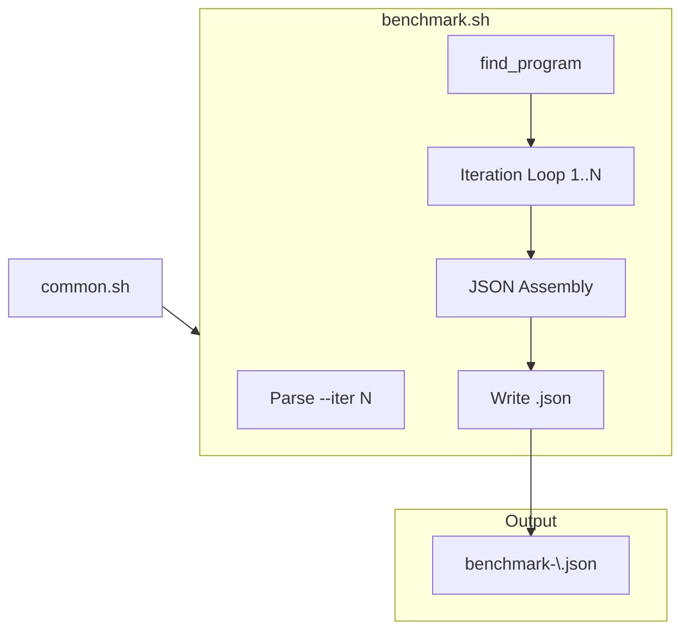
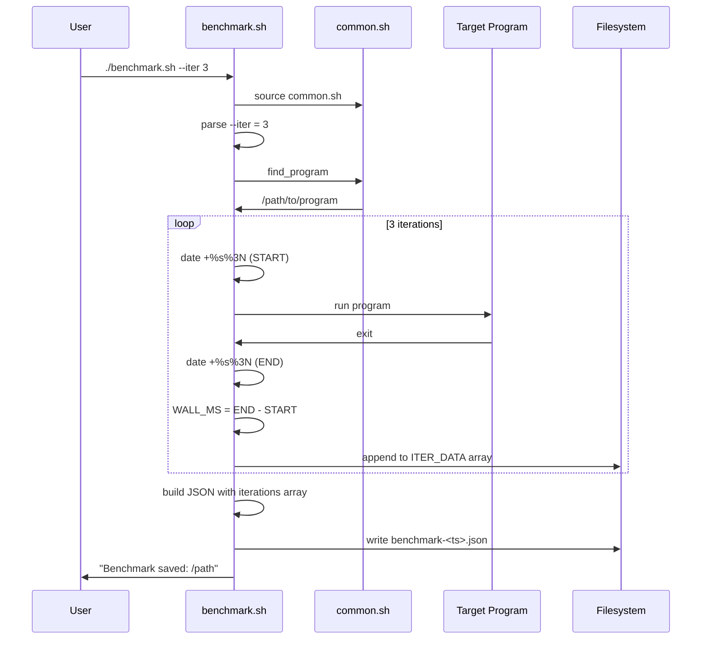

# benchmark.sh spec

## 1. Overview

**Role**: Runs N iterations of the target program with wall-clock timing, producing a JSON results file with per-iteration timing data and configuration metadata.

**Language**: Shell (Bash, sources `common.sh`)

**Lifecycle**: Parse `--iter` → binary discovery → iteration loop (N × run program + timestamp) → JSON assembly → write to `$OUTPUT_DIR/benchmarks/`

**Cross-references**: Depends on `common.sh` (find_program, OUTPUT_DIR, DEFAULT_ITERATIONS, logging). Produces benchmark JSON files consumed by `compare.sh`.

## 2. Component Specifications

### CLI Interface

```
Usage: ./benchmark.sh [--iter N]
  --iter N    Number of iterations (default: 5)
```

### Processing Steps

1. **Parse args** — Read `--iter` flag, default to `$DEFAULT_ITERATIONS`
2. **Binary discovery** — Call `find_program()`, exit with error if not found
3. **Iteration loop** — For i=1..ITERATIONS: record START_MS, run program, record END_MS, compute WALL_MS, append to JSON array
4. **Build results JSON** — Assemble full JSON with label, timestamp, iteration array, config
5. **Write file** — `$OUTPUT_DIR/benchmarks/benchmark-<timestamp>.json`

### Exit Codes

| Code | Condition |
|------|-----------|
| 0 | Benchmark completed |
| 1 | Binary not found |

## 3. System Architecture



## 4. Detailed Data Flow



## 5. Visualization

### Animation Source

```html
<!DOCTYPE html>
<html>
<head><meta charset="utf-8"><title>Benchmark Runner</title><script src="https://d3js.org/d3.v7.min.js"></script>
<style>
body{font-family:monospace;background:#1e1e2e;color:#cdd6f4;margin:0;padding:20px}
.controls{margin-bottom:15px}.controls button{background:#45475a;color:#cdd6f4;border:1px solid #585b70;padding:6px 16px;cursor:pointer;font-family:monospace;font-size:13px}
.controls button:hover{background:#585b70}.controls span{margin:0 12px;font-size:13px;color:#a6adc8}
#vis{width:680px;height:380px;border:1px solid #45475a;background:#181825;overflow:hidden;position:relative}
.log{margin-top:10px;max-height:80px;overflow-y:auto;font-size:11px;color:#a6adc8}.log div{padding:1px 0;border-bottom:1px solid #313244}
.bar{fill:#89b4fa}.bar-label{fill:#cdd6f4;font-size:10px;text-anchor:end;dominant-baseline:central}
.axis text{fill:#a6adc8;font-size:10px}
</style>
</head>
<body>
<div class="controls"><button id="play-pause" data-testid="play-pause">Play</button><button id="replay">Replay</button><span id="kf-label">0/<span id="kf-total">0</span></span></div>
<div id="vis"><svg width="680" height="380"><g id="bars"></g><g id="labels"></g></svg></div>
<div class="log" id="log"></div>
<script>
(function(){
const keyframes=[{time:0,label:'idle'},{time:600,label:'preparing'},{time:1500,label:'iter-1'},{time:2800,label:'iter-2'},{time:4100,label:'iter-3'},{time:5400,label:'building-json'},{time:6400,label:'done'}];
const verification=[{label:'idle',hor:0,ver:0,precision:0,logCount:0},{label:'preparing',hor:1,ver:0,precision:0,logCount:1},{label:'iter-1',hor:2,ver:1,precision:0,logCount:2},{label:'iter-2',hor:2,ver:2,precision:1,logCount:3},{label:'iter-3',hor:2,ver:3,precision:2,logCount:4},{label:'building-json',hor:3,ver:3,precision:2,logCount:5},{label:'done',hor:4,ver:3,precision:3,logCount:6}];
const T=6400;window.ANIMATION_DURATION_MS=T;window.ANIMATION_KEYFRAMES=keyframes;window.ANIMATION_VERIFICATION=verification;
let ck=0,pl=false,tm=null;
const svg=d3.select('#vis svg'),lg=document.getElementById('log'),pb=document.getElementById('play-pause'),rb=document.getElementById('replay'),kl=document.getElementById('kf-label'),kt=document.getElementById('kf-total');
kt.textContent=keyframes.length-1;
const iters=[342,318,361];
function ul(c){lg.innerHTML='';const e=['benchmark.sh: waiting','benchmark.sh: preparing, binary found','benchmark.sh: iteration 1 - 342ms','benchmark.sh: iteration 2 - 318ms','benchmark.sh: iteration 3 - 361ms','benchmark.sh: building JSON output','benchmark.sh: done'];for(let i=0;i<=Math.min(c,e.length-1);i++){const d=document.createElement('div');d.textContent=e[i];lg.appendChild(d)}}
function rs(i){ck=i;kl.textContent=i+'/'+(keyframes.length-1);const g=svg.select('#bars');g.selectAll('*').remove();const l=svg.select('#labels');l.selectAll('*').remove();const show=i>=1?Math.min(i-1,iters.length):0;if(show>0){g.append('text').attr('x',30).attr('y',30).attr('fill','#a6adc8').attr('font-size','12').text('Wall Time (ms)');for(let j=0;j<show;j++){const h=Math.min(iters[j]/2,200);const y=320-h;g.append('rect').attr('class','bar').attr('x',80+j*120).attr('y',y).attr('width',40).attr('height',h).attr('fill','#89b4fa').attr('opacity',j===show-1?1:0.5);g.append('text').attr('x',100+j*120).attr('y',y-6).attr('fill','#cdd6f4').attr('font-size','10').attr('text-anchor','middle').text(iters[j]+'ms');l.append('text').attr('x',100+j*120).attr('y',340).attr('fill','#a6adc8').attr('font-size','10').attr('text-anchor','middle').text('Iter '+(j+1))}}ul(i)}
function jk(idx){if(idx<0||idx>=keyframes.length)return;pl=false;pb.textContent='Play';if(tm){clearInterval(tm);tm=null}rs(idx)}
window.jumpToKeyframe=jk;
function ra(){jk(0)}window.resetAnimation=ra;
function gas(){const v=verification[ck]||verification[0];return{hor:v.hor,ver:v.ver,precision:v.precision,boundsOpacity:0,logCount:v.logCount,keyframeIdx:ck,keyframeLabel:keyframes[ck].label}}
window.getAnimationState=gas;
rs(0);
pb.addEventListener('click',function(){if(pl){pl=false;pb.textContent='Play';if(tm){clearInterval(tm);tm=null}}else{pl=true;pb.textContent='Pause';if(ck>=keyframes.length-1)ck=0;const st=T/(keyframes.length-1);tm=setInterval(()=>{if(ck<keyframes.length-1)jk(ck+1);else{pl=false;pb.textContent='Play';clearInterval(tm);tm=null}},st)}});
rb.addEventListener('click',function(){ra();pl=true;pb.textContent='Pause';const st=T/(keyframes.length-1);tm=setInterval(()=>{if(ck<keyframes.length-1)jk(ck+1);else{pl=false;pb.textContent='Play';clearInterval(tm);tm=null}},st)});
})();
</script>
</body>
</html>
```

## 6. Testing Requirements

| Test ID | Scenario | Steps | Expected |
|---------|----------|-------|----------|
| PB01 | Unknown CLI option | `./benchmark.sh --bad-flag` | Error + exit 1 |
| PB02 | Binary not found | Run without release binary | Error + exit 1 |
| PB03 | Custom iteration count | `./benchmark.sh --iter 3` with valid binary | JSON with 3 iteration entries |
| PB04 | Default iteration count | `./benchmark.sh` | JSON with 5 iteration entries |
| PB05 | JSON schema validity | Parse output JSON with `python3 -m json.tool` | Valid JSON |

## 7. Cross-References

| Direction | Spec File | Relationship |
|-----------|-----------|--------------|
| Sources | `.opencode/skills/profiler/scripts/common.spec.md` | Sources common.sh for find_program, DEFAULT_ITERATIONS |
| Consumed by | `.opencode/skills/profiler/scripts/compare.spec.md` | Produces JSON consumed by compare.sh |
