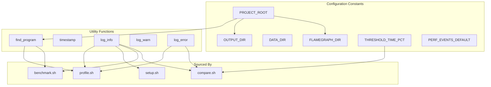
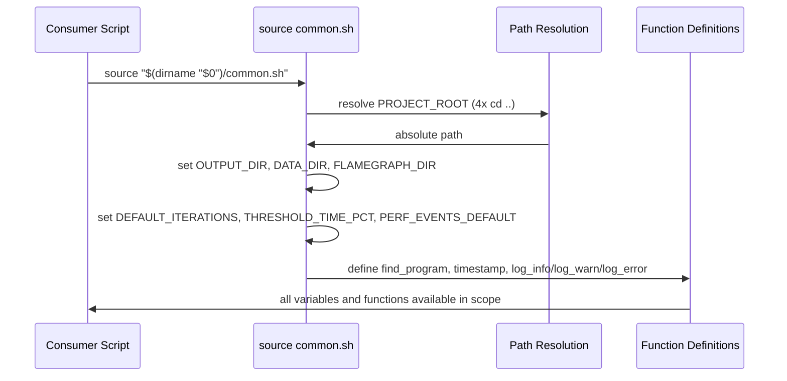

# common.sh spec

## 1. Overview

**Role**: Shared configuration and utility functions for the profiler skill. Must be sourced (not executed) by all other profiler scripts via `source "$(dirname "$0")/common.sh"`. Defines project paths, default workload parameters, benchmark thresholds, perf event defaults, binary discovery, timestamping, and logging.

**Language**: Shell (Bash, `set -euo pipefail`)

**Cross-references**: Sourced by `profile.sh`, `setup.sh`, `benchmark.sh`, `compare.sh`. Depends on `scripts/FlameGraph/` clone path defined in `FLAMEGRAPH_DIR`.

## 2. Component Specifications

### Constants

| Name | Value | Description |
|------|-------|-------------|
| `PROJECT_ROOT` | auto-detected | Root of project (4 levels up from scripts dir) |
| `SCRIPTS_DIR` | `$PROJECT_ROOT/.opencode/skills/profiler/scripts` | Location of profiler scripts |
| `OUTPUT_DIR` | `$PROJECT_ROOT/.profiler` | All profiler output (gitignored) |
| `DATA_DIR` | `$PROJECT_ROOT/test/data` | Test input data |
| `FLAMEGRAPH_DIR` | `$PROJECT_ROOT/scripts/FlameGraph` | Vendored FlameGraph Perl scripts |
| `DEFAULT_INPUT` | `input` | Default input filename |
| `DEFAULT_RESOLUTION` | `1280x720` | Default resolution string |
| `DEFAULT_FRAMES` | `10` | Default frame count |
| `DEFAULT_CONFIG` | `default` | Default config label |
| `DEFAULT_ITERATIONS` | `5` | Default benchmark iteration count |
| `THRESHOLD_TIME_PCT` | `2.0` | Regression threshold: max allowed time increase % |
| `THRESHOLD_QUALITY` | `0.1` | Regression threshold: max allowed quality drop |
| `PERF_EVENTS_DEFAULT` | `cycles,cache-misses,branch-misses` | Default perf event set |

### Functions

| Signature | Description | Returns |
|-----------|-------------|---------|
| `find_program()` | Search known paths for release binary | stdout: path string, exit 0 on found; empty + exit 1 on not found |
| `timestamp()` | Generate ISO-like timestamp | stdout: `YYYYMMDDTHHMMSS` |
| `log_info(msg)` | Print info message | stdout: `[INFO] msg` |
| `log_warn(msg)` | Print warning message | stderr: `[WARN] msg` |
| `log_error(msg)` | Print error message | stderr: `[ERROR] msg` |

## 3. System Architecture



## 4. Detailed Data Flow



## 5. Visualization

### Animation Source

```html
<!DOCTYPE html>
<html>
<head>
<meta charset="utf-8">
<title>Profiler Common Shell Config</title>
<script src="https://d3js.org/d3.v7.min.js"></script>
<style>
body{font-family:monospace;background:#1e1e2e;color:#cdd6f4;margin:0;padding:20px}
.controls{margin-bottom:15px}
.controls button{background:#45475a;color:#cdd6f4;border:1px solid #585b70;padding:6px 16px;cursor:pointer;font-family:monospace;font-size:13px}
.controls button:hover{background:#585b70}
.controls span{margin:0 12px;font-size:13px;color:#a6adc8}
#vis{width:680px;height:380px;border:1px solid #45475a;background:#181825;overflow:hidden;position:relative}
.log{margin-top:10px;max-height:80px;overflow-y:auto;font-size:11px;color:#a6adc8}
.log div{padding:1px 0;border-bottom:1px solid #313244}
.var-box{fill:#313244;stroke:#585b70;stroke-width:1.5;rx:4}
.var-label{fill:#cdd6f4;font-size:11px;text-anchor:middle;dominant-baseline:central}
.src-line{fill:#313244;stroke:transparent}
.src-text{fill:#cdd6f4;font-size:10px}
</style>
</head>
<body>
<div class="controls">
<button id="play-pause" data-testid="play-pause">Play</button>
<button id="replay">Replay</button>
<span id="kf-label">0/<span id="kf-total">0</span></span>
</div>
<div id="vis"><svg width="680" height="380">
<g id="legend" transform="translate(440,10)">
<rect x="0" y="0" width="8" height="8" fill="#f9e2af" opacity="0.4"/><text x="14" y="7" fill="#a6adc8" font-size="10">Sourced</text>
<rect x="0" y="16" width="8" height="8" fill="#a6e3a1"/><text x="14" y="23" fill="#a6adc8" font-size="10">Ready</text>
</g>
<g id="vars"></g>
</svg></div>
<div class="log" id="log"></div>
<script>
(function(){
const keyframes=[
{time:0,label:'idle'},
{time:800,label:'sourcing'},
{time:2000,label:'resolving-paths'},
{time:3500,label:'loading-constants'},
{time:5000,label:'defining-functions'},
{time:6000,label:'ready'}
];
const verification=[
{label:'idle',hor:0,ver:0,precision:0,logCount:0},
{label:'sourcing',hor:1,ver:0,precision:0,logCount:1},
{label:'resolving-paths',hor:3,ver:1,precision:0,logCount:2},
{label:'loading-constants',hor:6,ver:2,precision:1,logCount:3},
{label:'defining-functions',hor:6,ver:3,precision:2,logCount:4},
{label:'ready',hor:7,ver:3,precision:3,logCount:5}
];
const TOTAL_DURATION=6000;
window.ANIMATION_DURATION_MS=TOTAL_DURATION;
window.ANIMATION_KEYFRAMES=keyframes;
window.ANIMATION_VERIFICATION=verification;
let currentKf=0,playing=false,timer=null;
const svg=d3.select('#vis svg'),logDiv=document.getElementById('log'),playBtn=document.getElementById('play-pause'),replayBtn=document.getElementById('replay'),kfLabel=document.getElementById('kf-label'),kfTotal=document.getElementById('kf-total');
kfTotal.textContent=keyframes.length-1;
const varNames=['PROJECT_ROOT','OUTPUT_DIR','DATA_DIR','FLAMEGRAPH_DIR','THRESHOLD_TIME_PCT','PERF_EVENTS_DEFAULT','find_program()','timestamp()','log_info()'];
function updateLog(c){logDiv.innerHTML='';const e=['common.sh: waiting for source...','common.sh: being sourced by consumer','common.sh: resolving PROJECT_ROOT (4x cd ..)','common.sh: setting OUTPUT_DIR, FLAMEGRAPH_DIR, THRESHOLDs','common.sh: defining find_program, timestamp, logging','common.sh: ready - all variables exported'];for(let i=0;i<=Math.min(c,e.length-1);i++){const d=document.createElement('div');d.textContent=e[i];logDiv.appendChild(d)}}
function renderState(i){currentKf=i;kfLabel.textContent=i+'/'+(keyframes.length-1);const g=svg.select('#vars');g.selectAll('*').remove();const show=Math.min(i,varNames.length);for(let j=0;j<show;j++){const x=30+Math.floor(j/9)*340,y=50+(j%9)*30;const active=j<5?'#f9e2af':j<7?'#89b4fa':'#a6e3a1';g.append('rect').attr('x',x).attr('y',y).attr('width',300).attr('height',22).attr('fill','#313244').attr('stroke',active).attr('stroke-width',1.5).attr('rx',3);g.append('text').attr('x',x+8).attr('y',y+15).attr('fill','#cdd6f4').attr('font-size','10').text(varNames[j]);g.append('circle').attr('cx',x+280).attr('cy',y+11).attr('r',4).attr('fill',active)}updateLog(i)}
function jumpToKeyframe(idx){if(idx<0||idx>=keyframes.length)return;playing=false;playBtn.textContent='Play';if(timer){clearInterval(timer);timer=null}renderState(idx)}
window.jumpToKeyframe=jumpToKeyframe;
function resetAnimation(){jumpToKeyframe(0)}
window.resetAnimation=resetAnimation;
function getAnimationState(){const v=verification[currentKf]||verification[0];return{hor:v.hor,ver:v.ver,precision:v.precision,boundsOpacity:0,logCount:v.logCount,keyframeIdx:currentKf,keyframeLabel:keyframes[currentKf].label}}
window.getAnimationState=getAnimationState;
renderState(0);
playBtn.addEventListener('click',function(){if(playing){playing=false;playBtn.textContent='Play';if(timer){clearInterval(timer);timer=null}}else{playing=true;playBtn.textContent='Pause';if(currentKf>=keyframes.length-1)currentKf=0;const step=TOTAL_DURATION/(keyframes.length-1);timer=setInterval(()=>{if(currentKf<keyframes.length-1)jumpToKeyframe(currentKf+1);else{playing=false;playBtn.textContent='Play';clearInterval(timer);timer=null}},step)}});
replayBtn.addEventListener('click',function(){resetAnimation();playing=true;playBtn.textContent='Pause';const step=TOTAL_DURATION/(keyframes.length-1);timer=setInterval(()=>{if(currentKf<keyframes.length-1)jumpToKeyframe(currentKf+1);else{playing=false;playBtn.textContent='Play';clearInterval(timer);timer=null}},step)});
})();
</script>
</body>
</html>
```

## 6. Testing Requirements

### Unit Tests

| Test ID | Method | Input | Expected Output | Assertion |
|---------|--------|-------|-----------------|-----------|
| PC01 | `find_program` | Binary exists at `$PROJECT_ROOT/program` | Non-empty path, exit 0 | Path is executable |
| PC02 | `find_program` | No binary found | Empty string, exit 1 | Returns error |
| PC03 | `timestamp` | Any | String matching `[0-9]{8}T[0-9]{6}` | Regex match |

### Integration Tests

| Test ID | Scenario | Steps | Expected |
|---------|----------|-------|----------|
| PC04 | Source common.sh in subshell | `bash -c 'source common.sh && echo $OUTPUT_DIR'` | Outputs `.profiler` path |
| PC05 | All variables set after source | `bash -c 'source common.sh && echo $THRESHOLD_TIME_PCT'` | Outputs `2.0` |

## 7. Cross-References

| Direction | Spec File | Relationship |
|-----------|-----------|--------------|
| Sourced by | `.opencode/skills/profiler/scripts/profile.spec.md` | Uses find_program, logging, OUTPUT_DIR |
| Sourced by | `.opencode/skills/profiler/scripts/setup.spec.md` | Uses OUTPUT_DIR, FLAMEGRAPH_DIR |
| Sourced by | `.opencode/skills/profiler/scripts/benchmark.spec.md` | Uses find_program, DEFAULT_ITERATIONS |
| Sourced by | `.opencode/skills/profiler/scripts/compare.spec.md` | Uses THRESHOLD_TIME_PCT, log_error |
