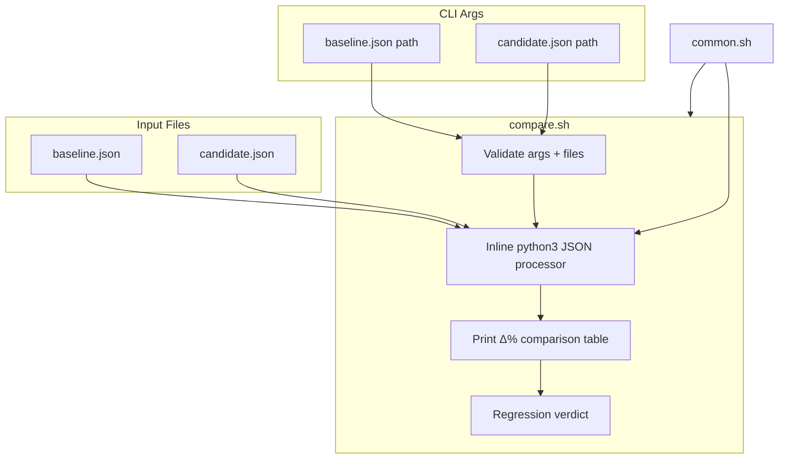
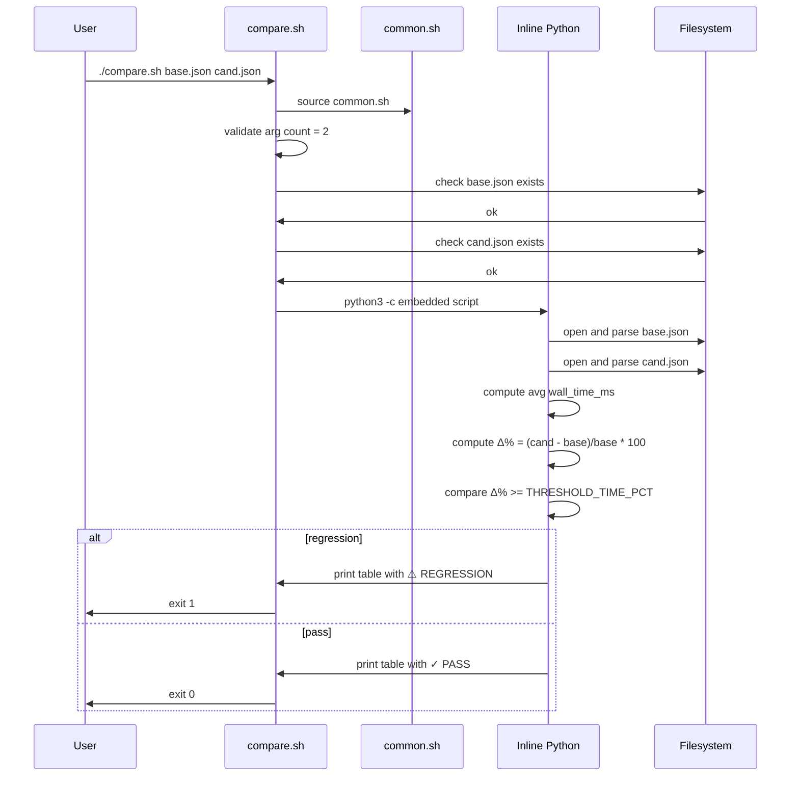

# compare.sh spec

## 1. Overview

**Role**: Compares two benchmark JSON files (baseline vs candidate) and computes delta percentages. Detects performance regressions when wall-clock time increase exceeds `THRESHOLD_TIME_PCT` (2.0%). Outputs a formatted ASCII table with Metric, Baseline, Candidate, Δ%, and Status columns.

**Language**: Shell (Bash, sources `common.sh`, delegates JSON processing to an inline `python3 -c` script)

**Lifecycle**: Validate args → validate file existence → delegate to embedded Python → print regression verdict

**Cross-references**: Depends on `common.sh` (THRESHOLD_TIME_PCT, log_error). Consumes benchmark JSON files produced by `benchmark.sh`.

## 2. Component Specifications

### CLI Interface

```
Usage: ./compare.sh <baseline.json> <candidate.json>
```

### Processing Steps

1. **Validate args** — Exactly 2 positional args required
2. **Validate files** — Both files must exist
3. **Inline Python** — The script embeds a Python program that:
   - Loads both JSON files
   - Computes average `wall_time_ms` per iteration for each
   - Calculates Δ% = ((candidate - baseline) / baseline) × 100
   - Prints formatted ASCII table
   - If Δ% ≥ THRESHOLD_TIME_PCT: prints "REGRESSION DETECTED" and exits non-zero
4. **Error handling** — If Python script fails (syntax, file parse), shell wrapper prints error

### Exit Codes

| Code | Condition |
|------|-----------|
| 0 | Both valid, no regression |
| 1 | Wrong args / files not found |
| 1 | Python script error |
| 1 | Regression detected (time Δ% ≥ THRESHOLD_TIME_PCT) |

## 3. System Architecture



## 4. Detailed Data Flow



## 5. Visualization

### Animation Source

```html
<!DOCTYPE html>
<html>
<head><meta charset="utf-8"><title>Benchmark Comparison</title><script src="https://d3js.org/d3.v7.min.js"></script>
<style>
body{font-family:monospace;background:#1e1e2e;color:#cdd6f4;margin:0;padding:20px}
.controls{margin-bottom:15px}.controls button{background:#45475a;color:#cdd6f4;border:1px solid #585b70;padding:6px 16px;cursor:pointer;font-family:monospace;font-size:13px}
.controls button:hover{background:#585b70}.controls span{margin:0 12px;font-size:13px;color:#a6adc8}
#vis{width:680px;height:380px;border:1px solid #45475a;background:#181825;overflow:hidden;position:relative}
.log{margin-top:10px;max-height:80px;overflow-y:auto;font-size:11px;color:#a6adc8}.log div{padding:1px 0;border-bottom:1px solid #313244}
.comp-bar{fill:#89b4fa}.comp-bar-cand{fill:#f9e2af}.comp-text{fill:#cdd6f4;font-size:10px;text-anchor:middle}.axis text{fill:#a6adc8;font-size:10px}
.vreg{fill:#f38ba8;font-size:13px;font-weight:bold;text-anchor:middle}
.vpass{fill:#a6e3a1;font-size:13px;font-weight:bold;text-anchor:middle}
</style>
</head>
<body>
<div class="controls"><button id="play-pause" data-testid="play-pause">Play</button><button id="replay">Replay</button><span id="kf-label">0/<span id="kf-total">0</span></span></div>
<div id="vis"><svg width="680" height="380"><g id="chart"></g></svg></div>
<div class="log" id="log"></div>
<script>
(function(){
const keyframes=[{time:0,label:'idle'},{time:600,label:'validating'},{time:1800,label:'loading-jsons'},{time:3200,label:'computing-delta'},{time:4500,label:'displaying-table'},{time:5500,label:'verdict'},{time:6500,label:'done'}];
const verification=[{label:'idle',hor:0,ver:0,precision:0,logCount:0},{label:'validating',hor:2,ver:0,precision:0,logCount:1},{label:'loading-jsons',hor:2,ver:1,precision:0,logCount:2},{label:'computing-delta',hor:3,ver:2,precision:1,logCount:3},{label:'displaying-table',hor:4,ver:2,precision:2,logCount:4},{label:'verdict',hor:4,ver:3,precision:2,logCount:5},{label:'done',hor:5,ver:3,precision:3,logCount:6}];
const T=6500;window.ANIMATION_DURATION_MS=T;window.ANIMATION_KEYFRAMES=keyframes;window.ANIMATION_VERIFICATION=verification;
let ck=0,pl=false,tm=null;
const svg=d3.select('#vis svg'),lg=document.getElementById('log'),pb=document.getElementById('play-pause'),rb=document.getElementById('replay'),kl=document.getElementById('kf-label'),kt=document.getElementById('kf-total');
kt.textContent=keyframes.length-1;
function ul(c){lg.innerHTML='';const e=['compare.sh: waiting','compare.sh: validating args and files','compare.sh: parsing baseline.json + candidate.json','compare.sh: computing avg wall time Δ%','compare.sh: Metric | Baseline | Candidate | Δ% | Status','compare.sh: Δ% = 1.2% < 2.0% → PASS','compare.sh: done'];for(let i=0;i<=Math.min(c,e.length-1);i++){const d=document.createElement('div');d.textContent=e[i];lg.appendChild(d)}}
function rs(i){ck=i;kl.textContent=i+'/'+(keyframes.length-1);const g=svg.select('#chart');g.selectAll('*').remove();if(i>=2){g.append('rect').attr('x',40).attr('y',20).attr('width',600).attr('height',40).attr('fill','#313244').attr('rx',4);g.append('text').attr('x',340).attr('y',45).attr('fill','#a6adc8').attr('font-size','11').attr('text-anchor','middle').text('Metric        Baseline    Candidate   Δ%        Status');g.append('text').attr('x',340).attr('y',65).attr('fill','#45475a').attr('font-size','11').attr('text-anchor','middle').text('────────── ─────────── ─────────── ────────── ──────────')}if(i>=3){const by=85;g.append('rect').attr('x',40).attr('y',by).attr('width',600).attr('height',36).attr('fill','#313244').attr('rx',4);g.append('text').attr('x',340).attr('y',by+24).attr('fill','#cdd6f4').attr('font-size','12').attr('text-anchor','middle').text('Wall time (ms)  342.00       346.10      +1.2%     ✓');g.append('rect').attr('x',380).attr('y',by+5).attr('width',120).attr('height',26).attr('fill','#a6e3a1').attr('rx',3)}if(i>=4){const vy=150;g.append('text').attr('class','vpass').attr('x',340).attr('y',vy).text('✓ PASS: no regression detected')}ul(i)}
function jk(idx){if(idx<0||idx>=keyframes.length)return;pl=false;pb.textContent='Play';if(tm){clearInterval(tm);tm=null}rs(idx)}
window.jumpToKeyframe=jk;
function ra(){jk(0)}window.resetAnimation=ra;
function gas(){const v=verification[ck]||verification[0];return{hor:v.hor,ver:v.ver,precision:v.precision,boundsOpacity:0,logCount:v.logCount,keyframeIdx:ck,keyframeLabel:keyframes[ck].label}}
window.getAnimationState=gas;
rs(0);
pb.addEventListener('click',function(){if(pl){pl=false;pb.textContent='Play';if(tm){clearInterval(tm);tm=null}}else{pl=true;pb.textContent='Pause';if(ck>=keyframes.length-1)ck=0;const st=T/(keyframes.length-1);tm=setInterval(()=>{if(ck<keyframes.length-1)jk(ck+1);else{pl=false;pb.textContent='Play';clearInterval(tm);tm=null}},st)}});
rb.addEventListener('click',function(){ra();pl=true;pb.textContent='Pause';const st=T/(keyframes.length-1);tm=setInterval(()=>{if(ck<keyframes.length-1)jk(ck+1);else{pl=false;pb.textContent='Play';clearInterval(tm);tm=null}},st)});
})();
</script>
</body>
</html>
```

## 6. Testing Requirements

| Test ID | Scenario | Steps | Expected |
|---------|----------|-------|----------|
| PC01 | Wrong arg count | `./compare.sh one.json` | Error: "Usage:" + exit 1 |
| PC02 | File not found | `./compare.sh missing.json existing.json` | Error: "not found" + exit 1 |
| PC03 | Valid comparison, no regression | Two identical benchmark JSONs | Table printed, "PASS" + exit 0 |
| PC04 | Regression detected | Candidate with +5% wall time | "REGRESSION DETECTED" + exit 1 |
| PC05 | Malformed JSON | Invalid JSON input | Python error handled, exit 1 |

## 7. Cross-References

| Direction | Spec File | Relationship |
|-----------|-----------|--------------|
| Sources | `.opencode/skills/profiler/scripts/common.spec.md` | Sources common.sh for THRESHOLD_TIME_PCT, log_error |
| Consumes | `.opencode/skills/profiler/scripts/benchmark.spec.md` | Reads benchmark JSON files produced by benchmark.sh |
