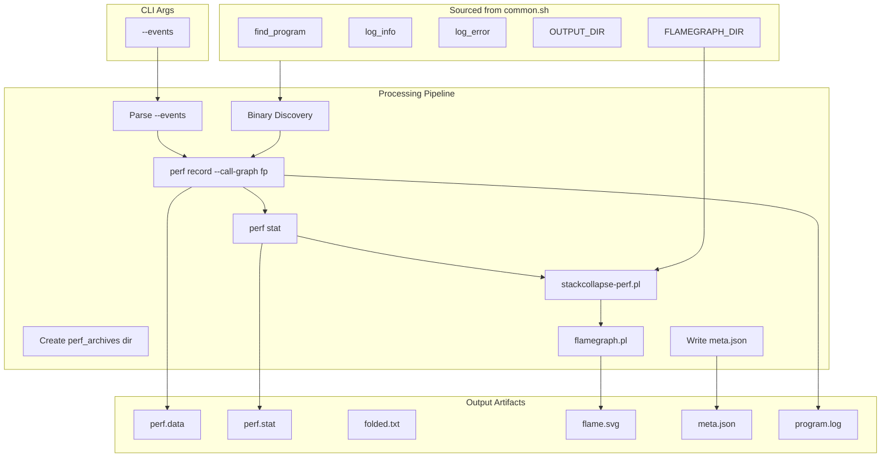
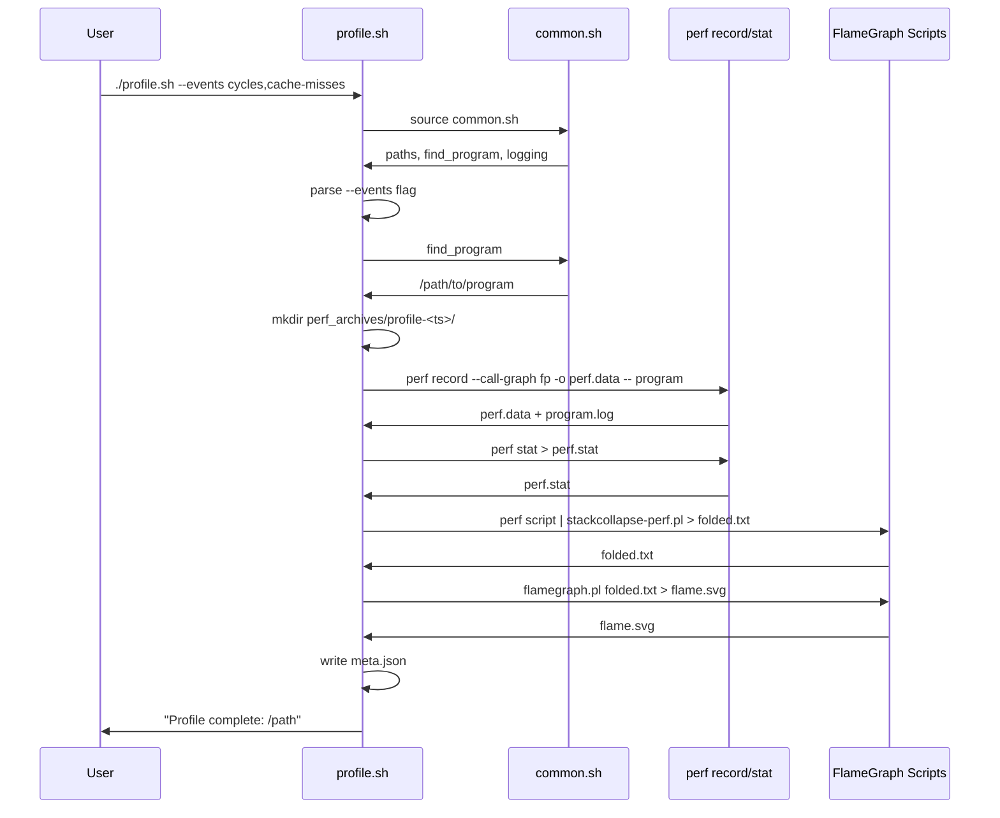

# profile.sh spec

## 1. Overview

**Role**: Runs `perf record` with call-graph frame pointers on the target program, then generates a flamegraph SVG via Brendan Gregg's FlameGraph toolchain. Also runs `perf stat` for aggregate counters. Writes metadata JSON, program output log, perf data, and flame SVG to `$OUTPUT_DIR/perf_archives/<label>/`.

**Language**: Shell (Bash, sources `common.sh`)

**Lifecycle**: Parse `--events` → discover binary → create output dir → `perf record` → `perf stat` → stack collapse → flamegraph.pl → write meta.json

**Cross-references**: Depends on `common.sh` (paths, logging, binary discovery). Depends on `scripts/FlameGraph/` (Perl scripts installed by `setup.sh`).

## 2. Component Specifications

### CLI Interface

```
Usage: ./profile.sh [--events LIST]
  --events LIST    Comma-separated perf events (default: cycles,cache-misses,branch-misses)
```

### Processing Steps (in order)

1. **Parse args** — Read `--events` flag, default to `$PERF_EVENTS_DEFAULT`
2. **Binary discovery** — Call `find_program()`, exit with error if not found
3. **Create output dir** — `$OUTPUT_DIR/perf_archives/profile-<timestamp>/`
4. **perf record** — `perf record --call-graph fp -e "$EVENTS" -o "$PERF_DATA" -- "$PROGRAM"`
5. **perf stat** — `perf stat -e "$EVENTS" -- "$PROGRAM" > "$PERF_STAT"`
6. **Flamegraph gen** — If perf.data exists: `perf script | stackcollapse-perf.pl > folded.txt`, then `flamegraph.pl folded.txt > flame.svg`
7. **Meta write** — Write JSON with label, timestamp, events, program path, exit code

### Exit Codes

| Code | Condition |
|------|-----------|
| 0 | Profile completed successfully |
| 1 | Binary not found |
| 1 | Unknown CLI option |

## 3. System Architecture



## 4. Detailed Data Flow



## 5. Visualization

### Animation Source

```html
<!DOCTYPE html>
<html>
<head><meta charset="utf-8"><title>Profile Pipeline</title><script src="https://d3js.org/d3.v7.min.js"></script>
<style>
body{font-family:monospace;background:#1e1e2e;color:#cdd6f4;margin:0;padding:20px}
.controls{margin-bottom:15px}
.controls button{background:#45475a;color:#cdd6f4;border:1px solid #585b70;padding:6px 16px;cursor:pointer;font-family:monospace;font-size:13px}
.controls button:hover{background:#585b70}
.controls span{margin:0 12px;font-size:13px;color:#a6adc8}
#vis{width:680px;height:380px;border:1px solid #45475a;background:#181825;overflow:hidden;position:relative}
.log{margin-top:10px;max-height:80px;overflow-y:auto;font-size:11px;color:#a6adc8}
.log div{padding:1px 0;border-bottom:1px solid #313244}
.stage{fill:#313244;stroke:#585b70;rx:4}
.st-label{fill:#cdd6f4;font-size:11px;text-anchor:middle;dominant-baseline:central}
.arrow{stroke:#89b4fa;stroke-width:2;fill:none}
</style>
</head>
<body>
<div class="controls"><button id="play-pause" data-testid="play-pause">Play</button><button id="replay">Replay</button><span id="kf-label">0/<span id="kf-total">0</span></span></div>
<div id="vis"><svg width="680" height="380"><g id="stages"></g><g id="arrows"></g></svg></div>
<div class="log" id="log"></div>
<script>
(function(){
const keyframes=[{time:0,label:'idle'},{time:600,label:'sourcing-common'},{time:1500,label:'parsing-args'},{time:2500,label:'finding-binary'},{time:3500,label:'perf-record'},{time:4800,label:'perf-stat'},{time:5800,label:'flamegraph'},{time:6800,label:'writing-meta'},{time:7600,label:'done'}];
const verification=[{label:'idle',hor:0,ver:0,precision:0,logCount:0},{label:'sourcing-common',hor:1,ver:0,precision:0,logCount:1},{label:'parsing-args',hor:2,ver:0,precision:0,logCount:2},{label:'finding-binary',hor:3,ver:0,precision:0,logCount:3},{label:'perf-record',hor:4,ver:1,precision:0,logCount:4},{label:'perf-stat',hor:4,ver:2,precision:1,logCount:5},{label:'flamegraph',hor:4,ver:3,precision:2,logCount:6},{label:'writing-meta',hor:5,ver:3,precision:2,logCount:7},{label:'done',hor:6,ver:3,precision:3,logCount:8}];
const TOTAL=7600;window.ANIMATION_DURATION_MS=TOTAL;window.ANIMATION_KEYFRAMES=keyframes;window.ANIMATION_VERIFICATION=verification;
let ck=0,pl=false,tm=null;
const svg=d3.select('#vis svg'),lg=document.getElementById('log'),pb=document.getElementById('play-pause'),rb=document.getElementById('replay'),kl=document.getElementById('kf-label'),kt=document.getElementById('kf-total');
kt.textContent=keyframes.length-1;
const stages=[{l:'source common.sh'},{l:'parse --events'},{l:'find_program'},{l:'perf record'},{l:'perf stat'},{l:'stackcollapse | flamegraph'},{l:'write meta.json'},{l:'done'}];
function ul(c){lg.innerHTML='';const e=['profile.sh: waiting','profile.sh: sourcing common.sh','profile.sh: parsing --events cycles,...','profile.sh: binary found at bin/release/program','profile.sh: perf record running...','profile.sh: perf stat done, generating flamegraph','profile.sh: flamegraph.pl output: flame.svg','profile.sh: writing meta.json','profile.sh: complete'];for(let i=0;i<=Math.min(c,e.length-1);i++){const d=document.createElement('div');d.textContent=e[i];lg.appendChild(d)}}
function rs(i){ck=i;kl.textContent=i+'/'+(keyframes.length-1);const g=svg.select('#stages');g.selectAll('*').remove();const a=svg.select('#arrows');a.selectAll('*').remove();const show=Math.min(i,stages.length);for(let j=0;j<show;j++){const y=45+j*36;g.append('rect').attr('class','stage').attr('x',30).attr('y',y).attr('width',320).attr('height',28).attr('fill','#313244').attr('stroke',j===show-1&&i<stages.length?'#f9e2af':'#585b70');g.append('text').attr('class','st-label').attr('x',190).attr('y',y+16).text(stages[j].l);const dot=j<5?'#f9e2af':j<7?'#89b4fa':'#a6e3a1';g.append('circle').attr('cx',370).attr('cy',y+14).attr('r',5).attr('fill',dot);if(j>0){a.append('line').attr('class','arrow').attr('x1',190).attr('y1',45+(j-1)*36+28).attr('x2',190).attr('y2',45+j*36)}}ul(i)}
function jk(idx){if(idx<0||idx>=keyframes.length)return;pl=false;pb.textContent='Play';if(tm){clearInterval(tm);tm=null}rs(idx)}
window.jumpToKeyframe=jk;
function ra(){jk(0)}window.resetAnimation=ra;
function gas(){const v=verification[ck]||verification[0];return{hor:v.hor,ver:v.ver,precision:v.precision,boundsOpacity:0,logCount:v.logCount,keyframeIdx:ck,keyframeLabel:keyframes[ck].label}}
window.getAnimationState=gas;
rs(0);
pb.addEventListener('click',function(){if(pl){pl=false;pb.textContent='Play';if(tm){clearInterval(tm);tm=null}}else{pl=true;pb.textContent='Pause';if(ck>=keyframes.length-1)ck=0;const st=TOTAL/(keyframes.length-1);tm=setInterval(()=>{if(ck<keyframes.length-1)jk(ck+1);else{pl=false;pb.textContent='Play';clearInterval(tm);tm=null}},st)}});
rb.addEventListener('click',function(){ra();pl=true;pb.textContent='Pause';const st=TOTAL/(keyframes.length-1);tm=setInterval(()=>{if(ck<keyframes.length-1)jk(ck+1);else{pl=false;pb.textContent='Play';clearInterval(tm);tm=null}},st)});
})();
</script>
</body>
</html>
```

## 6. Testing Requirements

| Test ID | Scenario | Steps | Expected |
|---------|----------|-------|----------|
| PP01 | Unknown CLI option | `./profile.sh --bad-flag` | Error message + exit 1 |
| PP02 | Binary not found | Run in project without release binary | Error: "Program binary not found" + exit 1 |
| PP03 | Perf not available | `perf record` fails | Non-zero exit cascades via `set -e` |
| PP04 | Full profile run | `./profile.sh` with valid binary | perf.data, flame.svg, meta.json created |

## 7. Cross-References

| Direction | Spec File | Relationship |
|-----------|-----------|--------------|
| Sources | `.opencode/skills/profiler/scripts/common.spec.md` | Sources common.sh for paths, find_program, logging |
| Depends on | `.opencode/skills/profiler/scripts/setup.spec.md` | Requires FlameGraph scripts installed by setup.sh |
