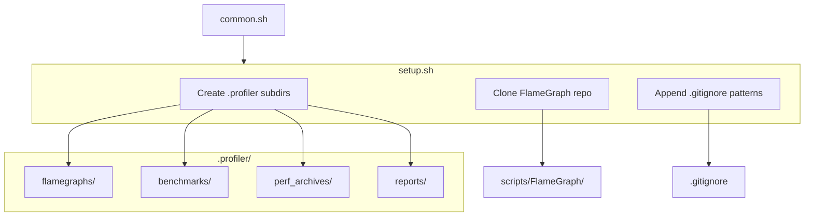
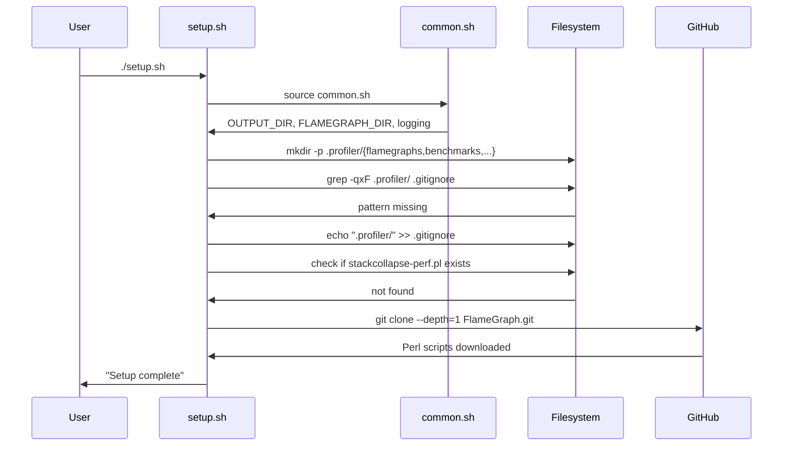

# setup.sh spec

## 1. Overview

**Role**: One-time environment preparation for the profiler skill. Creates `.profiler/` subdirectory structure, adds gitignore patterns, and clones Brendan Gregg's FlameGraph repository if not present.

**Language**: Shell (Bash, sources `common.sh`)

**Lifecycle**: Source common.sh → `mkdir -p` subdirs → append `.gitignore` entries → clone FlameGraph if missing

**Cross-references**: Depends on `common.sh` (OUTPUT_DIR, FLAMEGRAPH_DIR, DATA_DIR). Produces the FlameGraph scripts consumed by `profile.sh` and `compare.sh`.

## 2. Component Specifications

### CLI Interface

```
Usage: ./setup.sh
```
No arguments.

### Processing Steps

1. **Source common.sh** — get OUTPUT_DIR, FLAMEGRAPH_DIR, DATA_DIR, logging functions
2. **Create output dirs** — `mkdir -p $OUTPUT_DIR/{flamegraphs,benchmarks,perf_archives,reports}`
3. **Gitignore entries** — Append `test/data/` and `.profiler/` to `.gitignore` if not already present
4. **Clone FlameGraph** — If `$FLAMEGRAPH_DIR/stackcollapse-perf.pl` doesn't exist, clone `git clone --depth=1 https://github.com/brendangregg/FlameGraph.git`

### Exit Codes

| Code | Condition |
|------|-----------|
| 0 | Setup completed successfully |
| 1 | FlameGraph clone failed |

## 3. System Architecture



## 4. Detailed Data Flow



## 5. Visualization

### Animation Source

```html
<!DOCTYPE html>
<html>
<head><meta charset="utf-8"><title>Profiler Setup</title><script src="https://d3js.org/d3.v7.min.js"></script>
<style>
body{font-family:monospace;background:#1e1e2e;color:#cdd6f4;margin:0;padding:20px}
.controls{margin-bottom:15px}
.controls button{background:#45475a;color:#cdd6f4;border:1px solid #585b70;padding:6px 16px;cursor:pointer;font-family:monospace;font-size:13px}
.controls button:hover{background:#585b70}
.controls span{margin:0 12px;font-size:13px;color:#a6adc8}
#vis{width:680px;height:340px;border:1px solid #45475a;background:#181825;overflow:hidden;position:relative}
.log{margin-top:10px;max-height:80px;overflow-y:auto;font-size:11px;color:#a6adc8}
.log div{padding:1px 0;border-bottom:1px solid #313244}
.step{fill:#313244;stroke:#585b70;rx:4}
.step-label{fill:#cdd6f4;font-size:11px;text-anchor:middle;dominant-baseline:central}
</style>
</head>
<body>
<div class="controls"><button id="play-pause" data-testid="play-pause">Play</button><button id="replay">Replay</button><span id="kf-label">0/<span id="kf-total">0</span></span></div>
<div id="vis"><svg width="680" height="340"><g id="steps"></g></svg></div>
<div class="log" id="log"></div>
<script>
(function(){
const keyframes=[{time:0,label:'idle'},{time:700,label:'sourcing'},{time:1800,label:'creating-dirs'},{time:3000,label:'updating-gitignore'},{time:4200,label:'cloning-flamegraph'},{time:5500,label:'done'}];
const verification=[{label:'idle',hor:0,ver:0,precision:0,logCount:0},{label:'sourcing',hor:1,ver:0,precision:0,logCount:1},{label:'creating-dirs',hor:3,ver:1,precision:0,logCount:2},{label:'updating-gitignore',hor:4,ver:2,precision:1,logCount:3},{label:'cloning-flamegraph',hor:5,ver:2,precision:2,logCount:4},{label:'done',hor:6,ver:3,precision:3,logCount:5}];
const T=5500;window.ANIMATION_DURATION_MS=T;window.ANIMATION_KEYFRAMES=keyframes;window.ANIMATION_VERIFICATION=verification;
let ck=0,pl=false,tm=null;
const svg=d3.select('#vis svg'),lg=document.getElementById('log'),pb=document.getElementById('play-pause'),rb=document.getElementById('replay'),kl=document.getElementById('kf-label'),kt=document.getElementById('kf-total');
kt.textContent=keyframes.length-1;
const steps=[{l:'source common.sh'},{l:'mkdir -p .profiler/*/'},{l:'echo .profiler/ >> .gitignore'},{l:'git clone FlameGraph.git'},{l:'done'}];
function ul(c){lg.innerHTML='';const e=['setup.sh: waiting','setup.sh: sourcing common.sh','setup.sh: creating .profiler subdirectories','setup.sh: updating .gitignore (2 patterns)','setup.sh: cloning FlameGraph (depth=1)','setup.sh: complete'];for(let i=0;i<=Math.min(c,e.length-1);i++){const d=document.createElement('div');d.textContent=e[i];lg.appendChild(d)}}
function rs(i){ck=i;kl.textContent=i+'/'+(keyframes.length-1);const g=svg.select('#steps');g.selectAll('*').remove();const sh=Math.min(i,steps.length);for(let j=0;j<sh;j++){const y=40+j*50;g.append('rect').attr('class','step').attr('x',40).attr('y',y).attr('width',360).attr('height',34).attr('fill','#313244').attr('stroke',j===sh-1&&i<steps.length?'#f9e2af':'#585b70');g.append('text').attr('class','step-label').attr('x',220).attr('y',y+19).text(steps[j].l);const cl=j<3?'#f9e2af':j<4?'#89b4fa':'#a6e3a1';g.append('circle').attr('cx',420).attr('cy',y+17).attr('r',5).attr('fill',cl)}ul(i)}
function jk(idx){if(idx<0||idx>=keyframes.length)return;pl=false;pb.textContent='Play';if(tm){clearInterval(tm);tm=null}rs(idx)}
window.jumpToKeyframe=jk;
function ra(){jk(0)}window.resetAnimation=ra;
function gas(){const v=verification[ck]||verification[0];return{hor:v.hor,ver:v.ver,precision:v.precision,boundsOpacity:0,logCount:v.logCount,keyframeIdx:ck,keyframeLabel:keyframes[ck].label}}
window.getAnimationState=gas;
rs(0);
pb.addEventListener('click',function(){if(pl){pl=false;pb.textContent='Play';if(tm){clearInterval(tm);tm=null}}else{pl=true;pb.textContent='Pause';if(ck>=keyframes.length-1)ck=0;const st=T/(keyframes.length-1);tm=setInterval(()=>{if(ck<keyframes.length-1)jk(ck+1);else{pl=false;pb.textContent='Play';clearInterval(tm);tm=null}},st)}});
rb.addEventListener('click',function(){ra();pl=true;pb.textContent='Pause';const st=T/(keyframes.length-1);tm=setInterval(()=>{if(ck<keyframes.length-1)jk(ck+1);else{pl=false;pb.textContent='Play';clearInterval(tm);tm=null}},st)});
})();
</script>
</body>
</html>
```

## 6. Testing Requirements

| Test ID | Scenario | Steps | Expected |
|---------|----------|-------|----------|
| PS01 | Dry-run mkdir | `bash -c 'source setup.sh'` | .profiler subdirs created |
| PS02 | Gitignore idempotent | Run setup.sh twice | .gitignore has no duplicate patterns |
| PS03 | FlameGraph already cloned | Run setup.sh twice | Second run skips clone, log: "already present" |

## 7. Cross-References

| Direction | Spec File | Relationship |
|-----------|-----------|--------------|
| Sources | `.opencode/skills/profiler/scripts/common.spec.md` | Sources common.sh for paths, logging |
| Consumed by | `.opencode/skills/profiler/scripts/profile.spec.md` | Installs FlameGraph scripts that profile.sh consumes |
