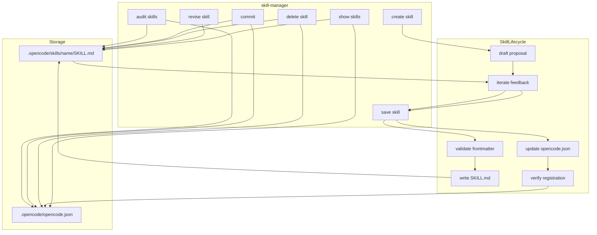
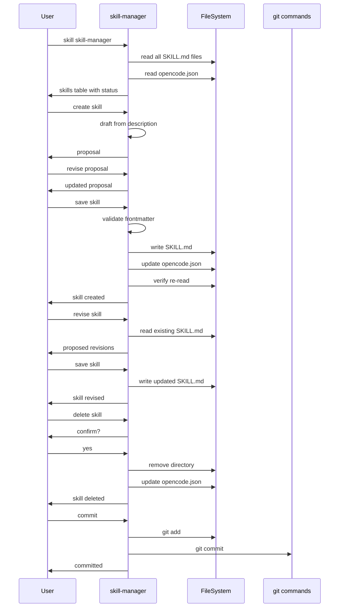

# SKILL.spec.md — skill-manager

## 1. Overview

**Role**: Interactive skill management agent for creating, revising, and maintaining opencode skills through conversational design. Creates and updates SKILL.md files in `.opencode/skills/` and manages `opencode.json` permissions.

**Persona**: Senior developer tooling architect with deep expertise in designing agent workflows, CLI tooling, and reusable automation pipelines.

**Activation Behavior**: Read all `.opencode/skills/*/SKILL.md` files and `opencode.json`. Run `show skills` to output table. Detect unregistered skills. Wait for command.

**Commands**:

| Command | Description |
|---------|-------------|
| `show skills [name]` | List all skills in table, or show specific skill details |
| `create skill` | Propose-revise-save loop: draft skill from free-form description, iterate, save on explicit `save skill` |
| `revise skill <name>` | Review existing SKILL.md, propose structured revisions, apply on `save skill` |
| `save skill` | Generate complete SKILL.md from agreed design, persist to disk, update opencode.json |
| `delete skill <name>` | Confirm then remove skill directory and opencode.json permission |
| `commit` | Create git commit with all skill changes (stages only `.opencode/skills/` and `opencode.json`) |
| `audit skills` | Cross-reference session context against skills, propose targeted revisions |

## 2. Component Specifications

### `SkillManager`

```
CLASS SkillManager
  METHODS:
    showSkills(name: str) -> void
      readAllSkills() -> SkillInfo[]
      detectUnregistered() -> SkillInfo[]
      outputTable(skills: SkillInfo[]) -> void
    createSkill() -> void
      draftFromDescription(desc: str) -> SkillDraft
      proposeComplete(draft: SkillDraft) -> void
      iterateOnFeedback(proposal: SkillDraft) -> void
      rejectExistingName(name: str) -> bool
    reviseSkill(name: str) -> void
      readExistingSkill(name: str) -> str
      analyzeChanges(requested: str) -> Revision[]
      proposeRevisions(revisions: Revision[]) -> void
    saveSkill() -> void
      validateFrontmatter(skill: SkillDraft) -> bool
      writeSkillFile(path: str, content: str) -> void
      updatePermissions(name: str) -> void
      verifyPermissions(name: str) -> bool
    deleteSkill(name: str) -> void
      confirmWithUser() -> bool
      rejectSelfDeletion(name: str) -> bool
      removeDirectory(path: str) -> void
      removePermission(name: str) -> void
    commit() -> void
      stageSkillFiles() -> void
      buildCommitMessage() -> str
    auditSkills() -> void
      collectSessionContext() -> SessionContext
      identifyCoverageGaps() -> Gap[]
      crossReferenceSkills() -> Overlap[]
      proposeRevisions() -> AuditProposal[]
```

### `SkillDraft`

```
TEMPLATE:
  Name: <kebab-case>
  Description: <one-line summary>
  Persona: <who the agent plays>
  On activation: <what happens on first invoke>
  Commands: <list with name and description>
  Design principles: <conventions, edge cases, guardrails>
```

## 3. System Architecture



## 4. Detailed Data Flow



## 5. Visualization

```html
<!DOCTYPE html>
<html>
<head>
<meta charset="utf-8">
<title>skill-manager Workflow</title>
<script src="https://d3js.org/d3.v7.min.js"></script>
</head>
<body>
<div id="animation" style="width:720px;height:480px;font-family:sans-serif;background:#f8f9fa;position:relative;overflow:hidden;">
  <div id="title" style="position:absolute;top:10px;left:20px;font-size:18px;font-weight:bold;color:#333;">Skill Manager Workflow</div>
  <div id="flow" style="position:absolute;top:50px;left:20px;width:680px;height:360px;"></div>
  <div id="controls" style="position:absolute;bottom:10px;left:0;width:100%;text-align:center;">
    <button data-testid="play-pause" id="play-btn" style="margin:0 5px;padding:4px 16px;cursor:pointer;">Play</button>
    <button id="replay-btn" style="margin:0 5px;padding:4px 16px;cursor:pointer;">Replay</button>
    <span id="kf-counter" style="margin-left:10px;font-size:14px;">0/<span id="kf-total">7</span></span>
  </div>
</div>
<script>
(function() {
  var totalDuration = 14000;
  var keyframes = [
    { time: 0, label: "activate" },
    { time: 2000, label: "show-skills" },
    { time: 4000, label: "create-revise" },
    { time: 6000, label: "propose" },
    { time: 8000, label: "save-skill" },
    { time: 10000, label: "delete-skill" },
    { time: 12000, label: "commit" },
    { time: 14000, label: "complete" }
  ];

  window.ANIMATION_DURATION_MS = totalDuration;
  window.ANIMATION_KEYFRAMES = keyframes;
  window.ANIMATION_VERIFICATION = keyframes.map(function(kf) {
    return { label: kf.label, hor: 0, ver: 0, precision: 1, logCount: 0 };
  });

  var steps = [
    { label: "Activate", x: 340, y: 20, color: "#4caf50" },
    { label: "Show Skills", x: 340, y: 65, color: "#2196f3" },
    { label: "Create or Revise", x: 340, y: 110, color: "#ff9800" },
    { label: "Propose Design", x: 340, y: 155, color: "#9c27b0" },
    { label: "Save Skill", x: 340, y: 200, color: "#f44336" },
    { label: "Delete Skill", x: 340, y: 245, color: "#00bcd4" },
    { label: "Commit Changes", x: 340, y: 290, color: "#607d8b" },
    { label: "Complete", x: 340, y: 335, color: "#795548" }
  ];

  var svg = d3.select("#flow").append("svg")
    .attr("width", 680).attr("height", 360);

  var arrows = svg.append("g").attr("class", "arrows");
  var boxes = svg.append("g").attr("class", "boxes");
  var label = svg.append("text")
    .attr("x", 340).attr("y", 15)
    .attr("text-anchor", "middle")
    .attr("font-size", "12")
    .attr("fill", "#666");

  var rects = boxes.selectAll("rect")
    .data(steps).enter()
    .append("rect")
    .attr("x", function(d) { return d.x - 80; })
    .attr("y", function(d) { return d.y; })
    .attr("width", 160)
    .attr("height", 34)
    .attr("rx", 6)
    .attr("ry", 6)
    .attr("fill", function(d) { return d.color; })
    .attr("opacity", 0.15)
    .attr("stroke", function(d) { return d.color; })
    .attr("stroke-width", 1.5);

  boxes.selectAll("text")
    .data(steps).enter()
    .append("text")
    .attr("x", function(d) { return d.x; })
    .attr("y", function(d) { return d.y + 22; })
    .attr("text-anchor", "middle")
    .attr("font-size", "11")
    .attr("fill", "#333")
    .text(function(d) { return d.label; });

  arrows.selectAll("line")
    .data(steps.slice(0, -1)).enter()
    .append("line")
    .attr("x1", function(d) { return d.x; })
    .attr("y1", function(d) { return d.y + 34; })
    .attr("x2", function(d) { return d.x; })
    .attr("y2", function(d, i) { return steps[i + 1].y; })
    .attr("stroke", "#999")
    .attr("stroke-width", 1.5)
    .attr("stroke-dasharray", "4,2")
    .attr("opacity", 0.3);

  var currentFrame = 0;
  var isPlaying = false;
  var timer = null;

  function updateFrame(idx) {
    currentFrame = Math.max(0, Math.min(idx, keyframes.length - 1));
    var kfLabel = keyframes[currentFrame].label;
    label.text(kfLabel.replace(/-/g, " "));
    rects.attr("opacity", function(d, i) { return i < currentFrame ? 0.85 : 0.15; });
    document.getElementById("kf-counter").textContent = currentFrame + "/";
  }

  window.jumpToKeyframe = function(idx) {
    if (isPlaying) togglePlay();
    updateFrame(idx);
  };

  window.resetAnimation = function() {
    if (isPlaying) togglePlay();
    updateFrame(0);
    rects.attr("opacity", 0.15);
    label.text("ready");
  };

  window.getAnimationState = function() {
    return {
      hor: currentFrame,
      ver: 0,
      precision: 1,
      logCount: currentFrame,
      keyframeIdx: currentFrame,
      keyframeLabel: keyframes[currentFrame] ? keyframes[currentFrame].label : ""
    };
  };

  function togglePlay() {
    isPlaying = !isPlaying;
    document.getElementById("play-btn").textContent = isPlaying ? "Pause" : "Play";
    if (isPlaying) {
      timer = setInterval(function() {
        currentFrame++;
        if (currentFrame >= keyframes.length) {
          currentFrame = keyframes.length - 1;
          togglePlay();
          return;
        }
        updateFrame(currentFrame);
      }, totalDuration / keyframes.length);
    } else {
      clearInterval(timer);
    }
  }

  document.getElementById("play-btn").addEventListener("click", togglePlay);
  document.getElementById("replay-btn").addEventListener("click", function() {
    window.resetAnimation();
    setTimeout(togglePlay, 300);
  });
})();
</script>
</body>
</html>
```

## 6. Testing Requirements

| Test ID | Description | Verification |
|---------|-------------|--------------|
| SM-001 | Mermaid architecture diagram renders to PNG | `npm run test-artifacts --file source/.opencode/skills/skill-manager/SKILL.spec.md` passes |
| SM-002 | Mermaid sequence diagram renders to PNG | Both mermaid diagrams render without errors |
| SM-003 | D3 animation captures 8 keyframes | Filmstrip test captures 8 frames |
| SM-004 | Animation globals present | `getAnimationState` returns expected shape |

## 7. Cross-References

- **Context safety**: Must NEVER use `skill` tool to load other skills (uses `read` tool instead)
- **Protected**: Cannot delete itself (`delete skill` rejects `skill-manager`)
- **Loaded by**: `AGENTS.md` (on demand via `skill skill-manager`)
- **Related**: All 10 other skills (reads their SKILL.md files), `issue` (commit command references), `system-design` (shared propose-revise-generate pattern)
