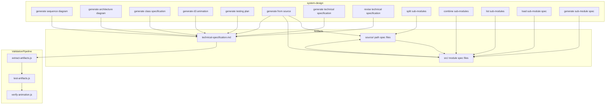
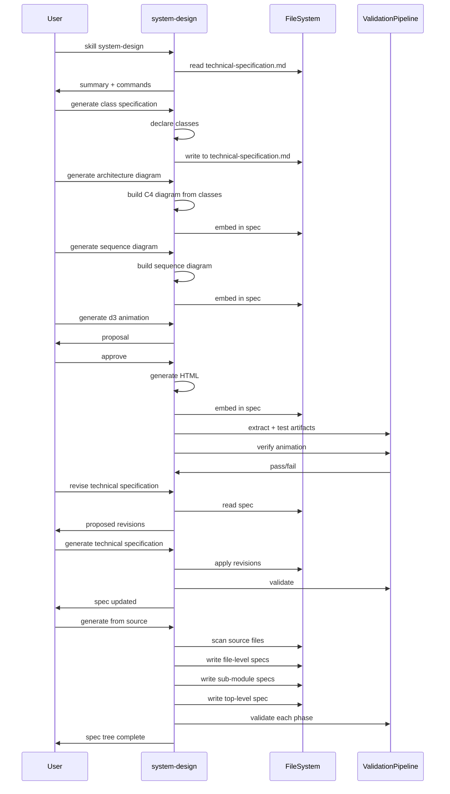

# SKILL.spec.md — system-design

## 1. Overview

**Role**: Interactive system design agent for iteratively refining technical specifications through conversational analysis, diagramming, and revision. Creates and updates `technical-specification.md`.

**Persona**: Senior video encoding systems engineer with deep expertise in C++14 performance-critical code, SIMD optimization, and H.266/VVC video compression.

**Activation Behavior**: Read `technical-specification.md` and output summary. If missing, skip to step 2. Load C++ conventions. Surface available commands. Wait for user.

**Commands** (from frontmatter and sections):

| Command | Description |
|---------|-------------|
| `generate sequence diagram` | Generate Mermaid sequenceDiagram, embed in technical-specification.md, validate |
| `generate architecture diagram` | Generate Mermaid graph TB C4 container diagram, embed, validate |
| `generate class specification` | Produce complete C++ class declarations following project conventions |
| `generate manim animation` | Generate self-contained Python Manim script for state machine visualization |
| `generate d3 animation` | Generate self-contained HTML D3.js animation with keyframes, verify |
| `generate testing plan` | Produce structured testing plan covering regression, unit, integration |
| `generate from source` | Generate project-wide specification tree bottom-up from source files |
| `generate technical specification` | Produce complete C++ class specification with diagrams and testing plan |
| `revise technical specification` | Review spec against design decisions, propose structured revisions |
| `split sub-modules` | Break monolithic spec into sub-modules with facades |
| `combine sub-modules` | Flatten sub-module specs back to monolithic document |
| `list sub-modules` | List all sub-module names, facades, and spec file paths |
| `load sub-module spec <path>` | Integrate sub-module spec into active specification |
| `generate sub-module spec <name>` | Generate `.spec.md` for a specific sub-module |

## 2. Component Specifications

### `SystemDesignEngine`

```
CLASS SystemDesignEngine
  METHODS:
    activate() -> void
      readSpecFile() -> Summary or null
      loadCppConventions() -> Conventions
      showCommands() -> void
    generateSequenceDiagram() -> void
      buildDiagram(classes: ClassDecl[]) -> str
      embedInSpec(diagram: str) -> void
      validate() -> bool
    generateArchitectureDiagram() -> void
      buildC4Diagram(classes: ClassDecl[]) -> str
      embedInSpec(diagram: str) -> void
      validate() -> bool
    generateClassSpecification() -> void
      declareClasses(design: Design) -> ClassDecl[]
      outputToSpec(classes: ClassDecl[]) -> void
    generateManimAnimation() -> void
      createManimScript(design: Design) -> str
      saveAsAnimationPy(script: str) -> void
    generateD3Animation() -> void
      proposeDesign() -> D3Proposal
      iterateOnFeedback() -> void
      generateHtml(proposal: D3Proposal) -> str
      embedInSpec(html: str) -> void
      validate() -> bool
      verify() -> bool
    generateTestingPlan() -> void
      readRegressionBaseline() -> File[]
      generateUnitTests() -> TestSuite[]
      generateIntegrationTests() -> TestSuite[]
    generateFromSource() -> void
      phase1FileSpecs() -> void
      phase15CrossReferences() -> void
      phase2SubModules() -> void
      phase3TopLevel() -> void
    generateTechnicalSpecification() -> void
      buildMonolithic() -> void
      buildSubModuleAware() -> void
    reviseTechnicalSpecification() -> void
      analyze(original: str, decisions: Decision[]) -> Revision[]
      propose(revisions: Revision[]) -> void
      apply(revisions: Revision[]) -> void
```

## 3. System Architecture



## 4. Detailed Data Flow



## 5. Visualization

```html
<!DOCTYPE html>
<html>
<head>
<meta charset="utf-8">
<title>system-design Flow</title>
<script src="https://d3js.org/d3.v7.min.js"></script>
</head>
<body>
<div id="animation" style="width:720px;height:480px;font-family:sans-serif;background:#f8f9fa;position:relative;overflow:hidden;">
  <div id="title" style="position:absolute;top:10px;left:20px;font-size:18px;font-weight:bold;color:#333;">System Design Workflow</div>
  <div id="flow" style="position:absolute;top:50px;left:20px;width:680px;height:360px;"></div>
  <div id="controls" style="position:absolute;bottom:10px;left:0;width:100%;text-align:center;">
    <button data-testid="play-pause" id="play-btn" style="margin:0 5px;padding:4px 16px;cursor:pointer;">Play</button>
    <button id="replay-btn" style="margin:0 5px;padding:4px 16px;cursor:pointer;">Replay</button>
    <span id="kf-counter" style="margin-left:10px;font-size:14px;">0/<span id="kf-total">7</span></span>
  </div>
</div>
<script>
(function() {
  var totalDuration = 14000;
  var keyframes = [
    { time: 0, label: "activate" },
    { time: 2000, label: "read-spec" },
    { time: 4000, label: "class-spec" },
    { time: 6000, label: "architecture-diagram" },
    { time: 8000, label: "sequence-diagram" },
    { time: 10000, label: "d3-animation" },
    { time: 12000, label: "validate" },
    { time: 14000, label: "complete" }
  ];

  window.ANIMATION_DURATION_MS = totalDuration;
  window.ANIMATION_KEYFRAMES = keyframes;
  window.ANIMATION_VERIFICATION = keyframes.map(function(kf) {
    return { label: kf.label, hor: 0, ver: 0, precision: 1, logCount: 0 };
  });

  var steps = [
    { label: "Activate", x: 340, y: 20, color: "#4caf50" },
    { label: "Read Spec", x: 340, y: 65, color: "#2196f3" },
    { label: "Class Spec", x: 340, y: 110, color: "#ff9800" },
    { label: "Architecture Diagram", x: 340, y: 155, color: "#9c27b0" },
    { label: "Sequence Diagram", x: 340, y: 200, color: "#f44336" },
    { label: "D3 Animation", x: 340, y: 245, color: "#00bcd4" },
    { label: "Validate", x: 340, y: 290, color: "#607d8b" },
    { label: "Complete", x: 340, y: 335, color: "#795548" }
  ];

  var svg = d3.select("#flow").append("svg")
    .attr("width", 680).attr("height", 360);

  var arrows = svg.append("g").attr("class", "arrows");
  var boxes = svg.append("g").attr("class", "boxes");
  var label = svg.append("text")
    .attr("x", 340).attr("y", 15)
    .attr("text-anchor", "middle")
    .attr("font-size", "12")
    .attr("fill", "#666");

  var rects = boxes.selectAll("rect")
    .data(steps).enter()
    .append("rect")
    .attr("x", function(d) { return d.x - 80; })
    .attr("y", function(d) { return d.y; })
    .attr("width", 160)
    .attr("height", 34)
    .attr("rx", 6)
    .attr("ry", 6)
    .attr("fill", function(d) { return d.color; })
    .attr("opacity", 0.15)
    .attr("stroke", function(d) { return d.color; })
    .attr("stroke-width", 1.5);

  boxes.selectAll("text")
    .data(steps).enter()
    .append("text")
    .attr("x", function(d) { return d.x; })
    .attr("y", function(d) { return d.y + 22; })
    .attr("text-anchor", "middle")
    .attr("font-size", "11")
    .attr("fill", "#333")
    .text(function(d) { return d.label; });

  arrows.selectAll("line")
    .data(steps.slice(0, -1)).enter()
    .append("line")
    .attr("x1", function(d) { return d.x; })
    .attr("y1", function(d) { return d.y + 34; })
    .attr("x2", function(d) { return d.x; })
    .attr("y2", function(d, i) { return steps[i + 1].y; })
    .attr("stroke", "#999")
    .attr("stroke-width", 1.5)
    .attr("stroke-dasharray", "4,2")
    .attr("opacity", 0.3);

  var currentFrame = 0;
  var isPlaying = false;
  var timer = null;

  function updateFrame(idx) {
    currentFrame = Math.max(0, Math.min(idx, keyframes.length - 1));
    var kfLabel = keyframes[currentFrame].label;
    label.text(kfLabel.replace(/-/g, " "));
    rects.attr("opacity", function(d, i) { return i < currentFrame ? 0.85 : 0.15; });
    document.getElementById("kf-counter").textContent = currentFrame + "/";
  }

  window.jumpToKeyframe = function(idx) {
    if (isPlaying) togglePlay();
    updateFrame(idx);
  };

  window.resetAnimation = function() {
    if (isPlaying) togglePlay();
    updateFrame(0);
    rects.attr("opacity", 0.15);
    label.text("ready");
  };

  window.getAnimationState = function() {
    return {
      hor: currentFrame,
      ver: 0,
      precision: 1,
      logCount: currentFrame,
      keyframeIdx: currentFrame,
      keyframeLabel: keyframes[currentFrame] ? keyframes[currentFrame].label : ""
    };
  };

  function togglePlay() {
    isPlaying = !isPlaying;
    document.getElementById("play-btn").textContent = isPlaying ? "Pause" : "Play";
    if (isPlaying) {
      timer = setInterval(function() {
        currentFrame++;
        if (currentFrame >= keyframes.length) {
          currentFrame = keyframes.length - 1;
          togglePlay();
          return;
        }
        updateFrame(currentFrame);
      }, totalDuration / keyframes.length);
    } else {
      clearInterval(timer);
    }
  }

  document.getElementById("play-btn").addEventListener("click", togglePlay);
  document.getElementById("replay-btn").addEventListener("click", function() {
    window.resetAnimation();
    setTimeout(togglePlay, 300);
  });
})();
</script>
</body>
</html>
```

## 6. Testing Requirements

| Test ID | Description | Verification |
|---------|-------------|--------------|
| SD-001 | Mermaid architecture diagram renders to PNG | `npm run test-artifacts --file source/.opencode/skills/system-design/SKILL.spec.md` passes |
| SD-002 | Mermaid sequence diagram renders to PNG | Both diagrams render via mmdc |
| SD-003 | D3 animation captures 8 keyframes | Filmstrip captures 8 labeled frames |
| SD-004 | Animation globals present | `getAnimationState` returns expected shape |

## 7. Cross-References

- **Mandatory dependency of**: `AGENTS.md` — loaded at every session start
- **Dependency of**: `asm-optimizer` (uses spec generation approach), `system-design-review` (audits specs)
- **Uses**: artifact pipeline (`scripts/extract-artifacts.js`, `scripts/test-artifacts.js`, `scripts/verify-animation.js`)
- **Loaded by**: `AGENTS.md` (mandatory at session start)
- **Related**: `skill-manager` (shared propose-revise-generate pattern)
