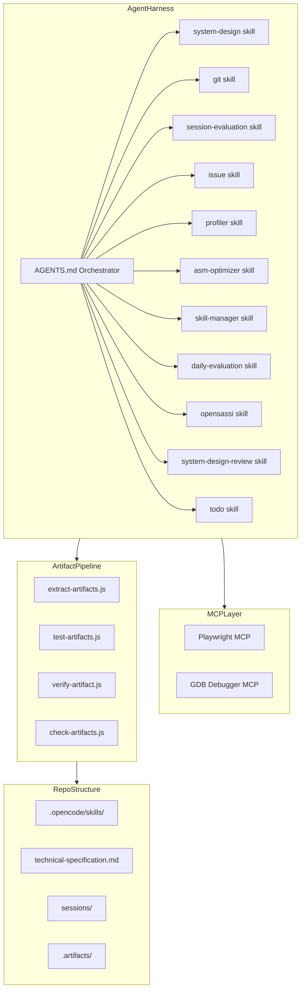
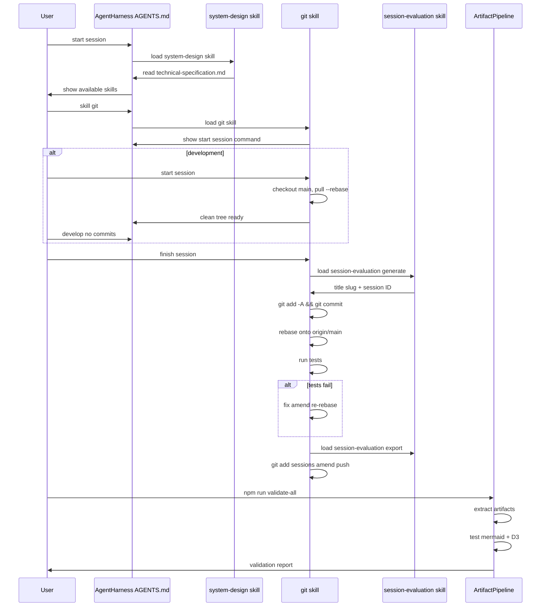

# AGENTS.md Specification — Agent Harness Orchestrator

## 1. Overview

**Role**: Master orchestrator for the opencode agent harness. Defines the meta-repository structure, skill loading conventions, session workflow, MCP tool configuration, artifact pipeline, and design constraints.

**Activation Behavior**: Loaded automatically at session start. Loads `skill system-design` mandatorily. Other skills are loaded on demand via `skill <name>`.

**Commands** (from frontmatter and sections):

| Command | Description |
|---------|-------------|
| `skill system-design` | Load system-design skill (mandatory at session start) |
| `skill <name>` | Load any other registered skill on demand |
| `npm run extract` | Extract diagrams from technical-specification.md |
| `npm run test-artifacts` | Validate artifacts (SVG, PNG, D3 keyframes) |
| `npm run validate-all` | `extract --all` + `test-artifacts` |
| `npm run verify-animation -- --file <path>` | D3 keyframe verification |
| `npm run check-artifacts` | Staleness check |

**Skills Registered**: asm-optimizer, daily-evaluation, git, issue, opensassi, profiler, session-evaluation, skill-manager, system-design, system-design-review, todo

## 2. Component Specifications

### `AgentHarness`

```typescript
interface AgentHarness {
  loadSystemDesign(): void;         // Load skill system-design at session start
  loadSkill(name: string): void;     // Load on-demand skill
  getRegisteredSkills(): Skill[];    // List all "allow"-ed skills
}

interface MCPTool {
  name: string;
  command: string;
  args: string[];
}

interface SessionWorkflow {
  start(): void;                     // checkout main, pull --rebase, verify clean
  develop(): void;                   // no commits, git add -A at finish
  finish(): void;                    // commit, rebase, test, eval, push
}
```

### `ArtifactPipeline`

```typescript
interface ArtifactPipeline {
  extract(filePath?: string): void;  // Extract mermaid + D3 from spec files
  testArtifacts(filePath?: string): boolean; // Validate extracted artifacts
  validateAll(): boolean;            // Extract all + test all
  verifyAnimation(filePath: string): boolean; // Verify D3 keyframe assertions
  checkArtifacts(): StaleEntry[];    // Find stale/outdated artifacts
}
```

### Config (`opencode.json`)

```typescript
interface OpencodeConfig {
  skills: Record<string, "allow">;   // Permission map
  mcpServers?: Record<string, MCPTool>;
  ignore: string[];                  // Glob patterns to ignore
}
```

## 3. System Architecture



## 4. Detailed Data Flow



## 5. Visualization

```html
<!DOCTYPE html>
<html>
<head>
<meta charset="utf-8">
<title>AGENTS.md Orchestrator Flow</title>
<script src="https://d3js.org/d3.v7.min.js"></script>
</head>
<body>
<div id="animation" style="width:720px;height:480px;font-family:sans-serif;background:#f8f9fa;position:relative;overflow:hidden;">
  <div id="title" style="position:absolute;top:10px;left:20px;font-size:18px;font-weight:bold;color:#333;">Agent Harness Orchestrator</div>
  <div id="flow" style="position:absolute;top:50px;left:20px;width:680px;height:360px;"></div>
  <div id="controls" style="position:absolute;bottom:10px;left:0;width:100%;text-align:center;">
    <button data-testid="play-pause" id="play-btn" style="margin:0 5px;padding:4px 16px;cursor:pointer;">Play</button>
    <button id="replay-btn" style="margin:0 5px;padding:4px 16px;cursor:pointer;">Replay</button>
    <span id="kf-counter" style="margin-left:10px;font-size:14px;">0/<span id="kf-total">7</span></span>
  </div>
</div>
<script>
(function() {
  const totalDuration = 14000;
  const keyframes = [
    { time: 0, label: "session-start" },
    { time: 2000, label: "system-design-load" },
    { time: 4000, label: "skill-load" },
    { time: 6000, label: "start-session" },
    { time: 8000, label: "finish-session" },
    { time: 10000, label: "test-rebase" },
    { time: 12000, label: "artifact-validation" },
    { time: 14000, label: "session-complete" }
  ];

  window.ANIMATION_DURATION_MS = totalDuration;
  window.ANIMATION_KEYFRAMES = keyframes;
  window.ANIMATION_VERIFICATION = keyframes.map(kf => ({
    label: kf.label,
    hor: 0,
    ver: 0,
    precision: 1,
    logCount: 0
  }));

  const steps = [
    { label: "Start Session", x: 340, y: 30, color: "#4caf50" },
    { label: "Load System Design", x: 340, y: 80, color: "#2196f3" },
    { label: "Load Skill On Demand", x: 340, y: 130, color: "#ff9800" },
    { label: "Develop No Commits", x: 340, y: 180, color: "#9c27b0" },
    { label: "Finish Session", x: 340, y: 230, color: "#f44336" },
    { label: "Rebase + Test", x: 340, y: 280, color: "#00bcd4" },
    { label: "Validate Artifacts", x: 340, y: 330, color: "#607d8b" }
  ];

  const svg = d3.select("#flow").append("svg")
    .attr("width", 680).attr("height", 360);

  const arrows = svg.append("g").attr("class", "arrows");
  const boxes = svg.append("g").attr("class", "boxes");
  const label = svg.append("text")
    .attr("x", 340).attr("y", 20)
    .attr("text-anchor", "middle")
    .attr("font-size", "12")
    .attr("fill", "#666");

  const rects = boxes.selectAll("rect")
    .data(steps).enter()
    .append("rect")
    .attr("x", d => d.x - 80)
    .attr("y", d => d.y)
    .attr("width", 160)
    .attr("height", 36)
    .attr("rx", 6)
    .attr("ry", 6)
    .attr("fill", d => d.color)
    .attr("opacity", 0.15)
    .attr("stroke", d => d.color)
    .attr("stroke-width", 1.5);

  boxes.selectAll("text")
    .data(steps).enter()
    .append("text")
    .attr("x", d => d.x)
    .attr("y", d => d.y + 24)
    .attr("text-anchor", "middle")
    .attr("font-size", "11")
    .attr("fill", "#333")
    .text(d => d.label);

  arrows.selectAll("line")
    .data(steps.slice(0, -1)).enter()
    .append("line")
    .attr("x1", d => d.x)
    .attr("y1", d => d.y + 36)
    .attr("x2", d => d.x)
    .attr("y2", (d, i) => steps[i + 1].y)
    .attr("stroke", "#999")
    .attr("stroke-width", 1.5)
    .attr("stroke-dasharray", "4,2")
    .attr("opacity", 0.3);

  let currentFrame = 0;
  let isPlaying = false;
  let timer = null;

  function updateFrame(idx) {
    currentFrame = Math.max(0, Math.min(idx, keyframes.length - 1));
    const kfLabel = keyframes[currentFrame].label;
    label.text(kfLabel.replace(/-/g, " "));

    rects.attr("opacity", (d, i) => i < currentFrame ? 0.85 : 0.15);
    document.getElementById("kf-counter").textContent = currentFrame + "/";
  }

  window.jumpToKeyframe = function(idx) {
    if (isPlaying) togglePlay();
    updateFrame(idx);
  };

  window.resetAnimation = function() {
    if (isPlaying) togglePlay();
    updateFrame(0);
    rects.attr("opacity", 0.15);
    label.text("ready");
  };

  window.getAnimationState = function() {
    return {
      hor: currentFrame,
      ver: 0,
      precision: 1,
      logCount: currentFrame,
      keyframeIdx: currentFrame,
      keyframeLabel: keyframes[currentFrame] ? keyframes[currentFrame].label : ""
    };
  };

  function togglePlay() {
    isPlaying = !isPlaying;
    document.getElementById("play-btn").textContent = isPlaying ? "Pause" : "Play";
    if (isPlaying) {
      timer = setInterval(function() {
        currentFrame++;
        if (currentFrame >= keyframes.length) {
          currentFrame = keyframes.length - 1;
          togglePlay();
          return;
        }
        updateFrame(currentFrame);
      }, totalDuration / keyframes.length);
    } else {
      clearInterval(timer);
    }
  }

  document.getElementById("play-btn").addEventListener("click", togglePlay);
  document.getElementById("replay-btn").addEventListener("click", function() {
    window.resetAnimation();
    setTimeout(togglePlay, 300);
  });
})();
</script>
</body>
</html>
```

## 6. Testing Requirements

| Test ID | Description | Verification |
|---------|-------------|--------------|
| AGENTS-001 | Mermaid architecture diagram renders to PNG without errors | `npm run test-artifacts --file source/AGENTS.spec.md` passes |
| AGENTS-002 | Mermaid sequence diagram renders to PNG without errors | `npm run test-artifacts --file source/AGENTS.spec.md` passes |
| AGENTS-003 | D3 animation window globals are set | `getAnimationState` returns object with `hor`, `ver`, `precision`, `logCount`, `keyframeIdx`, `keyframeLabel` |
| AGENTS-004 | Filmstrip captures all 8 keyframes | `test-artifacts.js` captures 8 frames with correct labels |

## 7. Cross-References

- **Mandatory dependency**: `system-design` skill — loaded automatically at every session start
- **Loaded on demand**: `asm-optimizer`, `daily-evaluation`, `git`, `issue`, `opensassi`, `profiler`, `session-evaluation`, `skill-manager`, `system-design-review`, `todo`
- **Configuration**: `.opencode/opencode.json` — all skills must be registered with `"allow"` permission
- **Artifact pipeline**: `scripts/extract-artifacts.js`, `scripts/test-artifacts.js`, `scripts/verify-artifact.js`, `scripts/check-artifacts.js`
- **MCP tools**: Playwright (`npx @playwright/mcp@latest --headless`), GDB Debugger (`gdb-mcp-server`)
