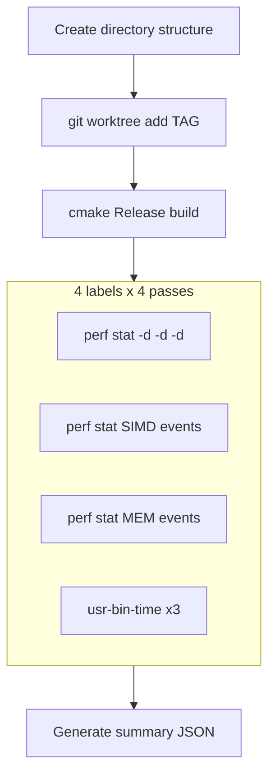
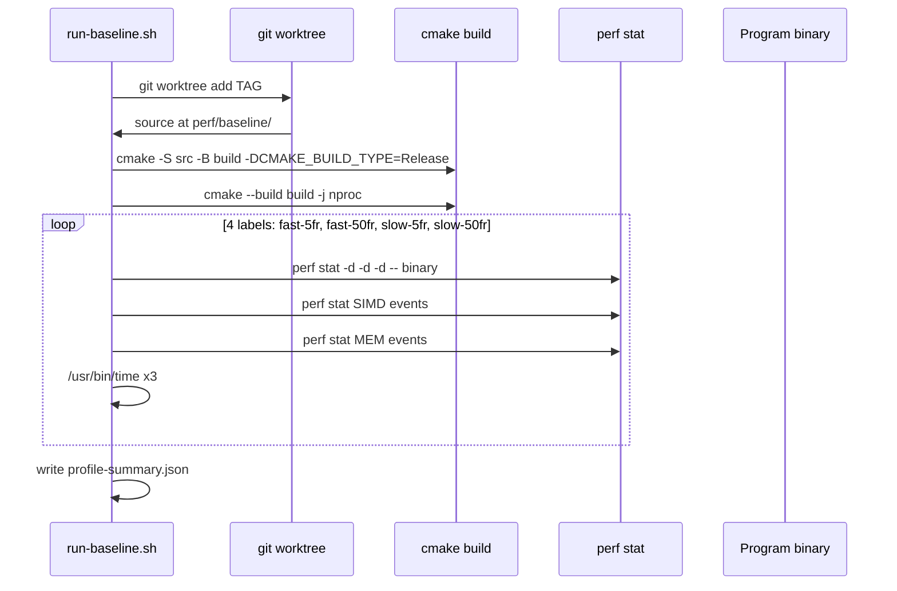

# run-baseline.sh spec

## 1. Overview

**Role**: Builds a tagged release baseline from a git worktree and runs a profiling matrix (perf stat + timing) across config/frame combinations. Produces structured profile output and a summary JSON report.

**Language**: Shell (Bash, set -euo pipefail)

**Lifecycle**: Create dirs → git worktree checkout TAG → cmake Release build → profiling matrix (2 configs × 2 frame counts × 3 perf passes + timing) → summary report

**Cross-references**: Standalone tool, cross-cutting across profiler and asm-optimizer skills. Not assigned to a sub-module. References test/data/ input files.

## 2. Component Specifications

```
Usage: ./scripts/asm-optimizer/run-baseline.sh [--rebuild]
  --rebuild    Force cmake rebuild even if binary exists
```

### Internal Functions

| Function | Description |
|----------|-------------|
| `run_perf_pass(label, config, frames, events, suffix)` | Runs perf stat with specified events, saves output |
| `run_timing_pass(label, config, frames)` | Runs `/usr/bin/time` 3 iterations, appends timing |

### Profiling Matrix

4 labels × (3 perf passes + 1 timing pass) = 16 profiling runs total

## 3. System Architecture



## 4. Detailed Data Flow



## 5. Visualization

### Animation Source

```html
<!DOCTYPE html><html><head><meta charset="utf-8"><title>Baseline Runner</title>
<script src="https://d3js.org/d3.v7.min.js"></script>
<style>body{font-family:monospace;background:#1e1e2e;color:#cdd6f4;margin:0;padding:20px}
.controls{margin-bottom:15px}.controls button{background:#45475a;color:#cdd6f4;border:1px solid #585b70;padding:6px 16px;cursor:pointer}
.controls span{margin:0 12px;font-size:13px;color:#a6adc8}
#vis{width:680px;height:340px;border:1px solid #45475a;background:#181825;overflow:hidden}
.log{margin-top:10px;max-height:80px;overflow-y:auto;font-size:11px;color:#a6adc8}
</style>
</head><body>
<div class="controls"><button id="play-pause" data-testid="play-pause">Play</button><button id="replay">Replay</button><span id="kf-label">0/<span id="kf-total">0</span></span></div>
<div id="vis"><svg width="680" height="340"><g id="s"></g></svg></div><div class="log" id="log"></div>
<script>
(function(){const kf=[{time:0,label:'idle'},{time:600,label:'setup-dirs'},{time:1800,label:'checkout-tag'},{time:3200,label:'building'},{time:4800,label:'profiling'},{time:6500,label:'report'},{time:7500,label:'done'}];const vf=[{label:'idle',hor:0,ver:0,precision:0,logCount:0},{label:'setup-dirs',hor:1,ver:0,precision:0,logCount:1},{label:'checkout-tag',hor:2,ver:0,precision:0,logCount:2},{label:'building',hor:2,ver:1,precision:1,logCount:3},{label:'profiling',hor:3,ver:2,precision:1,logCount:4},{label:'report',hor:4,ver:3,precision:2,logCount:5},{label:'done',hor:5,ver:3,precision:3,logCount:6}];const T=7500;window.ANIMATION_DURATION_MS=T;window.ANIMATION_KEYFRAMES=kf;window.ANIMATION_VERIFICATION=vf;let ck=0,pl=false,tm=null;const sv=d3.select('#vis svg'),lg=document.getElementById('log'),pb=document.getElementById('play-pause'),rb=document.getElementById('replay'),kl=document.getElementById('kf-label'),kt=document.getElementById('kf-total');kt.textContent=kf.length-1;function jk(idx){if(idx<0||idx>=kf.length)return;pl=false;pb.textContent='Play';if(tm){clearInterval(tm);tm=null}ck=idx;kl.textContent=idx+'/'+(kf.length-1);const g=sv.select('#s');g.selectAll('*').remove();const ee=['run-baseline: waiting','run-baseline: creating directories','run-baseline: git worktree add TAG','run-baseline: cmake Release build','run-baseline: profiling 4 labels x 4 passes','run-baseline: writing summary report','run-baseline: done'];for(let i=0;i<=Math.min(idx,6);i++){const d=document.createElement('div');d.textContent=ee[i];lg.appendChild(d)}if(idx>0){for(let j=0;j<Math.min(idx,6);j++){const y=30+j*42;g.append('rect').attr('x',30).attr('y',y).attr('width',400).attr('height',30).attr('fill','#313244').attr('stroke',j===Math.min(idx,6)-1?'#f9e2af':'#585b70').attr('rx',4);g.append('text').attr('x',230).attr('y',y+18).attr('fill','#cdd6f4').attr('font-size','11').attr('text-anchor','middle').text(ee[idx].replace('run-baseline: ',''))}}}window.jumpToKeyframe=jk;window.resetAnimation=function(){jk(0)};window.getAnimationState=function(){const v=vf[ck]||vf[0];return{hor:v.hor,ver:v.ver,precision:v.precision,boundsOpacity:0,logCount:v.logCount,keyframeIdx:ck,keyframeLabel:kf[ck].label}};jk(0);pb.addEventListener('click',function(){if(pl){pl=false;pb.textContent='Play';if(tm){clearInterval(tm);tm=null}}else{pl=true;pb.textContent='Pause';if(ck>=kf.length-1)ck=0;const stp=T/(kf.length-1);tm=setInterval(()=>{if(ck<kf.length-1)jk(ck+1);else{pl=false;pb.textContent='Play';clearInterval(tm);tm=null}},stp)}});rb.addEventListener('click',function(){jk(0);pl=true;pb.textContent='Pause';const stp=T/(kf.length-1);tm=setInterval(()=>{if(ck<kf.length-1)jk(ck+1);else{pl=false;pb.textContent='Play';clearInterval(tm);tm=null}},stp)});})();
</script>
</body></html>
```

## 6. Testing Requirements

| Test ID | Scenario | Expected |
|---------|----------|----------|
| RB01 | Run with --rebuild | Forces cmake rebuild |
| RB02 | Tag already checked out | Skips git worktree step |
| RB03 | Binary already exists | Skips cmake build step |
