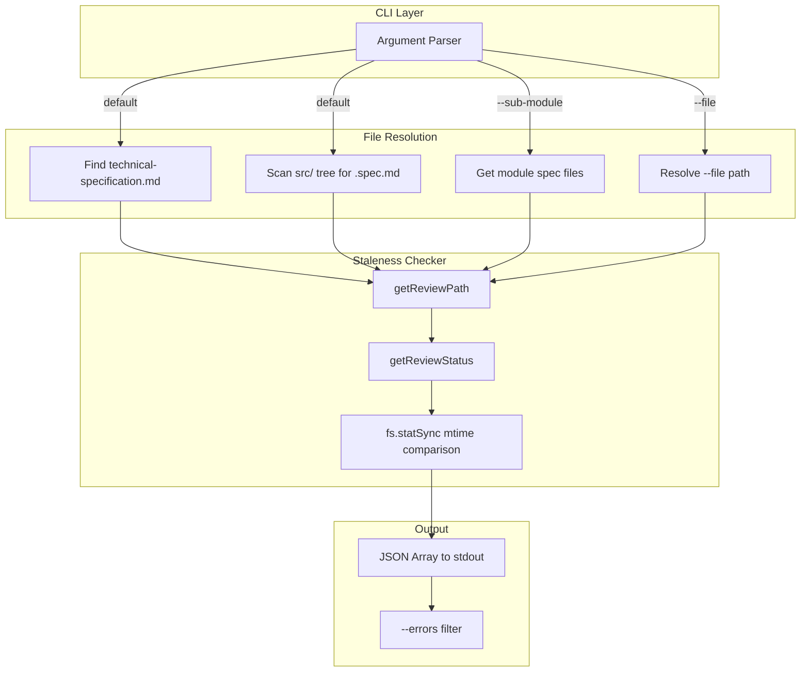
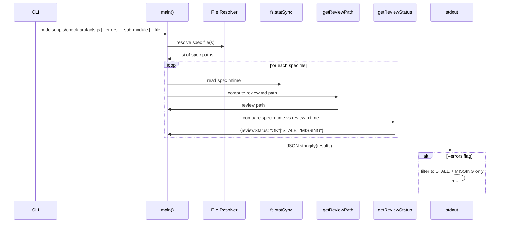

# check-artifacts.spec.md

## 1. Overview

**Role**: Staleness checker — compares spec file modification timestamps against their review artifact timestamps. Reports which spec files have been modified since their last review, indicating stale artifacts that need regeneration. Supports `--errors` flag to output only non-OK entries, `--sub-module` to scope by module, and `--file` for single-file checks.

**Language**: JavaScript (Node.js, no external dependencies beyond `fs` and `path`)

**Lifecycle**:
1. `main()` resolves spec files list based on flags
2. For each spec file, reads its `mtime` and the `review.md` mtime
3. Compares: if spec is newer than review → `"STALE"`; if no review → `"MISSING"`; otherwise → `"OK"`
4. Outputs JSON array to stdout

**Cross-references**: Used in CI pipelines after `generate from source` to detect drift. Depends on `extract-artifacts.js` directory conventions (`.artifacts/<specName>/review.md` path structure).

## 2. Component Specifications

### `get-review-path`
```
@param {string} specPath - Absolute path to a .spec.md file
@returns {string} - Expected path to the review.md file
```
For `technical-specification.md`, review path is `.artifacts/review.md`. For all other spec files, review path is `<specDir>/.artifacts/<specName>/review.md`.

### `get-review-status`
```
@param {string} specPath - Absolute path to a .spec.md file
@returns {{reviewFile: string|null, reviewMtime: number|null, reviewStatus: string}}
```
Checks if the review file exists. If missing → `"MISSING"`. If review mtime < spec mtime → `"STALE"`. Otherwise → `"OK"`.

### `get-all-spec-files`
```
@param {void}
@returns {string[]} - Absolute paths to all .spec.md files
```
Scans project root for `technical-specification.md` and `src/` directory tree for all `*.spec.md` files.

### `get-module-spec-files`
```
@param {string} name - Module directory name under src/
@returns {string[]} - Absolute paths to .spec.md files in that module
@throws {Error} - process.exit(1) if module directory not found
```
Lists all `.spec.md` files in `src/<name>/`.

### `main`
```
@param {void} - Reads process.argv for --errors, --sub-module, --file
@returns {void} - Outputs JSON array to stdout
```
Entry point. Resolves spec file list, computes review status for each, outputs filtered or full JSON.

## 3. System Architecture



## 4. Detailed Data Flow



## 5. Visualization

### Animation Source

```html
<!DOCTYPE html>
<html>
<head>
<meta charset="utf-8">
<title>Check Artifacts Staleness</title>
<script src="https://d3js.org/d3.v7.min.js"></script>
<style>
  body { font-family: monospace; background: #1e1e2e; color: #cdd6f4; margin: 0; padding: 20px; }
  .controls { margin-bottom: 15px; }
  .controls button { background: #45475a; color: #cdd6f4; border: 1px solid #585b70; padding: 6px 16px; cursor: pointer; font-family: monospace; font-size: 13px; }
  .controls button:hover { background: #585b70; }
  .controls span { margin: 0 12px; font-size: 13px; color: #a6adc8; }
  #vis { position: relative; width: 680px; height: 400px; border: 1px solid #45475a; background: #181825; overflow: hidden; }
  .log { margin-top: 10px; max-height: 80px; overflow-y: auto; font-size: 11px; color: #a6adc8; }
  .log div { padding: 1px 0; border-bottom: 1px solid #313244; }
  .spec-row { fill: #313244; stroke: #585b70; stroke-width: 1; rx: 3; }
  .ok { fill: #a6e3a1; }
  .stale { fill: #f9e2af; }
  .missing { fill: #f38ba8; }
  .legend text { fill: #a6adc8; font-size: 10px; }
</style>
</head>
<body>
<div class="controls">
  <button id="play-pause" data-testid="play-pause">Play</button>
  <button id="replay">Replay</button>
  <span id="kf-label">0/<span id="kf-total">0</span></span>
</div>
<div id="vis">
  <svg width="680" height="400">
    <g id="legend" transform="translate(400, 10)">
      <rect x="0" y="0" width="8" height="8" fill="#a6e3a1"/><text x="14" y="7">OK</text>
      <rect x="0" y="16" width="8" height="8" fill="#f9e2af"/><text x="14" y="23">STALE</text>
      <rect x="0" y="32" width="8" height="8" fill="#f38ba8"/><text x="14" y="39">MISSING</text>
    </g>
    <g id="spec-list">
      <text x="30" y="40" fill="#a6adc8" font-size="12" font-weight="bold">Spec Files</text>
    </g>
    <g id="spec-entries"></g>
  </svg>
</div>
<div class="log" id="log"></div>

<script>
(function(){
  const keyframes = [
    { time: 0,    label: 'idle' },
    { time: 800,  label: 'resolving-specs' },
    { time: 2000, label: 'checking-techspec' },
    { time: 3500, label: 'checking-modules' },
    { time: 5000, label: 'reporting-results' },
    { time: 6000, label: 'done' }
  ];

  const verification = [
    { label: 'idle', hor: 0, ver: 0, precision: 0, logCount: 0 },
    { label: 'resolving-specs', hor: 0, ver: 0, precision: 0, logCount: 1 },
    { label: 'checking-techspec', hor: 1, ver: 0, precision: 0, logCount: 2 },
    { label: 'checking-modules', hor: 3, ver: 1, precision: 0, logCount: 3 },
    { label: 'reporting-results', hor: 3, ver: 2, precision: 1, logCount: 4 },
    { label: 'done', hor: 4, ver: 2, precision: 2, logCount: 5 }
  ];

  const TOTAL_DURATION = 6000;
  window.ANIMATION_DURATION_MS = TOTAL_DURATION;
  window.ANIMATION_KEYFRAMES = keyframes;
  window.ANIMATION_VERIFICATION = verification;

  let currentKf = 0;
  let playing = false;
  let timer = null;

  const svg = d3.select('#vis svg');
  const logDiv = document.getElementById('log');
  const playBtn = document.getElementById('play-pause');
  const replayBtn = document.getElementById('replay');
  const kfLabel = document.getElementById('kf-label');
  const kfTotal = document.getElementById('kf-total');

  kfTotal.textContent = keyframes.length - 1;

  const specData = [
    { name: 'technical-specification.md', status: 'OK' },
    { name: 'src/storage/Storage.spec.md', status: 'OK' },
    { name: 'src/shard/Shard.spec.md', status: 'STALE' },
    { name: 'src/core/Core.spec.md', status: 'MISSING' },
    { name: 'scripts/extract-artifacts.spec.md', status: 'OK' }
  ];

  function updateLog(count) {
    logDiv.innerHTML = '';
    const entries = [
      'check-artifacts: waiting...',
      'check-artifacts: resolving spec file paths',
      'check-artifacts: checking technical-specification.md: OK',
      'check-artifacts: checking 3 module specs: 1 STALE, 1 MISSING',
      'check-artifacts: outputting JSON with --errors filter',
      'check-artifacts: done'
    ];
    for (let i = 0; i <= Math.min(count, entries.length - 1); i++) {
      const d = document.createElement('div');
      d.textContent = entries[i];
      logDiv.appendChild(d);
    }
    if (count >= entries.length - 1) logDiv.scrollTop = logDiv.scrollHeight;
  }

  function renderState(kfIdx) {
    currentKf = kfIdx;
    kfLabel.textContent = kfIdx + '/' + (keyframes.length - 1);

    const entriesG = svg.select('#spec-entries');
    entriesG.selectAll('*').remove();

    const showCount = Math.min(kfIdx, specData.length);
    for (let i = 0; i < showCount; i++) {
      const d = specData[i];
      const y = 60 + i * 36;
      entriesG.append('rect').attr('class', 'spec-row')
        .attr('x', 30).attr('y', y).attr('width', 340).attr('height', 28);
      entriesG.append('text')
        .attr('x', 40).attr('y', y + 18)
        .attr('fill', '#cdd6f4').attr('font-size', '11')
        .text(d.name);

      const statusColor = d.status === 'OK' ? '#a6e3a1' : d.status === 'STALE' ? '#f9e2af' : '#f38ba8';
      const statusText = d.status === 'OK' ? 'OK' : d.status === 'STALE' ? 'STALE' : 'MISSING';
      entriesG.append('text')
        .attr('x', 380).attr('y', y + 18)
        .attr('fill', statusColor).attr('font-size', '11').attr('font-weight', 'bold')
        .text(statusText);
    }

    updateLog(kfIdx);
  }

  function jumpToKeyframe(idx) {
    if (idx < 0 || idx >= keyframes.length) return;
    playing = false; playBtn.textContent = 'Play';
    if (timer) { clearInterval(timer); timer = null; }
    renderState(idx);
  }
  window.jumpToKeyframe = jumpToKeyframe;

  function resetAnimation() { jumpToKeyframe(0); }
  window.resetAnimation = resetAnimation;

  function getAnimationState() {
    const v = verification[currentKf] || verification[0];
    return { hor: v.hor, ver: v.ver, precision: v.precision, boundsOpacity: 0, logCount: v.logCount, keyframeIdx: currentKf, keyframeLabel: keyframes[currentKf].label };
  }
  window.getAnimationState = getAnimationState;

  renderState(0);

  playBtn.addEventListener('click', function() {
    if (playing) {
      playing = false; playBtn.textContent = 'Play';
      if (timer) { clearInterval(timer); timer = null; }
    } else {
      playing = true; playBtn.textContent = 'Pause';
      if (currentKf >= keyframes.length - 1) currentKf = 0;
      const stepMs = TOTAL_DURATION / (keyframes.length - 1);
      timer = setInterval(() => {
        if (currentKf < keyframes.length - 1) jumpToKeyframe(currentKf + 1);
        else { playing = false; playBtn.textContent = 'Play'; clearInterval(timer); timer = null; }
      }, stepMs);
    }
  });

  replayBtn.addEventListener('click', function() {
    resetAnimation();
    playing = true; playBtn.textContent = 'Pause';
    const stepMs = TOTAL_DURATION / (keyframes.length - 1);
    timer = setInterval(() => {
      if (currentKf < keyframes.length - 1) jumpToKeyframe(currentKf + 1);
      else { playing = false; playBtn.textContent = 'Play'; clearInterval(timer); timer = null; }
    }, stepMs);
  });
})();
</script>
</body>
</html>
```

## 6. Testing Requirements

### Unit Tests

| Test ID | Method | Input | Expected Output | Assertion |
|---------|--------|-------|-----------------|-----------|
| C01 | `getReviewPath` | `technical-specification.md` | `.artifacts/review.md` | Path ends with correct suffix |
| C02 | `getReviewPath` | `src/mod/Foo.spec.md` | `src/mod/.artifacts/Foo.spec.md/review.md` | Contains `.spec.md` subdir |
| C03 | `getReviewStatus` | Spec file with newer review | `reviewStatus: "OK"` | Exact match |
| C04 | `getReviewStatus` | Spec file modified after review | `reviewStatus: "STALE"` | Exact match |
| C05 | `getReviewStatus` | No review file exists | `reviewStatus: "MISSING"` | Exact match |
| C06 | `getAllSpecFiles` | Root spec + 3 module specs exist | Array length === 4 | All found |
| C07 | `getAllSpecFiles` | No spec files exist | Array length === 0 | No crash |
| C08 | `getModuleSpecFiles` | Module with 2 spec files | Array length === 2 | Both found |
| C09 | `getModuleSpecFiles` | Nonexistent module | `process.exit(1)` | Error message matches |

### Calling-Order Validation

| Test ID | Sequence | Expected Behavior |
|---------|----------|-------------------|
| C10 | Call with `--file` without path | Error: "Usage..." |
| C11 | Call with `--sub-module` without name | Error: "Usage..." |

### Integration Tests

| Test ID | Scenario | Steps | Expected |
|---------|----------|-------|----------|
| C12 | Extract → Check staleness | Run extract then check | `technical-specification.md` shows OK |
| C13 | Modify spec → Check | Touch spec file, run check | Shows STALE for modified file |

## 7. Cross-References

| Direction | Spec File | Relationship |
|-----------|-----------|--------------|
| Depends on | `source/scripts/extract-artifacts.spec.md` | Uses `.artifacts/<specName>/review.md` path convention |
| Consumed by | `source/scripts/test-artifacts.spec.md` | Works on same `src/` and `source/` artifact directory tree |
