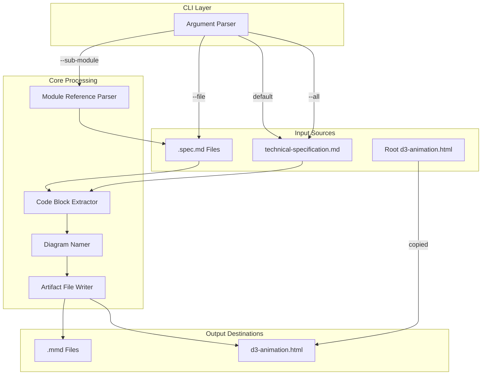
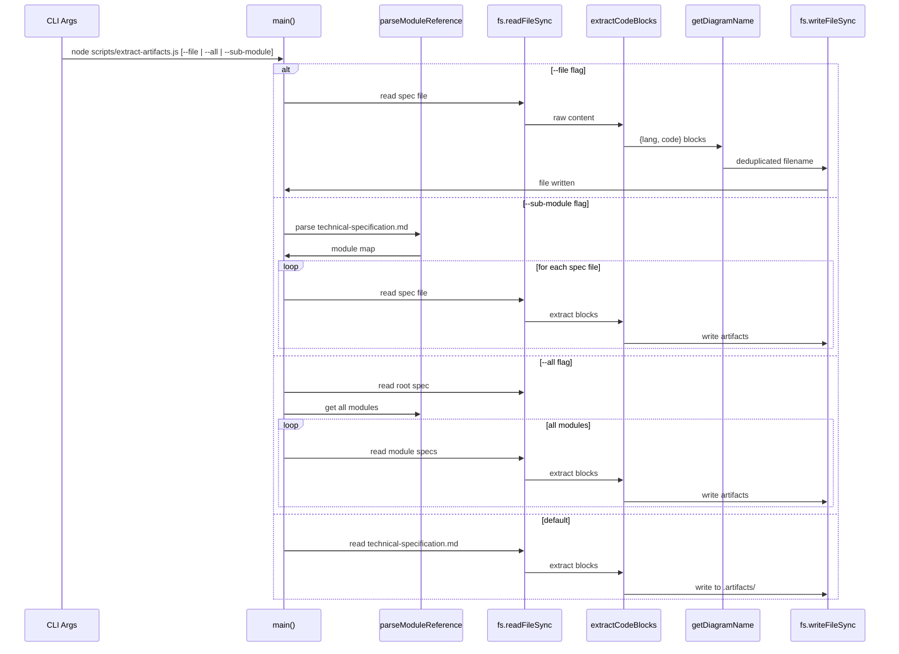

# extract-artifacts.spec.md

## 1. Overview

**Role**: Parses `.spec.md` files and `technical-specification.md`, extracts ` ```mermaid ` and ` ```html ` fenced code blocks, writes them to `.artifacts/` directories organized by spec file name. Also copies root-level `d3-animation.html` when processing the root spec.

**Language**: JavaScript (Node.js, no external dependencies beyond `fs` and `path`)

**Lifecycle**:
1. `main()` parses CLI args (`--file`, `--all`, `--sub-module`)
2. For `--file`: processes a single spec file
3. For `--all`: processes root spec + all module specs
4. For `--sub-module <name>`: parses Module Reference table from root spec, processes that module's specs

**Cross-references**: Core dependency of `test-artifacts.js` (validates extracted artifacts), `check-artifacts.js` (staleness check uses its directory conventions), `verify-artifact.js` (verifies extracted D3 HTML).

## 2. Component Specifications

### `extract-code-blocks`
```
@param {string} content - Raw text content of a spec file
@returns {Array<{lang: string, code: string}>} - Extracted code blocks with language tag
```
Extracts all ` ```mermaid ` and ` ```html ` fenced code blocks from spec file content. Returns empty array if no blocks found.

### `get-diagram-name`
```
@param {string} code - The extracted code content
@param {string} lang - Language tag ('mermaid' or 'html')
@param {number} index - Block index for fallback naming
@returns {string} - Filename: 'architecture.mmd', 'sequence.mmd', 'd3-animation.html', or 'diagram-N.mmd'
```
Assigns deterministic filenames: `graph TB/LR/RL/BT/TD` → `architecture.mmd`, `sequenceDiagram` → `sequence.mmd`, `html` → `d3-animation.html`.

### `process-spec-file`
```
@param {string} specPath - Absolute path to .spec.md file
@param {string} outputDir - .artifacts/ directory path
@param {Array<{src: string, dest: string}>} [extraFiles] - Additional files to copy
@returns {void} - Writes extracted files to disk
@throws {Error} - process.exit(1) if no artifacts found and no extra files exist
```
Main processing pipeline: read file → extract blocks → assign names → deduplicate via counter suffix → write to `<outputDir>/<specName>/<filename>`. Copies extra files if provided. Exits with error if the spec has zero extractable content.

### `parse-module-reference`
```
@param {void} - Reads technical-specification.md from project root
@returns {Object<string, {name: string, dir: string, specFiles: string[]}>} - Keyed by lowercase module name
```
Parses the Module Reference table (Markdown pipe table) from `technical-specification.md`. Returns a map of module names to their directory and spec file paths. Handles backtick removal and parenthetical annotations in spec file references.

### `process-sub-module`
```
@param {{name: string, dir: string, specFiles: string[]}} mod - Module descriptor
@returns {void} - Processes all spec files in the module directory
```
Creates the module's `.artifacts/` directory under `src/<module>/` and runs `process-spec-file` for each spec file listed in the module reference.

### `main`
```
@param {void} - Reads process.argv
@returns {void} - Exits with 0 on success, 1 on error
```
Entry point. Parses `--file`, `--all`, `--sub-module` flags. Dispatches to the appropriate processing mode. Default mode: processes just `technical-specification.md` into `.artifacts/`.

## 3. System Architecture



## 4. Detailed Data Flow



## 5. Visualization

### Animation Source

```html
<!DOCTYPE html>
<html>
<head>
<meta charset="utf-8">
<title>Extract Artifacts Pipeline</title>
<script src="https://d3js.org/d3.v7.min.js"></script>
<style>
  body { font-family: monospace; background: #1e1e2e; color: #cdd6f4; margin: 0; padding: 20px; }
  .controls { margin-bottom: 15px; }
  .controls button { background: #45475a; color: #cdd6f4; border: 1px solid #585b70; padding: 6px 16px; cursor: pointer; font-family: monospace; font-size: 13px; }
  .controls button:hover { background: #585b70; }
  .controls span { margin: 0 12px; font-size: 13px; color: #a6adc8; }
  #vis { position: relative; width: 680px; height: 400px; border: 1px solid #45475a; background: #181825; overflow: hidden; }
  .log { margin-top: 10px; max-height: 80px; overflow-y: auto; font-size: 11px; color: #a6adc8; }
  .log div { padding: 1px 0; border-bottom: 1px solid #313244; }
  .file-box { fill: #313244; stroke: #585b70; stroke-width: 1.5; rx: 4; }
  .file-label { fill: #cdd6f4; font-size: 11px; text-anchor: middle; dominant-baseline: central; }
  .arrow { stroke: #89b4fa; stroke-width: 2; fill: none; marker-end: url(#arrowhead); }
  .arrowhead { fill: #89b4fa; }
  .block-highlight { fill: #f9e2af; opacity: 0.3; }
  .extracted { fill: #a6e3a1; }
  .legend text { fill: #a6adc8; font-size: 10px; }
</style>
</head>
<body>
<div class="controls">
  <button id="play-pause" data-testid="play-pause">Play</button>
  <button id="replay">Replay</button>
  <span id="kf-label">0/<span id="kf-total">0</span></span>
</div>
<div id="vis">
  <svg width="680" height="400">
    <defs><marker id="arrowhead" markerWidth="8" markerHeight="6" refX="8" refY="3" orient="auto"><polygon points="0 0, 8 3, 0 6" class="arrowhead"/></marker></defs>
    <g id="legend" transform="translate(480, 10)">
      <rect x="0" y="0" width="8" height="8" fill="#313244" stroke="#585b70"/>
      <text x="14" y="7">Source File</text>
      <rect x="0" y="16" width="8" height="8" fill="#f9e2af" opacity="0.3"/>
      <text x="14" y="23">Active Block</text>
      <rect x="0" y="32" width="8" height="8" fill="#a6e3a1"/>
      <text x="14" y="39">Extracted</text>
    </g>
    <g id="pipeline">
      <rect class="file-box" x="30" y="60" width="130" height="40"/>
      <text class="file-label" x="95" y="80">spec.md File</text>
      <rect class="file-box" x="230" y="60" width="130" height="40"/>
      <text class="file-label" x="295" y="80">Code Extractor</text>
      <rect class="file-box" x="430" y="60" width="130" height="40"/>
      <text class="file-label" x="495" y="80">Diagram Namer</text>
      <rect class="file-box" x="230" y="180" width="130" height="40"/>
      <text class="file-label" x="295" y="200">File Writer</text>
      <rect class="file-box" x="430" y="180" width="130" height="40"/>
      <text class="file-label" x="495" y="200">.artifacts/ Dir</text>
      <line class="arrow" x1="160" y1="80" x2="220" y2="80"/>
      <line class="arrow" x1="360" y1="80" x2="420" y2="80"/>
      <line class="arrow" x1="430" y1="100" x2="430" y2="140"/>
      <line class="arrow" x1="495" y1="120" x2="495" y2="140"/>
      <line class="arrow" x1="360" y1="200" x2="420" y2="200"/>
      <polygon points="240,250 350,250 350,270 240,270" fill="#313244" stroke="#585b70"/>
      <text x="295" y="265" fill="#cdd6f4" font-size="10" text-anchor="middle" dominant-baseline="central">Extracted Blocks</text>
      <line class="arrow" x1="295" y1="220" x2="295" y2="242"/>
    </g>
    <g id="blocks"></g>
  </svg>
</div>
<div class="log" id="log"></div>

<script>
(function(){
  const keyframes = [
    { time: 0,    label: 'idle' },
    { time: 1000, label: 'reading-spec' },
    { time: 2500, label: 'extracting-blocks' },
    { time: 4000, label: 'naming-diagrams' },
    { time: 5500, label: 'writing-artifacts' },
    { time: 6500, label: 'done' }
  ];

  const verification = [
    { label: 'idle', hor: 0, ver: 0, precision: 0, logCount: 0 },
    { label: 'reading-spec', hor: 1, ver: 0, precision: 0, logCount: 1 },
    { label: 'extracting-blocks', hor: 1, ver: 3, precision: 1, logCount: 2 },
    { label: 'naming-diagrams', hor: 3, ver: 3, precision: 1, logCount: 3 },
    { label: 'writing-artifacts', hor: 3, ver: 2, precision: 2, logCount: 4 },
    { label: 'done', hor: 4, ver: 2, precision: 3, logCount: 5 }
  ];

  const TOTAL_DURATION = 6500;
  window.ANIMATION_DURATION_MS = TOTAL_DURATION;
  window.ANIMATION_KEYFRAMES = keyframes;
  window.ANIMATION_VERIFICATION = verification;

  let currentKf = 0;
  let playing = false;
  let timer = null;

  const svg = d3.select('#vis svg');
  const logDiv = document.getElementById('log');
  const playBtn = document.getElementById('play-pause');
  const replayBtn = document.getElementById('replay');
  const kfLabel = document.getElementById('kf-label');
  const kfTotal = document.getElementById('kf-total');

  kfTotal.textContent = keyframes.length - 1;

  function updateLog(count) {
    logDiv.innerHTML = '';
    const entries = [
      'extract-artifacts: waiting for input...',
      'extract-artifacts: reading spec.md file',
      'extract-artifacts: found 3 code blocks',
      'extract-artifacts: naming: architecture.mmd, sequence.mmd, d3-animation.html',
      'extract-artifacts: writing to .artifacts/',
      'extract-artifacts: done - 3 artifacts extracted'
    ];
    for (let i = 0; i <= Math.min(count, entries.length - 1); i++) {
      const d = document.createElement('div');
      d.textContent = entries[i];
      logDiv.appendChild(d);
    }
    if (count >= entries.length - 1) logDiv.scrollTop = logDiv.scrollHeight;
  }

  function renderState(kfIdx) {
    const kf = keyframes[kfIdx];
    currentKf = kfIdx;
    kfLabel.textContent = kfIdx + '/' + (keyframes.length - 1);

    svg.selectAll('.block-highlight').remove();
    svg.selectAll('.extracted-box').remove();

    const v = verification[kfIdx];
    const hor = v.hor;
    const ver = v.ver;
    const prec = v.precision;

    if (kfIdx >= 1) {
      svg.append('rect').attr('class', 'block-highlight')
        .attr('x', 30).attr('y', 56).attr('width', 130).attr('height', 48);
    }
    if (kfIdx >= 2) {
      for (let i = 0; i < hor; i++) {
        svg.append('rect').attr('class', 'extracted-box')
          .attr('x', 240 + i * 40).attr('y', 248).attr('width', 30).attr('height', 16)
          .attr('fill', '#a6e3a1').attr('rx', 2);
      }
    }
    if (kfIdx >= 3) {
      for (let i = 0; i < ver; i++) {
        svg.append('rect').attr('class', 'extracted-box')
          .attr('x', 240 + i * 40).attr('y', 248).attr('width', 30).attr('height', 16)
          .attr('fill', '#89b4fa').attr('rx', 2);
      }
    }
    updateLog(kfIdx);
  }

  function jumpToKeyframe(idx) {
    if (idx < 0 || idx >= keyframes.length) return;
    playing = false;
    playBtn.textContent = 'Play';
    if (timer) { clearInterval(timer); timer = null; }
    window.currentKfOverride = idx;
    renderState(idx);
  }
  window.jumpToKeyframe = jumpToKeyframe;

  function resetAnimation() {
    jumpToKeyframe(0);
  }
  window.resetAnimation = resetAnimation;

  function getAnimationState() {
    const v = verification[currentKf] || verification[0];
    return { hor: v.hor, ver: v.ver, precision: v.precision, boundsOpacity: 0, logCount: v.logCount, keyframeIdx: currentKf, keyframeLabel: keyframes[currentKf].label };
  }
  window.getAnimationState = getAnimationState;

  renderState(0);

  playBtn.addEventListener('click', function() {
    if (playing) {
      playing = false;
      playBtn.textContent = 'Play';
      if (timer) { clearInterval(timer); timer = null; }
    } else {
      playing = true;
      playBtn.textContent = 'Pause';
      if (currentKf >= keyframes.length - 1) { currentKf = 0; }
      const stepMs = TOTAL_DURATION / (keyframes.length - 1);
      timer = setInterval(() => {
        if (currentKf < keyframes.length - 1) {
          jumpToKeyframe(currentKf + 1);
        } else {
          playing = false;
          playBtn.textContent = 'Play';
          clearInterval(timer);
          timer = null;
        }
      }, stepMs);
    }
  });

  replayBtn.addEventListener('click', function() {
    resetAnimation();
    playing = true;
    playBtn.textContent = 'Pause';
    const stepMs = TOTAL_DURATION / (keyframes.length - 1);
    timer = setInterval(() => {
      if (currentKf < keyframes.length - 1) {
        jumpToKeyframe(currentKf + 1);
      } else {
        playing = false;
        playBtn.textContent = 'Play';
        clearInterval(timer);
        timer = null;
      }
    }, stepMs);
  });
})();
</script>
</body>
</html>
```

## 6. Testing Requirements

### Unit Tests

| Test ID | Method | Input | Expected Output | Assertion |
|---------|--------|-------|-----------------|-----------|
| E01 | `extractCodeBlocks` | Content with one ` ```mermaid ` block | `[{lang:'mermaid', code:'...'}]` | Array length === 1 |
| E02 | `extractCodeBlocks` | Content with one ` ```html ` block | `[{lang:'html', code:'...'}]` | Array length === 1 |
| E03 | `extractCodeBlocks` | Content with both block types | Array length === 2 | Both languages present |
| E04 | `extractCodeBlocks` | Content with no fenced blocks | `[]` | Empty array |
| E05 | `extractCodeBlocks` | Malformed (unclosed backtick fence) | `[]` | Graceful no match |
| E06 | `getDiagramName` | Mermaid `graph TB` first line | `'architecture.mmd'` | Exact string match |
| E07 | `getDiagramName` | Mermaid `sequenceDiagram` first line | `'sequence.mmd'` | Exact string match |
| E08 | `getDiagramName` | HTML block | `'d3-animation.html'` | Exact string match |
| E09 | `getDiagramName` | Unknown mermaid type | `'diagram-1.mmd'` | Falls back to index-based name |
| E10 | `processSpecFile` | Valid spec file with 1 mermaid + 1 html block | 2 files written to `.artifacts/` dir | Directory contains `architecture.mmd` and `d3-animation.html` |
| E11 | `processSpecFile` | Repeated diagram type (architecture dup) | Second gets suffix `-2` | `architecture-2.mmd` exists |
| E12 | `processSpecFile` | Spec file with zero extractable blocks | `process.exit(1)` with error message | Error output contains "No artifacts found" |
| E13 | `processSpecFile` | Extra file that exists on disk | File copied to artifact dir | Destination file exists and matches source |
| E14 | `processSpecFile` | Extra file that does not exist on disk | No copy attempted, no error | No extra file in artifact dir |

### Calling-Order Validation

| Test ID | Sequence | Expected Behavior |
|---------|----------|-------------------|
| E15 | Call `main()` with `--file non-existent.spec.md` | Error: "File not found", exit code 1 |
| E16 | Call `main()` without `--file` or `--all` or `--sub-module` | Default mode: process `technical-specification.md` |

### Integration Tests

| Test ID | Scenario | Steps | Expected |
|---------|----------|-------|----------|
| E17 | Extract + validate round-trip | Run `extract-artifacts.js --file <spec>` then `test-artifacts.js --file <spec>` | Mermaid renders, D3 filmstrip captures frames |
| E18 | `--all` mode | Run with `--all` on a project with module refs | All modules processed, no warnings |
| E19 | `--sub-module` with unknown name | Run with `--sub-module nonexistent` | Error: "Unknown sub-module", exit code 1 |

## 7. Cross-References

| Direction | Spec File | Relationship |
|-----------|-----------|--------------|
| Tested by | `source/scripts/test-artifacts.spec.md` | Validates extracted `.mmd` and `.html` output |
| Checked by | `source/scripts/check-artifacts.spec.md` | Depends on `.artifacts/<specName>/` directory convention |
| Verified by | `source/scripts/verify-artifact.spec.md` | Verifies extracted D3 HTML keyframes |
| Depends on | `technical-specification.md` | Reads Module Reference table from root spec |
