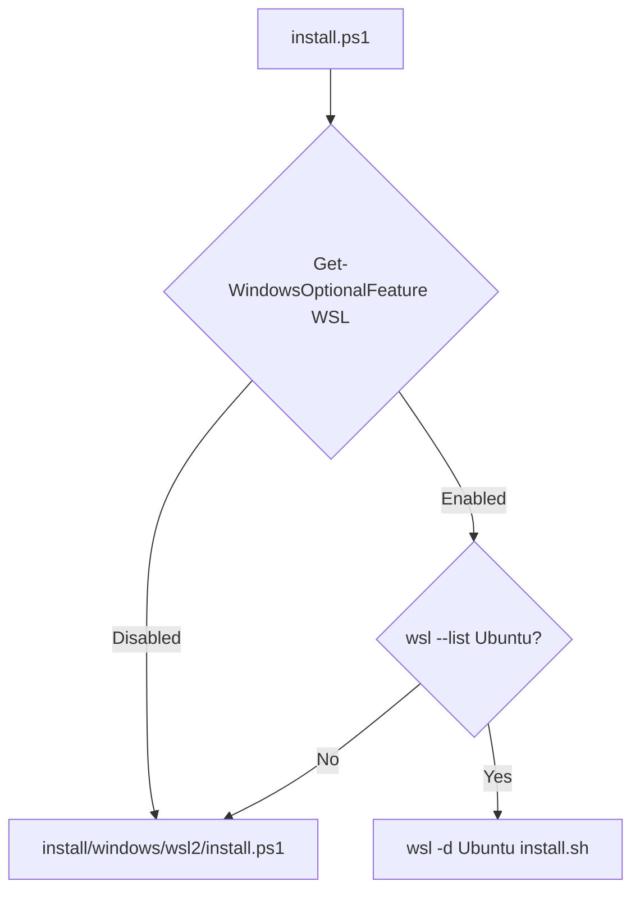
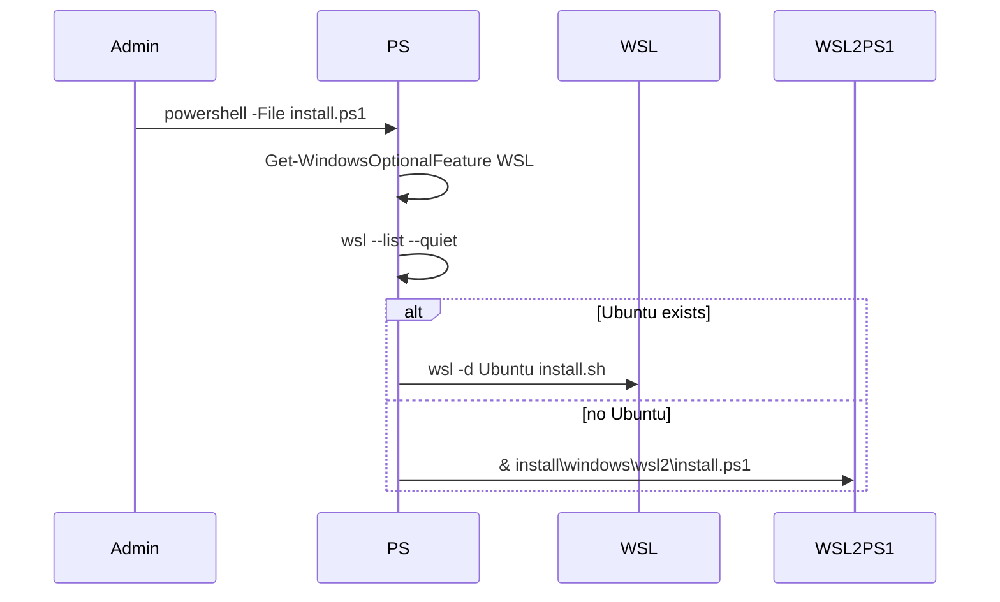

# install.ps1 spec

## 1. Overview

**Role**: Windows top-level installer dispatcher (PowerShell). Checks if WSL is enabled and Ubuntu is installed, then either runs the WSL2 setup or delegates to the Ubuntu installer inside WSL.

**Language**: PowerShell (requires admin: `#Requires -RunAsAdministrator`)

**Lifecycle**: Check WSL feature → if missing: run WSL2 installer → if present + Ubuntu: run Ubuntu installer inside WSL

**Cross-references**: Twin of `install.sh` (Unix variant). Dispatches to `install/windows/wsl2/install.ps1`.

## 2. Component Specifications

```
Usage: powershell -ExecutionPolicy Bypass -File scripts\install.ps1
```

## 3. System Architecture



## 4. Detailed Data Flow



## 5. Visualization

### Animation Source

```html
<!DOCTYPE html><html><head><meta charset="utf-8"><title>Windows Installer</title>
<script src="https://d3js.org/d3.v7.min.js"></script>
<style>body{font-family:monospace;background:#1e1e2e;color:#cdd6f4;margin:0;padding:20px}
.controls{margin-bottom:15px}.controls button{background:#45475a;color:#cdd6f4;border:1px solid #585b70;padding:6px 16px;cursor:pointer;font-family:monospace;font-size:13px}
.controls button:hover{background:#585b70}.controls span{margin:0 12px;font-size:13px;color:#a6adc8}
#vis{width:680px;height:300px;border:1px solid #45475a;background:#181825;overflow:hidden}
.log{margin-top:10px;max-height:80px;overflow-y:auto;font-size:11px;color:#a6adc8}
</style>
</head><body>
<div class="controls"><button id="play-pause" data-testid="play-pause">Play</button><button id="replay">Replay</button><span id="kf-label">0/<span id="kf-total">0</span></span></div>
<div id="vis"><svg width="680" height="300"><g id="m"></g></svg></div>
<div class="log" id="log"></div>
<script>
(function(){const kf=[{time:0,label:'idle'},{time:600,label:'check-admin'},{time:1800,label:'check-wsl'},{time:3000,label:'dispatch'},{time:4200,label:'done'}];const vf=[{label:'idle',hor:0,ver:0,precision:0,logCount:0},{label:'check-admin',hor:1,ver:0,precision:0,logCount:1},{label:'check-wsl',hor:2,ver:1,precision:0,logCount:2},{label:'dispatch',hor:3,ver:1,precision:1,logCount:3},{label:'done',hor:4,ver:2,precision:2,logCount:4}];const T=4200;window.ANIMATION_DURATION_MS=T;window.ANIMATION_KEYFRAMES=kf;window.ANIMATION_VERIFICATION=vf;let ck=0,pl=false,tm=null;const sv=d3.select('#vis svg'),lg=document.getElementById('log'),pb=document.getElementById('play-pause'),rb=document.getElementById('replay'),kl=document.getElementById('kf-label'),kt=document.getElementById('kf-total');kt.textContent=kf.length-1;const e=['install.ps1: waiting','install.ps1: admin check passed','install.ps1: WSL feature enabled','install.ps1: dispatching to WSL2 installer','install.ps1: done'];function jk(idx){if(idx<0||idx>=kf.length)return;pl=false;pb.textContent='Play';if(tm){clearInterval(tm);tm=null}ck=idx;kl.textContent=idx+'/'+(kf.length-1);const g=sv.select('#m');g.selectAll('*').remove();for(let i=0;i<=Math.min(idx,4);i++){const d=document.createElement('div');d.textContent=e[i];lg.appendChild(d)}if(idx>=2){g.append('rect').attr('x',30).attr('y',40).attr('width',200).attr('height',32).attr('fill','#313244').attr('stroke',idx>2?'#a6e3a1':'#f9e2af').attr('rx',4);g.append('text').attr('x',130).attr('y',60).attr('fill','#cdd6f4').attr('font-size','11').attr('text-anchor','middle').text('WSL State: Enabled');g.append('rect').attr('x',280).attr('y',40).attr('width',200).attr('height',32).attr('fill','#313244').attr('stroke','#89b4fa').attr('rx',4);g.append('text').attr('x',380).attr('y',60).attr('fill','#cdd6f4').attr('font-size','11').attr('text-anchor','middle').text(idx>2?'→ WSL2 Installer':'...')}}window.jumpToKeyframe=jk;window.resetAnimation=function(){jk(0)};window.getAnimationState=function(){const v=vf[ck]||vf[0];return{hor:v.hor,ver:v.ver,precision:v.precision,boundsOpacity:0,logCount:v.logCount,keyframeIdx:ck,keyframeLabel:kf[ck].label}};jk(0);pb.addEventListener('click',function(){if(pl){pl=false;pb.textContent='Play';if(tm){clearInterval(tm);tm=null}}else{pl=true;pb.textContent='Pause';if(ck>=kf.length-1)ck=0;const st=T/(kf.length-1);tm=setInterval(()=>{if(ck<kf.length-1)jk(ck+1);else{pl=false;pb.textContent='Play';clearInterval(tm);tm=null}},st)}});rb.addEventListener('click',function(){jk(0);pl=true;pb.textContent='Pause';const st=T/(kf.length-1);tm=setInterval(()=>{if(ck<kf.length-1)jk(ck+1);else{pl=false;pb.textContent='Play';clearInterval(tm);tm=null}},st)});})();
</script>
</body></html>
```

## 6. Testing Requirements

| Test ID | Scenario | Expected |
|---------|----------|----------|
| IW01 | Run as non-admin | PowerShell error from #Requires |
| IW02 | WSL already set up | Dispatches to wsl -d Ubuntu install.sh |
| IW03 | WSL needs install | Dispatches to WSL2 installer script |
