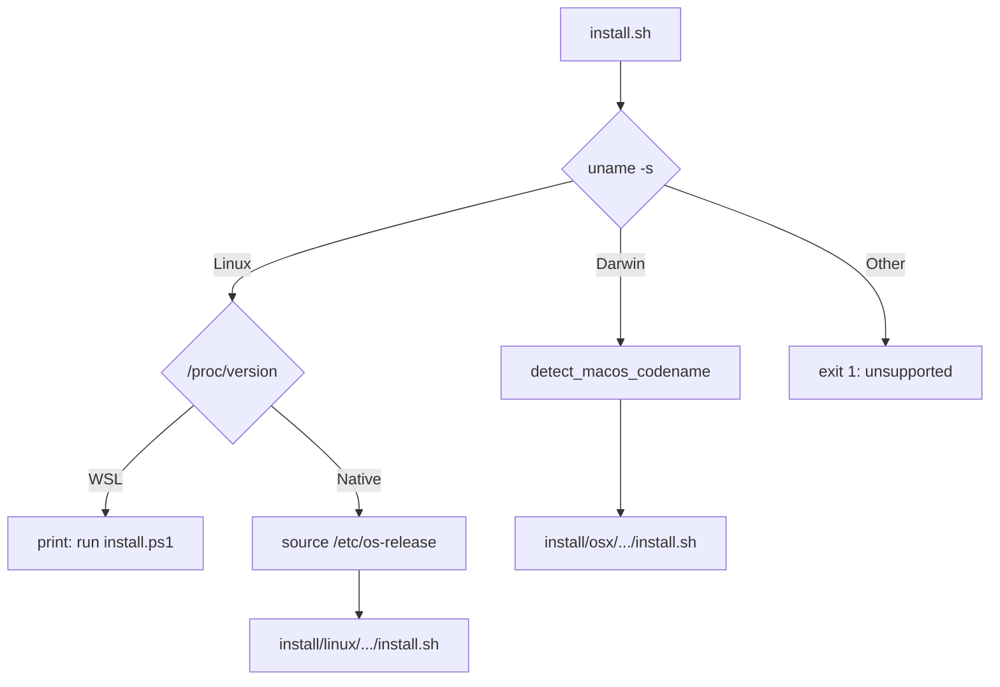
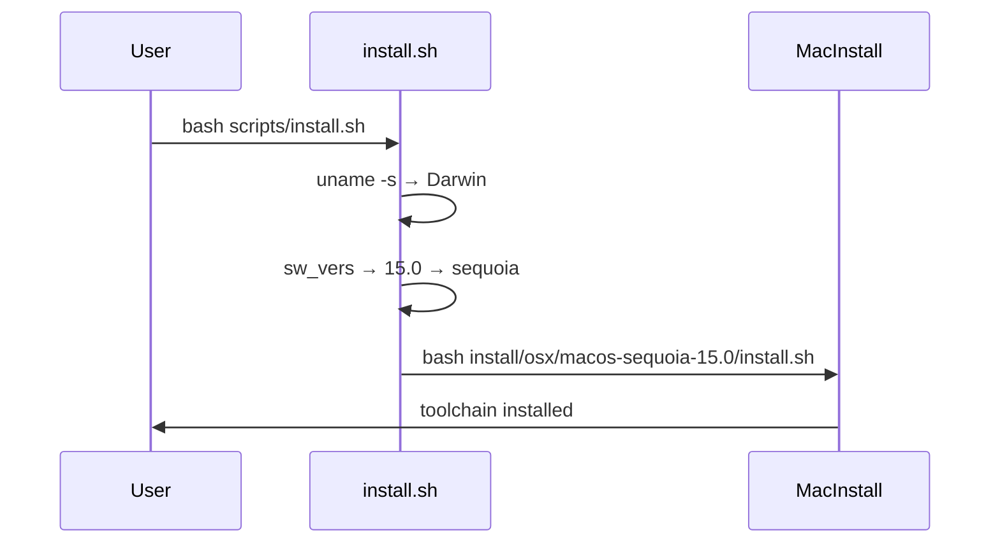

# install.sh spec

## 1. Overview

**Role**: Top-level OS detection and dispatch for the opencode environment installer. Detects macOS, Linux, or WSL, then delegates to the platform-specific installer script. Acts as the unified entry point for Unix users.

**Language**: Shell (Bash, `set -euo pipefail`)

**Lifecycle**: detect OS → macOS: detect codename + dispatch to macOS installer → Linux: detect distro/codename + dispatch → WSL: print message + redirect to PS1 installer

**Cross-references**: Dispatches to `install/linux/.../install.sh`, `install/osx/.../install.sh`. PowerShell twin is `install.ps1`.

## 2. Component Specifications

```
Usage: bash scripts/install.sh
```

### Exit Codes

| Code | Condition |
|------|-----------|
| 0 | Install delegated and completed |
| 1 | Unsupported OS |
| 1 | Unknown macOS/Linux version (no matching installer) |

## 3. System Architecture



## 4. Detailed Data Flow



## 5. Visualization

### Animation Source

```html
<!DOCTYPE html><html><head><meta charset="utf-8"><title>OS Dispatch Installer</title>
<script src="https://d3js.org/d3.v7.min.js"></script>
<style>body{font-family:monospace;background:#1e1e2e;color:#cdd6f4;margin:0;padding:20px}
.controls{margin-bottom:15px}.controls button{background:#45475a;color:#cdd6f4;border:1px solid #585b70;padding:6px 16px;cursor:pointer}
.controls span{margin:0 12px;font-size:13px;color:#a6adc8}
#vis{width:680px;height:300px;border:1px solid #45475a;background:#181825;overflow:hidden}
.log{margin-top:10px;max-height:80px;overflow-y:auto;font-size:11px;color:#a6adc8}
</style>
</head><body>
<div class="controls"><button id="play-pause" data-testid="play-pause">Play</button><button id="replay">Replay</button><span id="kf-label">0/<span id="kf-total">0</span></span></div>
<div id="vis"><svg width="680" height="300"><g id="s"></g></svg></div><div class="log" id="log"></div>
<script>
(function(){const kf=[{time:0,label:'idle'},{time:600,label:'detecting-os'},{time:2000,label:'dispatching'},{time:3500,label:'done'}];const vf=[{label:'idle',hor:0,ver:0,precision:0,logCount:0},{label:'detecting-os',hor:1,ver:0,precision:0,logCount:1},{label:'dispatching',hor:2,ver:1,precision:1,logCount:2},{label:'done',hor:3,ver:2,precision:2,logCount:3}];const T=3500;window.ANIMATION_DURATION_MS=T;window.ANIMATION_KEYFRAMES=kf;window.ANIMATION_VERIFICATION=vf;let ck=0,pl=false,tm=null;const sv=d3.select('#vis svg'),lg=document.getElementById('log'),pb=document.getElementById('play-pause'),rb=document.getElementById('replay'),kl=document.getElementById('kf-label'),kt=document.getElementById('kf-total');kt.textContent=kf.length-1;function jk(idx){if(idx<0||idx>=kf.length)return;pl=false;pb.textContent='Play';if(tm){clearInterval(tm);tm=null}ck=idx;kl.textContent=idx+'/'+(kf.length-1);const g=sv.select('#s');g.selectAll('*').remove();const ee=['install.sh: waiting','install.sh: uname -s detected','install.sh: dispatching to platform installer','install.sh: done'];for(let i=0;i<=Math.min(idx,3);i++){const d=document.createElement('div');d.textContent=ee[i];lg.appendChild(d)}if(idx>0){for(let j=0;j<Math.min(idx,3);j++){const y=40+j*70;g.append('rect').attr('x',30).attr('y',y).attr('width',350).attr('height',42).attr('fill','#313244').attr('stroke',j===Math.min(idx,3)-1?'#f9e2af':'#585b70').attr('rx',4);g.append('text').attr('x',205).attr('y',y+24).attr('fill','#cdd6f4').attr('font-size','11').attr('text-anchor','middle').text(ee[idx].replace('install.sh: ',''))}}}window.jumpToKeyframe=jk;window.resetAnimation=function(){jk(0)};window.getAnimationState=function(){const v=vf[ck]||vf[0];return{hor:v.hor,ver:v.ver,precision:v.precision,boundsOpacity:0,logCount:v.logCount,keyframeIdx:ck,keyframeLabel:kf[ck].label}};jk(0);pb.addEventListener('click',function(){if(pl){pl=false;pb.textContent='Play';if(tm){clearInterval(tm);tm=null}}else{pl=true;pb.textContent='Pause';if(ck>=kf.length-1)ck=0;const stp=T/(kf.length-1);tm=setInterval(()=>{if(ck<kf.length-1)jk(ck+1);else{pl=false;pb.textContent='Play';clearInterval(tm);tm=null}},stp)}});rb.addEventListener('click',function(){jk(0);pl=true;pb.textContent='Pause';const stp=T/(kf.length-1);tm=setInterval(()=>{if(ck<kf.length-1)jk(ck+1);else{pl=false;pb.textContent='Play';clearInterval(tm);tm=null}},stp)});})();
</script>
</body></html>
```

## 6. Testing Requirements

| Test ID | Scenario | Steps | Expected |
|---------|----------|-------|----------|
| IS01 | Run on macOS | `bash install.sh` on macOS | Dispatches to macOS installer |
| IS02 | Run on Linux | `bash install.sh` on Ubuntu | Dispatches to Ubuntu installer |
| IS03 | Run on WSL | Detects WSL via /proc/version | Prints PowerShell instructions |
| IS04 | Unknown OS | Mock unsupported uname | Error: unsupported OS |
