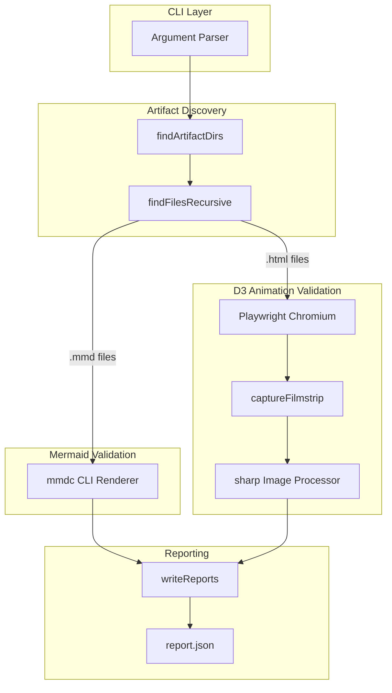
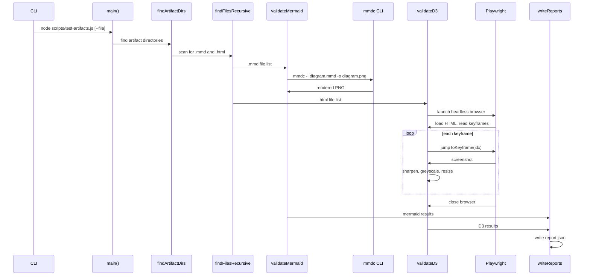

# test-artifacts.spec.md

## 1. Overview

**Role**: Validates extracted artifacts from `.spec.md` files. Renders Mermaid `.mmd` diagrams to PNG via `mmdc` CLI. Captures D3 animation filmstrips (keyframe screenshots) via Playwright headless browser. Writes validation reports to `report.json`.

**Language**: JavaScript (Node.js, depends on `playwright`, `sharp`, `mmdc` CLI)

**Lifecycle**:
1. `main()` finds artifact directories (from `--file` flag or scans `src/`, `source/`, `.artifacts/`)
2. `validateMermaid()` — renders each `.mmd` to `.png` via `mmdc`
3. `validateD3()` — opens each `.html` in Playwright, captures keyframe screenshots
4. `writeReports()` — persists JSON validation reports

**Cross-references**: Consumes output of `extract-artifacts.js`. Complementary to `verify-artifact.js` (verifier does deep DOM assertion, this does filmstrip capture). Depends on `check-artifacts.js` staleness conventions for CI gating.

## 2. Component Specifications

### `find-artifact-dirs`
```
@param {string|null} specPath - Optional .spec.md file path
@returns {Object<string, string>} - Map of label to absolute artifact directory path
```
When `--file` is given, returns only that spec's artifact directory (`<specDir>/.artifacts/<specName>/`). Otherwise scans `src/`, `source/` trees recursively for `.artifacts/` directories and the root `.artifacts/` directory.

### `find-files-recursive`
```
@param {string} dir - Directory to search
@param {string} ext - File extension filter (e.g. '.mmd', '.html')
@returns {string[]} - Absolute paths to matching files
```
Recursive directory walk returning all files ending with the given extension.

### `validate-mermaid`
```
@param {string|null} specPath - Optional spec path to scope validation
@returns {Promise<{pass: Array<{file:string, png:string}>, fail: Array<{file:string, error:string}>}>}
```
For each artifact directory, finds all `.mmd` files, runs `mmdc` to render each to PNG. Returns pass/fail results. Reports error if no `.mmd` files found.

### `capture-filmstrip`
```
@param {string} htmlFile - Absolute path to D3 HTML file
@returns {Promise<{pass: boolean, animationDurationMs: number|null, frames: Array, keyframes: Array|null, skipped: boolean}>}
```
Launches headless Chromium, loads the HTML file. Reads `window.ANIMATION_KEYFRAMES` if available and uses `jumpToKeyframe()` to capture each frame; falls back to 5-fraction timed capture. Resizes to greyscale 720px via `sharp`. Returns frame metadata.

### `validate-d3`
```
@param {string|null} specPath - Optional spec path to scope validation
@returns {Promise<{pass: Array, fail: Array, skipped: Array}>}
```
Finds all `.html` files in artifact directories, runs `captureFilmstrip` on each. Returns structured results.

### `write-reports`
```
@param {Object} mermaidResults - Results from validate-mermaid
@param {Object} d3Results - Results from validate-d3
@param {string|null} specPath - Optional spec path
@returns {void}
```
For each artifact directory, writes a `report.json` with timestamp, mermaid results list (pass/fail per file), and D3 filmstrip results list (pass/fail/skipped per HTML file).

### `main`
```
@param {void} - Reads process.argv for --file flag
@returns {Promise<void>} - Exits 1 on any validation failure
```
Entry point. Finds artifact dirs, validates mermaid + D3, writes reports, exits 1 if any tests failed.

## 3. System Architecture



## 4. Detailed Data Flow



## 5. Visualization

### Animation Source

```html
<!DOCTYPE html>
<html>
<head>
<meta charset="utf-8">
<title>Test Artifacts Validator</title>
<script src="https://d3js.org/d3.v7.min.js"></script>
<style>
  body { font-family: monospace; background: #1e1e2e; color: #cdd6f4; margin: 0; padding: 20px; }
  .controls { margin-bottom: 15px; }
  .controls button { background: #45475a; color: #cdd6f4; border: 1px solid #585b70; padding: 6px 16px; cursor: pointer; font-family: monospace; font-size: 13px; }
  .controls button:hover { background: #585b70; }
  .controls span { margin: 0 12px; font-size: 13px; color: #a6adc8; }
  #vis { position: relative; width: 680px; height: 420px; border: 1px solid #45475a; background: #181825; overflow: hidden; }
  .log { margin-top: 10px; max-height: 80px; overflow-y: auto; font-size: 11px; color: #a6adc8; }
  .log div { padding: 1px 0; border-bottom: 1px solid #313244; }
  .stage-box { fill: #313244; stroke: #585b70; stroke-width: 1.5; rx: 4; }
  .stage-label { fill: #cdd6f4; font-size: 11px; text-anchor: middle; dominant-baseline: central; }
  .pass { fill: #a6e3a1; }
  .fail { fill: #f38ba8; }
  .running { fill: #f9e2af; }
  .legend text { fill: #a6adc8; font-size: 10px; }
</style>
</head>
<body>
<div class="controls">
  <button id="play-pause" data-testid="play-pause">Play</button>
  <button id="replay">Replay</button>
  <span id="kf-label">0/<span id="kf-total">0</span></span>
</div>
<div id="vis">
  <svg width="680" height="420">
    <g id="legend" transform="translate(480, 10)">
      <rect x="0" y="0" width="8" height="8" fill="#f9e2af"/><text x="14" y="7">Running</text>
      <rect x="0" y="16" width="8" height="8" fill="#a6e3a1"/><text x="14" y="23">Pass</text>
      <rect x="0" y="32" width="8" height="8" fill="#f38ba8"/><text x="14" y="39">Fail</text>
    </g>
    <g id="pipeline">
      <rect class="stage-box" x="30" y="50" width="140" height="36"/>
      <text class="stage-label" x="100" y="68">Find Artifacts</text>
      <rect class="stage-box" x="200" y="50" width="140" height="36"/>
      <text class="stage-label" x="270" y="68">Scan Files</text>
      <rect class="stage-box" x="30" y="130" width="140" height="36"/>
      <text class="stage-label" x="100" y="148">Validate Mermaid</text>
      <rect class="stage-box" x="200" y="130" width="140" height="36"/>
      <text class="stage-label" x="270" y="148">Validate D3</text>
      <rect class="stage-box" x="370" y="130" width="140" height="36"/>
      <text class="stage-label" x="440" y="148">Write Report</text>
      <line class="arrow" x1="170" y1="68" x2="192" y2="68" stroke="#89b4fa" stroke-width="2"/>
      <line class="arrow" x1="340" y1="68" x2="340" y2="90" stroke="#89b4fa" stroke-width="2"/>
      <line class="arrow" x1="100" y1="86" x2="100" y2="122" stroke="#89b4fa" stroke-width="2"/>
      <line class="arrow" x1="270" y1="86" x2="270" y2="122" stroke="#89b4fa" stroke-width="2"/>
      <line class="arrow" x1="170" y1="148" x2="192" y2="148" stroke="#89b4fa" stroke-width="2"/>
      <line class="arrow" x1="340" y1="148" x2="362" y2="148" stroke="#89b4fa" stroke-width="2"/>
    </g>
    <g id="status-overlay"></g>
  </svg>
</div>
<div class="log" id="log"></div>

<script>
(function(){
  const keyframes = [
    { time: 0,    label: 'idle' },
    { time: 800,  label: 'discovering' },
    { time: 2000, label: 'scanning-files' },
    { time: 3500, label: 'validating-mermaid' },
    { time: 5000, label: 'validating-d3' },
    { time: 6500, label: 'writing-report' },
    { time: 7500, label: 'done' }
  ];

  const verification = [
    { label: 'idle', hor: 0, ver: 0, precision: 0, logCount: 0 },
    { label: 'discovering', hor: 1, ver: 0, precision: 0, logCount: 1 },
    { label: 'scanning-files', hor: 2, ver: 2, precision: 1, logCount: 2 },
    { label: 'validating-mermaid', hor: 1, ver: 1, precision: 1, logCount: 3 },
    { label: 'validating-d3', hor: 2, ver: 1, precision: 2, logCount: 4 },
    { label: 'writing-report', hor: 3, ver: 2, precision: 2, logCount: 5 },
    { label: 'done', hor: 3, ver: 3, precision: 3, logCount: 6 }
  ];

  const TOTAL_DURATION = 7500;
  window.ANIMATION_DURATION_MS = TOTAL_DURATION;
  window.ANIMATION_KEYFRAMES = keyframes;
  window.ANIMATION_VERIFICATION = verification;

  let currentKf = 0;
  let playing = false;
  let timer = null;

  const svg = d3.select('#vis svg');
  const logDiv = document.getElementById('log');
  const playBtn = document.getElementById('play-pause');
  const replayBtn = document.getElementById('replay');
  const kfLabel = document.getElementById('kf-label');
  const kfTotal = document.getElementById('kf-total');

  kfTotal.textContent = keyframes.length - 1;

  function updateLog(count) {
    logDiv.innerHTML = '';
    const entries = [
      'test-artifacts: waiting...',
      'test-artifacts: searching .artifacts/ directories',
      'test-artifacts: found 3 .mmd + 1 .html files',
      'test-artifacts: mmdc rendering: 2/2 passed',
      'test-artifacts: D3 filmstrip: 7/7 keyframes captured',
      'test-artifacts: writing report.json',
      'test-artifacts: done - all validations passed'
    ];
    for (let i = 0; i <= Math.min(count, entries.length - 1); i++) {
      const d = document.createElement('div');
      d.textContent = entries[i];
      logDiv.appendChild(d);
    }
    if (count >= entries.length - 1) logDiv.scrollTop = logDiv.scrollHeight;
  }

  function statusColor(idx) {
    if (idx === 0) return '#45475a';
    if (idx < 3) return '#f9e2af';
    if (idx < 6) return '#a6e3a1';
    return '#a6e3a1';
  }

  function renderState(kfIdx) {
    currentKf = kfIdx;
    kfLabel.textContent = kfIdx + '/' + (keyframes.length - 1);

    const overlay = svg.select('#status-overlay');
    overlay.selectAll('*').remove();

    const stages = [
      { x: 30, y: 50, w: 140, h: 36 },
      { x: 200, y: 50, w: 140, h: 36 },
      { x: 30, y: 130, w: 140, h: 36 },
      { x: 200, y: 130, w: 140, h: 36 },
      { x: 370, y: 130, w: 140, h: 36 }
    ];

    const activeCount = Math.min(kfIdx, stages.length);
    for (let i = 0; i < activeCount; i++) {
      overlay.append('rect')
        .attr('x', stages[i].x + 2)
        .attr('y', stages[i].y + 2)
        .attr('width', stages[i].w - 4)
        .attr('height', stages[i].h - 4)
        .attr('fill', statusColor(i))
        .attr('opacity', 0.3)
        .attr('rx', 3);
    }

    const v = verification[kfIdx];
    const mmdPassCount = v.hor;
    const d3PassCount = v.ver;
    const reportCount = v.precision;

    if (mmdPassCount > 0) {
      overlay.append('text').attr('x', 110).attr('y', 190).attr('fill', '#a6e3a1').attr('font-size', '11').attr('text-anchor', 'middle').text(mmdPassCount + '/2 mermaid passed');
    }
    if (d3PassCount > 0) {
      overlay.append('text').attr('x', 280).attr('y', 190).attr('fill', '#a6e3a1').attr('font-size', '11').attr('text-anchor', 'middle').text(d3PassCount + '/3 d3 captured');
    }
    if (reportCount > 0) {
      overlay.append('text').attr('x', 450).attr('y', 190).attr('fill', '#a6e3a1').attr('font-size', '11').attr('text-anchor', 'middle').text('report.json written');
    }

    updateLog(kfIdx);
  }

  function jumpToKeyframe(idx) {
    if (idx < 0 || idx >= keyframes.length) return;
    playing = false;
    playBtn.textContent = 'Play';
    if (timer) { clearInterval(timer); timer = null; }
    renderState(idx);
  }
  window.jumpToKeyframe = jumpToKeyframe;

  function resetAnimation() { jumpToKeyframe(0); }
  window.resetAnimation = resetAnimation;

  function getAnimationState() {
    const v = verification[currentKf] || verification[0];
    return { hor: v.hor, ver: v.ver, precision: v.precision, boundsOpacity: 0, logCount: v.logCount, keyframeIdx: currentKf, keyframeLabel: keyframes[currentKf].label };
  }
  window.getAnimationState = getAnimationState;

  renderState(0);

  playBtn.addEventListener('click', function() {
    if (playing) {
      playing = false; playBtn.textContent = 'Play';
      if (timer) { clearInterval(timer); timer = null; }
    } else {
      playing = true; playBtn.textContent = 'Pause';
      if (currentKf >= keyframes.length - 1) currentKf = 0;
      const stepMs = TOTAL_DURATION / (keyframes.length - 1);
      timer = setInterval(() => {
        if (currentKf < keyframes.length - 1) jumpToKeyframe(currentKf + 1);
        else { playing = false; playBtn.textContent = 'Play'; clearInterval(timer); timer = null; }
      }, stepMs);
    }
  });

  replayBtn.addEventListener('click', function() {
    resetAnimation();
    playing = true; playBtn.textContent = 'Pause';
    const stepMs = TOTAL_DURATION / (keyframes.length - 1);
    timer = setInterval(() => {
      if (currentKf < keyframes.length - 1) jumpToKeyframe(currentKf + 1);
      else { playing = false; playBtn.textContent = 'Play'; clearInterval(timer); timer = null; }
    }, stepMs);
  });
})();
</script>
</body>
</html>
```

## 6. Testing Requirements

### Unit Tests

| Test ID | Method | Input | Expected Output | Assertion |
|---------|--------|-------|-----------------|-----------|
| T01 | `findArtifactDirs` | `--file scripts/test.spec.md` exists | Returns `{'scripts/test': <abs-path>}` | Label matches expected |
| T02 | `findArtifactDirs` | `--file nonexistent.spec.md` | Empty object `{}` | No artifacts found |
| T03 | `findArtifactDirs` | No `--file`, no `src/` or `source/` dirs | Empty object `{}` | Graceful empty scan |
| T04 | `findFilesRecursive` | Directory with 2 `.mmd` files | `[abs-path-1, abs-path-2]` | Both found, sorted |
| T05 | `findFilesRecursive` | Directory with no matching files | `[]` | Empty array |
| T06 | `findFilesRecursive` | Nonexistent directory | `[]` | Empty array, no crash |
| T07 | `validateMermaid` | Directory with 1 valid `.mmd` | pass: 1, fail: 0 | PNG file created |
| T08 | `validateMermaid` | Directory with 0 `.mmd` files | pass: 0, fail: 0, log: "no .mmd files found" | No crash |
| T09 | `validateMermaid` | Malformed `.mmd` (invalid syntax) | pass: 0, fail: 1 | Error message captured |

### Calling-Order Validation

| Test ID | Sequence | Expected Behavior |
|---------|----------|-------------------|
| T10 | Call `main()` with `--file` without value | Error message printed, exit 1 |
| T11 | Call `main()` with no artifact dirs found | Logs message, exits cleanly (0) |

### Integration Tests

| Test ID | Scenario | Steps | Expected |
|---------|----------|-------|----------|
| T12 | Extract → Test round-trip | Run `extract-artifacts.js --file <spec>` then `test-artifacts.js --file <spec>` | Mermaid renders OK, D3 captures frames |
| T13 | Full `--all` validation | Run `npm run extract -- --all && npm run test-artifacts` | All mermaid + D3 pass |

## 7. Cross-References

| Direction | Spec File | Relationship |
|-----------|-----------|--------------|
| Tests | `source/scripts/extract-artifacts.spec.md` | Validates extractor output format and artifacts |
| Complements | `source/scripts/verify-artifact.spec.md` | Filmstrip capture (this) + DOM assertion (verify) |
| Consumes | `source/scripts/check-artifacts.spec.md` | Shares artifact directory discovery conventions |
