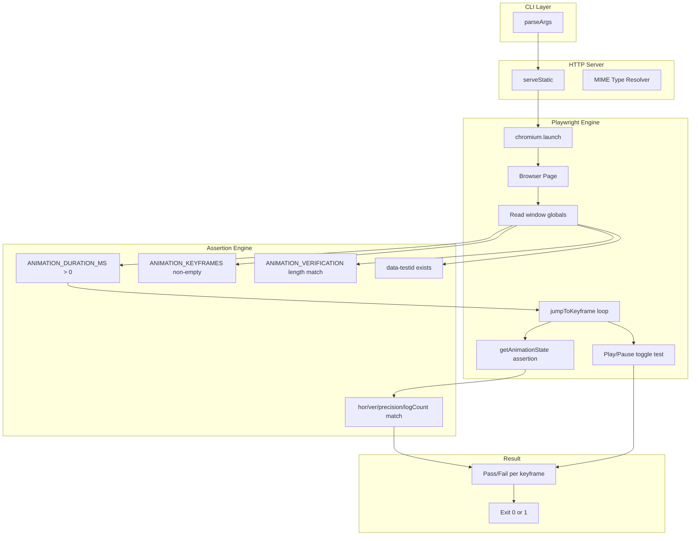
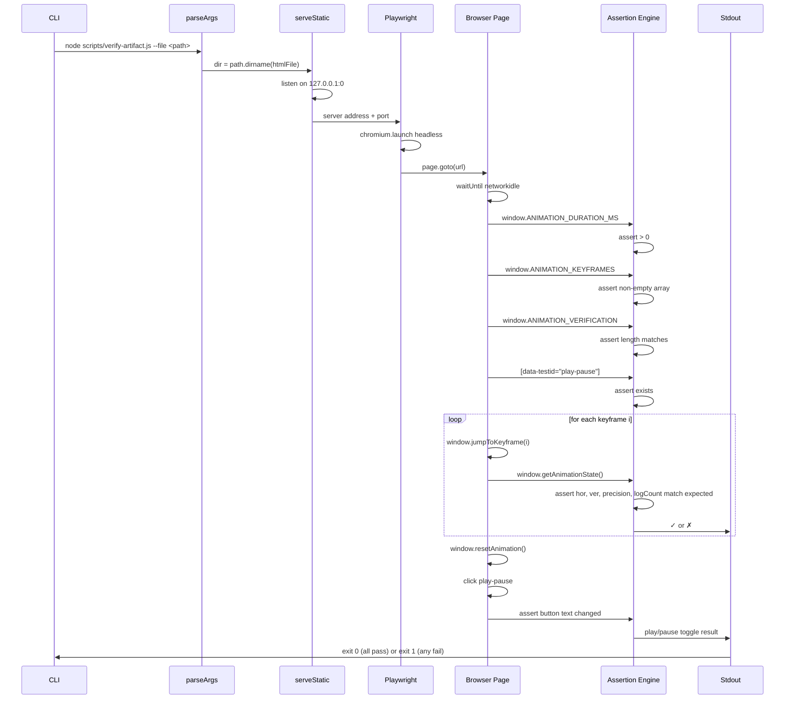

# verify-artifact.spec.md

## 1. Overview

**Role**: Deep DOM assertion verifier for D3 animations. Serves the extracted D3 HTML file via a local HTTP server, launches Playwright headless browser, reads `window.ANIMATION_DURATION_MS`, `ANIMATION_KEYFRAMES`, and `ANIMATION_VERIFICATION`, then asserts that every keyframe's DOM state (via `getAnimationState()`) matches the expected values. Also verifies the Play/Pause toggle button works.

**Language**: JavaScript (Node.js, depends on `playwright`, `http`)

**Lifecycle**:
1. `parseArgs()` extracts `--file <path>` from CLI
2. `serveStatic()` creates a minimal HTTP server to serve the HTML
3. `verify()` launches Playwright, navigates to `http://127.0.0.1:<port>/<file>`
4. Checks required globals, iterates keyframes, asserts DOM state
5. Verifies play/pause toggle text changes on click
6. Exits 0 on all pass, 1 on any failure

**Cross-references**: Consumes output of `extract-artifacts.js`. Complements `test-artifacts.js` (filmstrip does visual capture, this does structured DOM assertion). Used in `generate-d3-animation` validation pipeline.

## 2. Component Specifications

### `serve-static`
```
@param {string} dir - Directory to serve files from
@returns {Promise<http.Server>} - Started HTTP server listening on random port
```
Creates an HTTP server that serves files from the given directory. Handles MIME types for `.html`, `.js`, `.css`, `.png`, `.svg`. Returns a promise that resolves once the server is listening on `127.0.0.1` on port 0 (OS-assigned).

### `parse-args`
```
@param {void} - Reads process.argv
@returns {{filePath: string}} - Path to the D3 HTML file
@throws {Error} - process.exit(1) if --file not provided
```
Parses `--file` from CLI arguments. Exits with usage message if missing.

### `verify`
```
@param {void}
@returns {Promise<void>} - Exits 0 on pass, 1 on fail
```
Main verification pipeline:
1. Starts HTTP server for the HTML's directory
2. Launches headless Chromium via Playwright
3. Loads the page, waits for network idle
4. Asserts `ANIMATION_DURATION_MS` > 0
5. Asserts `ANIMATION_KEYFRAMES` is non-empty array
6. Asserts `ANIMATION_VERIFICATION` length === keyframes length
7. Asserts `[data-testid="play-pause"]` exists in DOM
8. For each keyframe: calls `jumpToKeyframe(idx)`, calls `getAnimationState()`, asserts hor/ver/precision/logCount match expected
9. Calls `resetAnimation()`, clicks play/pause, asserts button text changed
10. Exits 0 if all passed, 1 if any failed

## 3. System Architecture



## 4. Detailed Data Flow



## 5. Visualization

### Animation Source

```html
<!DOCTYPE html>
<html>
<head>
<meta charset="utf-8">
<title>Verify Artifact Keyframe Asserter</title>
<script src="https://d3js.org/d3.v7.min.js"></script>
<style>
  body { font-family: monospace; background: #1e1e2e; color: #cdd6f4; margin: 0; padding: 20px; }
  .controls { margin-bottom: 15px; }
  .controls button { background: #45475a; color: #cdd6f4; border: 1px solid #585b70; padding: 6px 16px; cursor: pointer; font-family: monospace; font-size: 13px; }
  .controls button:hover { background: #585b70; }
  .controls span { margin: 0 12px; font-size: 13px; color: #a6adc8; }
  #vis { position: relative; width: 680px; height: 380px; border: 1px solid #45475a; background: #181825; overflow: hidden; }
  .log { margin-top: 10px; max-height: 80px; overflow-y: auto; font-size: 11px; color: #a6adc8; }
  .log div { padding: 1px 0; border-bottom: 1px solid #313244; }
  .kf-row { fill: #313244; stroke: #585b70; stroke-width: 1; rx: 3; }
  .kf-pass { fill: #a6e3a1; }
  .kf-fail { fill: #f38ba8; }
  .kf-current { fill: #f9e2af; }
  .legend text { fill: #a6adc8; font-size: 10px; }
</style>
</head>
<body>
<div class="controls">
  <button id="play-pause" data-testid="play-pause">Play</button>
  <button id="replay">Replay</button>
  <span id="kf-label">0/<span id="kf-total">0</span></span>
</div>
<div id="vis">
  <svg width="680" height="380">
    <g id="legend" transform="translate(420, 10)">
      <rect x="0" y="0" width="8" height="8" fill="#a6e3a1"/><text x="14" y="7">Pass</text>
      <rect x="0" y="16" width="8" height="8" fill="#f38ba8"/><text x="14" y="23">Fail</text>
    </g>
    <g id="assertion-list">
      <text x="30" y="40" fill="#a6adc8" font-size="12" font-weight="bold">Keyframe Assertions</text>
    </g>
    <g id="assertion-entries"></g>
    <g id="status-summary"></g>
  </svg>
</div>
<div class="log" id="log"></div>

<script>
(function(){
  const keyframes = [
    { time: 0,    label: 'idle' },
    { time: 1000, label: 'loading-page' },
    { time: 2500, label: 'checking-globals' },
    { time: 4000, label: 'asserting-kf-0' },
    { time: 5000, label: 'asserting-kf-1' },
    { time: 6000, label: 'asserting-kf-2' },
    { time: 7000, label: 'testing-playpause' },
    { time: 8000, label: 'done' }
  ];

  const verification = [
    { label: 'idle', hor: 0, ver: 0, precision: 0, logCount: 0 },
    { label: 'loading-page', hor: 0, ver: 0, precision: 0, logCount: 1 },
    { label: 'checking-globals', hor: 1, ver: 0, precision: 0, logCount: 2 },
    { label: 'asserting-kf-0', hor: 2, ver: 1, precision: 0, logCount: 3 },
    { label: 'asserting-kf-1', hor: 2, ver: 2, precision: 1, logCount: 4 },
    { label: 'asserting-kf-2', hor: 2, ver: 3, precision: 2, logCount: 5 },
    { label: 'testing-playpause', hor: 3, ver: 3, precision: 2, logCount: 6 },
    { label: 'done', hor: 4, ver: 3, precision: 3, logCount: 7 }
  ];

  const TOTAL_DURATION = 8000;
  window.ANIMATION_DURATION_MS = TOTAL_DURATION;
  window.ANIMATION_KEYFRAMES = keyframes;
  window.ANIMATION_VERIFICATION = verification;

  let currentKf = 0;
  let playing = false;
  let timer = null;

  const svg = d3.select('#vis svg');
  const logDiv = document.getElementById('log');
  const playBtn = document.getElementById('play-pause');
  const replayBtn = document.getElementById('replay');
  const kfLabel = document.getElementById('kf-label');
  const kfTotal = document.getElementById('kf-total');

  kfTotal.textContent = keyframes.length - 1;

  const assertionRows = [
    { label: 'ANIMATION_DURATION_MS', result: 'pass' },
    { label: 'ANIMATION_KEYFRAMES', result: 'pass' },
    { label: 'ANIMATION_VERIFICATION', result: 'pass' },
    { label: '[data-testid="play-pause"]', result: 'pass' },
    { label: 'Keyframe 0: hor/ver/prec/log', result: 'pass' },
    { label: 'Keyframe 1: hor/ver/prec/log', result: 'pass' },
    { label: 'Keyframe 2: hor/ver/prec/log', result: 'pass' },
    { label: 'Play/Pause toggle', result: 'pass' }
  ];

  function updateLog(count) {
    logDiv.innerHTML = '';
    const entries = [
      'verify-artifact: waiting...',
      'verify-artifact: loading page via HTTP server',
      'verify-artifact: reading window globals',
      'verify-artifact: asserting keyframe 0: hor=2 ver=1',
      'verify-artifact: asserting keyframe 1: hor=2 ver=2',
      'verify-artifact: asserting keyframe 2: hor=2 ver=3',
      'verify-artifact: testing play/pause toggle',
      'verify-artifact: done - 8/8 assertions passed'
    ];
    for (let i = 0; i <= Math.min(count, entries.length - 1); i++) {
      const d = document.createElement('div');
      d.textContent = entries[i];
      logDiv.appendChild(d);
    }
    if (count >= entries.length - 1) logDiv.scrollTop = logDiv.scrollHeight;
  }

  function renderState(kfIdx) {
    currentKf = kfIdx;
    kfLabel.textContent = kfIdx + '/' + (keyframes.length - 1);

    const entriesG = svg.select('#assertion-entries');
    entriesG.selectAll('*').remove();
    const summaryG = svg.select('#status-summary');
    summaryG.selectAll('*').remove();

    const showCount = Math.min(kfIdx, assertionRows.length);
    for (let i = 0; i < showCount; i++) {
      const d = assertionRows[i];
      const y = 55 + i * 28;
      const isCurrent = (i === showCount - 1 && kfIdx < assertionRows.length);

      entriesG.append('rect').attr('class', 'kf-row')
        .attr('x', 30).attr('y', y).attr('width', 360).attr('height', 24);

      if (isCurrent) {
        entriesG.append('rect').attr('x', 30).attr('y', y).attr('width', 360).attr('height', 24)
          .attr('fill', '#f9e2af').attr('opacity', 0.15).attr('rx', 3);
      }

      entriesG.append('text')
        .attr('x', 40).attr('y', y + 16)
        .attr('fill', '#cdd6f4').attr('font-size', '11')
        .text(d.label);

      const color = d.result === 'pass' ? '#a6e3a1' : '#f38ba8';
      entriesG.append('text')
        .attr('x', 400).attr('y', y + 16)
        .attr('fill', color).attr('font-size', '11').attr('font-weight', 'bold')
        .text(d.result === 'pass' ? 'PASS' : 'FAIL');
    }

    if (kfIdx >= assertionRows.length) {
      summaryG.append('text')
        .attr('x', 200).attr('y', 300)
        .attr('fill', '#a6e3a1').attr('font-size', '14').attr('font-weight', 'bold')
        .attr('text-anchor', 'middle')
        .text('All 8/8 assertions passed');
    }

    updateLog(kfIdx);
  }

  function jumpToKeyframe(idx) {
    if (idx < 0 || idx >= keyframes.length) return;
    playing = false; playBtn.textContent = 'Play';
    if (timer) { clearInterval(timer); timer = null; }
    renderState(idx);
  }
  window.jumpToKeyframe = jumpToKeyframe;

  function resetAnimation() { jumpToKeyframe(0); }
  window.resetAnimation = resetAnimation;

  function getAnimationState() {
    const v = verification[currentKf] || verification[0];
    return { hor: v.hor, ver: v.ver, precision: v.precision, boundsOpacity: 0, logCount: v.logCount, keyframeIdx: currentKf, keyframeLabel: keyframes[currentKf].label };
  }
  window.getAnimationState = getAnimationState;

  renderState(0);

  playBtn.addEventListener('click', function() {
    if (playing) {
      playing = false; playBtn.textContent = 'Play';
      if (timer) { clearInterval(timer); timer = null; }
    } else {
      playing = true; playBtn.textContent = 'Pause';
      if (currentKf >= keyframes.length - 1) currentKf = 0;
      const stepMs = TOTAL_DURATION / (keyframes.length - 1);
      timer = setInterval(() => {
        if (currentKf < keyframes.length - 1) jumpToKeyframe(currentKf + 1);
        else { playing = false; playBtn.textContent = 'Play'; clearInterval(timer); timer = null; }
      }, stepMs);
    }
  });

  replayBtn.addEventListener('click', function() {
    resetAnimation();
    playing = true; playBtn.textContent = 'Pause';
    const stepMs = TOTAL_DURATION / (keyframes.length - 1);
    timer = setInterval(() => {
      if (currentKf < keyframes.length - 1) jumpToKeyframe(currentKf + 1);
      else { playing = false; playBtn.textContent = 'Play'; clearInterval(timer); timer = null; }
    }, stepMs);
  });
})();
</script>
</body>
</html>
```

## 6. Testing Requirements

### Unit Tests

| Test ID | Method | Input | Expected Output | Assertion |
|---------|--------|-------|-----------------|-----------|
| V01 | `parseArgs` | `['--file', 'path/to/d3.html']` | `{filePath: 'path/to/d3.html'}` | Exact match |
| V02 | `parseArgs` | `[]` (no --file) | `process.exit(1)` | Usage error message |
| V03 | `serveStatic` | Directory with `index.html` | HTTP server listening | Server object with `address()` returning port |
| V04 | `serveStatic` | File not found request | HTTP 404 response | `res.writeHead(404)` called |

### Calling-Order Validation

| Test ID | Sequence | Expected Behavior |
|---------|----------|-------------------|
| V05 | Call without `--file` | Error: "Usage" + exit 1 |
| V06 | Call with `--file` pointing to nonexistent file | Error: "File not found" + exit 1 |
| V07 | Start server, close, start again | Second server gets different port | Port numbers differ |

### Integration Tests

| Test ID | Scenario | Steps | Expected |
|---------|----------|-------|----------|
| V08 | Verify a valid D3 HTML | Run `verify-artifact.js --file <valid-d3.html>` | All keyframes pass, exit 0 |
| V09 | Verify a D3 HTML with wrong verification data | Modify expected values, run verify | Failures reported, exit 1 |
| V10 | Verify a D3 HTML missing play-pause button | Remove button from HTML, run verify | Error: "play-pause not found" |

## 7. Cross-References

| Direction | Spec File | Relationship |
|-----------|-----------|--------------|
| Complements | `source/scripts/test-artifacts.spec.md` | DOM assertion (this) + filmstrip capture (test-artifacts) |
| Consumes | `source/scripts/extract-artifacts.spec.md` | Verifies extracted D3 HTML files from `.artifacts/` |
