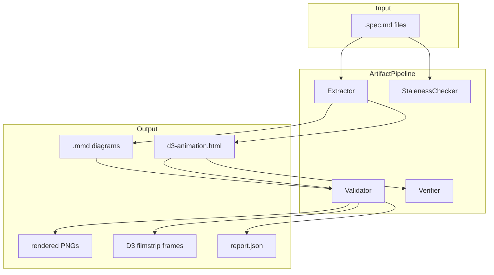
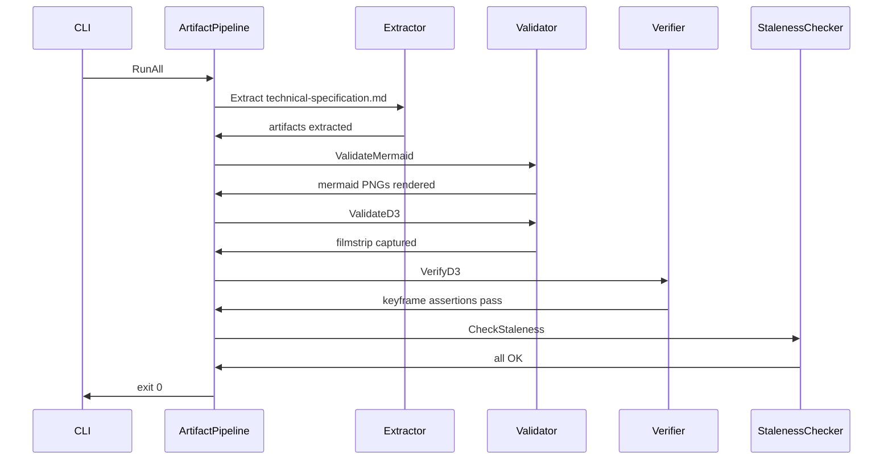

# ArtifactPipeline spec

## 1. Overview

**Role**: Facade for the artifact pipeline sub-module. Orchestrates extraction of mermaid + D3 artifacts from `.spec.md` files, validation (mermaid→PNG rendering + D3 filmstrip capture), staleness checking, and D3 keyframe verification.

**Dependencies**: None (standalone Node.js scripts). Consumed by `git` skill (validates before commit), `system-design` skill (validates after spec generation).

**Lifecycle Stages**: Extract → Validate (mermaid + D3) → Verify → Staleness check

## 2. Component Specifications

```cpp
#pragma once

namespace artifactpipeline {

class ArtifactPipeline {
public:
    // === Lifecycle ===
    /// \retval 0 Pipeline initialized and ready
    static int Init();

    /// \retval 0 All pending extractions and validations completed
    static int RunAll();

    // === Extraction ===
    /// \param[in] pSpecPath  Path to .spec.md file (null = root technical-specification.md)
    /// \retval 0 Artifacts extracted to .artifacts/<specName>/
    static int Extract(const char* pSpecPath);

    /// \param[in] pModuleName  Sub-module name from Module Reference table
    /// \retval 0 All module spec files extracted
    static int ExtractSubModule(const char* pModuleName);

    // === Validation ===
    /// \param[in] pSpecPath  Optional scope. null = validate all artifact dirs.
    /// \retval 0 All mermaid diagrams rendered to PNG
    static int ValidateMermaid(const char* pSpecPath);

    /// \param[in] pSpecPath  Optional scope.
    /// \retval 0 All D3 animations captured as filmstrip frames
    static int ValidateD3(const char* pSpecPath);

    /// \param[in] pHtmlPath  Path to extracted d3-animation.html
    /// \retval 0 All keyframe assertions passed
    static int VerifyD3(const char* pHtmlPath);

    // === Staleness ===
    /// \param[in] pSpecPath  Optional scope.
    /// \retval 0 All specs reviewed and up to date
    static int CheckStaleness(const char* pSpecPath);

    /// \param[in] bErrorsOnly  If true, output only STALE and MISSING entries
    /// \retval 0 Check completed (results may include stale items)
    static int CheckStalenessFiltered(bool bErrorsOnly);

    // === Lifecycle ===
    static int Exit();

    virtual ~ArtifactPipeline() = default;

private:
    static bool m_bInitialized;
    static int xParseArgs(int argc, const char* const* argv);
    static int xWriteReports();
};

} // namespace artifactpipeline
```

### Internal Components

| Class | Path | Access |
|-------|------|--------|
| `Extractor` | `scripts/extract-artifacts.spec.md` | pipeline.extract |
| `Validator` | `scripts/test-artifacts.spec.md` | pipeline.validate |
| `Verifier` | `scripts/verify-artifact.spec.md` | pipeline.verify |
| `StalenessChecker` | `scripts/check-artifacts.spec.md` | pipeline.check |

## 3. System Architecture



## 4. Detailed Data Flow



## 5. Visualization

(D3 animation covering the 4-stage pipeline flow — Extract → Validate → Verify → Check. See extract-artifacts.spec.md §5 for the core extractor animation.)

## 6. Testing Requirements

| Test ID | Scenario | Steps | Expected |
|---------|----------|-------|----------|
| AP01 | Full pipeline | RunAll with valid spec | All 4 stages pass |
| AP02 | Extract only | Extract with non-existent file | Error, exit 1 |
| AP03 | Staleness check | CheckStaleness after extract | All OK |

## 7. CLI Entry Point

Wired via `npm run` scripts:

```
npm run extract          → ArtifactPipeline::Extract()
npm run test-artifacts   → ArtifactPipeline::ValidateMermaid() + ValidateD3()
npm run validate-all     → ArtifactPipeline::RunAll()
npm run verify-animation → ArtifactPipeline::VerifyD3()
npm run check-artifacts  → ArtifactPipeline::CheckStaleness()
```
