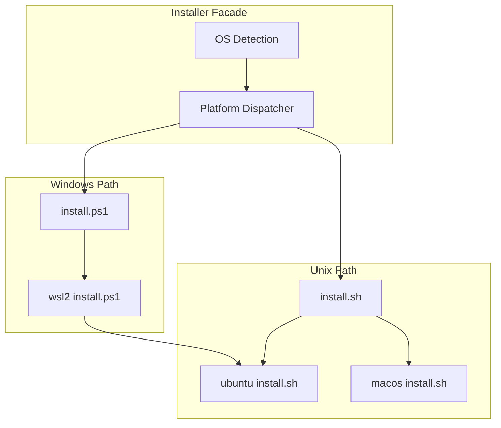
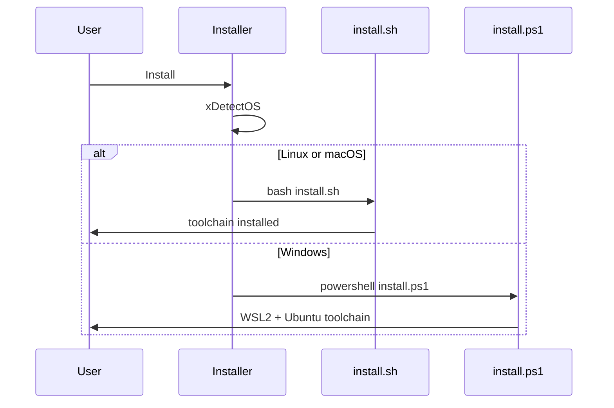

# Installer spec

## 1. Overview

**Role**: Facade for cross-platform development environment installation. Detects OS and dispatches to platform-specific installers (Ubuntu apt, macOS Homebrew, Windows WSL2).

**Dependencies**: None (Shell + PowerShell scripts, zero external deps). Consumed by `opensassi` skill (`init` command).

**Lifecycle Stages**: OS detection → platform install → npm install → verification

## 2. Component Specifications

```cpp
#pragma once

namespace installer {

class Installer {
public:
    /// \retval 0 Installation completed
    static int Install();

    /// \param[in] bForceRebuild  If true, re-run platform install even if toolchain exists
    /// \retval 0 Installation completed
    static int InstallWithOptions(bool bForceRebuild);

    /// \retval 0 Toolchain verification table printed
    static int Verify();

    virtual ~Installer() = default;

private:
    static int xDetectOS();
    static int xRunLinuxInstaller();
    static int xRunMacOSInstaller();
    static int xRunWindowsInstaller();
    static int xRunWSL2Installer();
};

} // namespace installer
```

### Internal Components

| Class | Path | Access |
|-------|------|--------|
| `OSDispatcher` | `scripts/install.sh.spec.md` | installer.dispatch.unix |
| `WindowsDispatcher` | `scripts/install.ps1.spec.md` | installer.dispatch.windows |
| `UbuntuInstaller` | `scripts/install/linux/ubuntu-noble-24.04/install.sh.spec.md` | installer.platform.ubuntu |
| `MacOSInstaller` | `scripts/install/osx/macos-sequoia-15.0/install.sh.spec.md` | installer.platform.macos |
| `WSL2Installer` | `scripts/install/windows/wsl2/install.ps1.spec.md` | installer.platform.wsl2 |

## 3. System Architecture



## 4. Detailed Data Flow



## 5. Testing Requirements

| Test ID | Scenario | Expected |
|---------|----------|----------|
| IN01 | Run on Ubuntu | All apt packages installed, verification table shown |
| IN02 | Run on macOS | Xcode + Homebrew + packages installed |
| IN03 | Run on Windows | WSL2 setup, Ubuntu toolchain installed inside WSL |
| IN04 | Re-run idempotent | All tools present, verification only |

## 6. CLI Entry Point

```
bash scripts/install.sh               → Installer::Install on Unix
powershell scripts\install.ps1        → Installer::Install on Windows
```
