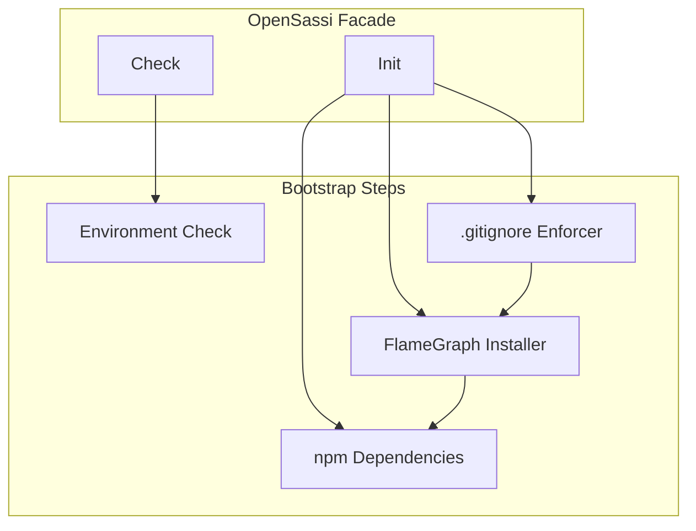
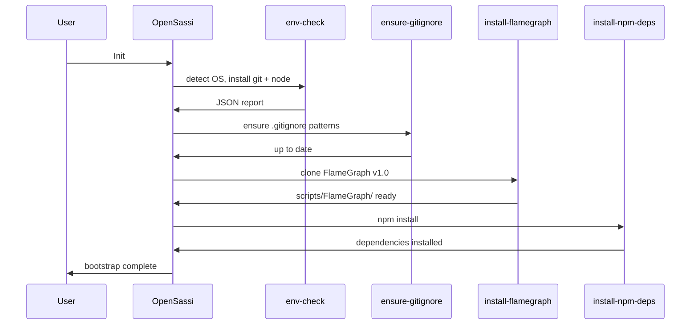

# OpenSassi spec

## 1. Overview

**Role**: Facade for the project bootstrap sub-module. Detects OS, installs git + Node.js LTS, sets up .gitignore patterns, clones FlameGraph, installs npm dependencies.

**Dependencies**: bash or powershell for bootstrap scripts. Consumed by `opensassi` skill.

**Lifecycle Stages**: Environment check → git/node install → .gitignore → FlameGraph → npm install

## 2. Component Specifications

```cpp
#pragma once

namespace opensassi {

class OpenSassi {
public:
    // === Lifecycle ===
    /// \retval 0 Environment check complete, JSON output to stdout
    static int Check();

    /// \retval 0 Full bootstrap completed
    static int Init();

    // === Component Steps ===
    /// \retval 0 .gitignore patterns ensured
    static int EnsureGitignore();

    /// \retval 0 FlameGraph cloned to scripts/FlameGraph/
    static int InstallFlameGraph();

    /// \retval 0 npm dependencies installed
    static int InstallNpmDeps();

    virtual ~OpenSassi() = default;

private:
    static int xDetectOS();
    static int xSetupNode();
};

} // namespace opensassi
```

### Internal Components

| Class | Path | Access |
|-------|------|--------|
| `EnvCheckUnix` | `.opencode/skills/opensassi/scripts/env-check.sh.spec.md` | opensassi.env.unix |
| `EnvCheckWindows` | `.opencode/skills/opensassi/scripts/env-check.ps1.spec.md` | opensassi.env.windows |
| `GitignoreEnforcer` | `.opencode/skills/opensassi/scripts/ensure-gitignore.spec.md` | opensassi.gitignore |
| `FlameGraphInstaller` | `.opencode/skills/opensassi/scripts/install-flamegraph.spec.md` | opensassi.flamegraph |
| `NpmDepsInstaller` | `.opencode/skills/opensassi/scripts/install-npm-deps.spec.md` | opensassi.npm |

## 3. System Architecture



## 4. Detailed Data Flow



## 5. CLI Entry Point

```
.opencode/skills/opensassi/scripts/env-check.sh   → OpenSassi::Check() on Unix
.opencode/skills/opensassi/scripts/env-check.ps1   → OpenSassi::Check() on Windows
.opencode/skills/opensassi/scripts/ensure-gitignore.sh  → OpenSassi::EnsureGitignore()
.opencode/skills/opensassi/scripts/install-flamegraph.sh → OpenSassi::InstallFlameGraph()
.opencode/skills/opensassi/scripts/install-npm-deps.sh   → OpenSassi::InstallNpmDeps()
```
