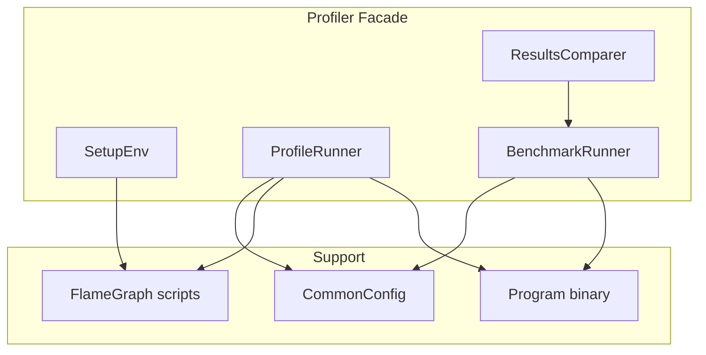
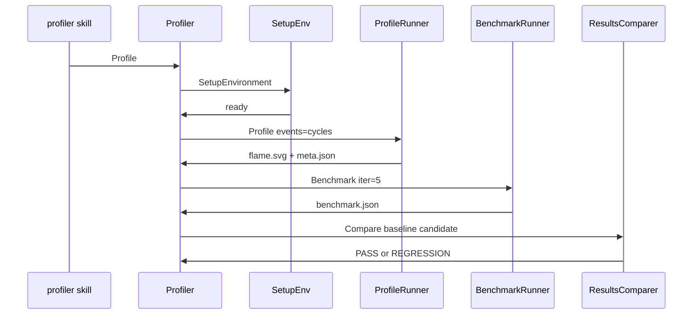

# Profiler spec

## 1. Overview

**Role**: Facade for the profiling sub-module. Runs perf profiling with flamegraph generation, benchmarking with iteration loops, results comparison with regression detection, and environment setup.

**Dependencies**: Linux perf, FlameGraph scripts (cloned by setup.sh). Consumed by `profiler` skill and `asm-optimizer` skill.

**Lifecycle Stages**: Setup → Profile (perf record + flamegraph) → Benchmark → Compare

## 2. Component Specifications

```cpp
#pragma once

namespace profiler {

class Profiler {
public:
    // === Lifecycle ===
    static int Init();
    static int Exit();

    // === Setup ===
    /// \retval 0 .profiler/ dirs created, FlameGraph cloned
    static int SetupEnvironment();

    // === Profiling ===
    /// \param[in] pEvents  Comma-separated perf events (null = default)
    /// \retval 0 perf.data + flame.svg + meta.json written
    static int Profile(const char* pEvents);

    // === Benchmarking ===
    /// \param[in] nIterations  Number of iterations (0 = default 5)
    /// \retval 0 benchmark-<ts>.json written
    static int Benchmark(int nIterations);

    // === Comparison ===
    /// \param[in] pBaselinePath  Path to baseline benchmark JSON
    /// \param[in] pCandidatePath Path to candidate benchmark JSON
    /// \retval 0 No regression detected
    /// \retval 1 Regression detected (delta exceeds threshold)
    static int Compare(const char* pBaselinePath, const char* pCandidatePath);

    // === Utility ===
    /// \param[out] pPathBuffer  Output buffer for binary path
    /// \retval 0 Binary found
    static int FindProgram(char* pPathBuffer, int bufferSize);

    virtual ~Profiler() = default;

private:
    static int xRunPerfPass(const char* pLabel, int nFrames, const char* pEvents);
    static int xRunTimingPass(const char* pLabel, int nFrames);
};

} // namespace profiler
```

### Internal Components

| Class | Path | Access |
|-------|------|--------|
| `CommonConfig` | `.opencode/skills/profiler/scripts/common.spec.md` | profiler.config |
| `ProfileRunner` | `.opencode/skills/profiler/scripts/profile.spec.md` | profiler.runner |
| `SetupEnv` | `.opencode/skills/profiler/scripts/setup.spec.md` | profiler.setup |
| `BenchmarkRunner` | `.opencode/skills/profiler/scripts/benchmark.spec.md` | profiler.benchmark |
| `ResultsComparer` | `.opencode/skills/profiler/scripts/compare.spec.md` | profiler.compare |

## 3. System Architecture



## 4. Detailed Data Flow



## 5. CLI Entry Point

```
.opencode/skills/profiler/scripts/setup.sh     → Profiler::SetupEnvironment()
.opencode/skills/profiler/scripts/profile.sh    → Profiler::Profile()
.opencode/skills/profiler/scripts/benchmark.sh  → Profiler::Benchmark()
.opencode/skills/profiler/scripts/compare.sh    → Profiler::Compare()
```
