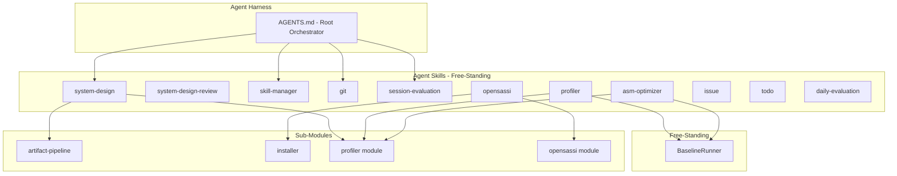
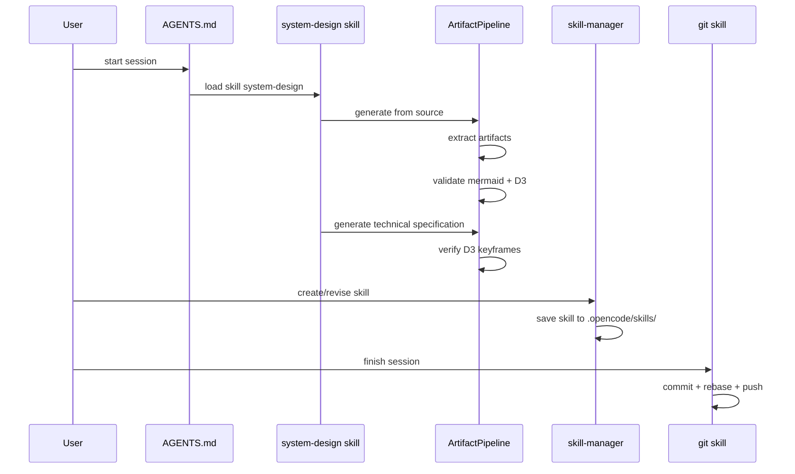

# opencode Agent Harness — Technical Specification

## 1. Overview

**Purpose**: The opencode project is a meta-repository (agent harness) that provides domain-specific expertise to an LLM agent through a skill system. Skills are self-contained Markdown prompt files in `.opencode/skills/<name>/SKILL.md` that define agent personas, commands, and workflows. The project also includes an artifact pipeline for extracting and validating diagrams and D3 animations from technical specifications, cross-platform environment installers, profiling/benchmarking tools, and project bootstrap scripts.

**Source Languages**: Shell (Bash), PowerShell, JavaScript, Markdown (agent instructions)

### Module Reference

| Module | Directory | Facade Class | Spec File |
|--------|-----------|-------------|-----------|
| artifact-pipeline | `scripts/` | `ArtifactPipeline` | `spec/ArtifactPipeline.spec.md` |
| installer | `scripts/` | `Installer` | `spec/Installer.spec.md` |
| profiler | `.opencode/skills/profiler/scripts/` | `Profiler` | `spec/Profiler.spec.md` |
| opensassi | `.opencode/skills/opensassi/scripts/` | `OpenSassi` | `spec/OpenSassi.spec.md` |

## 2. Component Specifications

### Sub-Module Listing

| Facade Class | Role | Spec |
|-------------|------|------|
| `ArtifactPipeline` | Extract + validate + verify + staleness-check for spec artifacts | `spec/ArtifactPipeline.spec.md` |
| `Installer` | Cross-platform dev environment installation (Unix + Windows) | `spec/Installer.spec.md` |
| `Profiler` | Linux perf profiling, flamegraphs, benchmarking, regression detection | `spec/Profiler.spec.md` |
| `OpenSassi` | Project bootstrap: env check, git/node install, .gitignore, FlameGraph, npm | `spec/OpenSassi.spec.md` |

### Internal Components by Module

| Module | Component | Access Path | Spec File |
|--------|-----------|-------------|-----------|
| artifact-pipeline | Extractor | pipeline.extract | `scripts/extract-artifacts.spec.md` |
| artifact-pipeline | Validator | pipeline.validate | `scripts/test-artifacts.spec.md` |
| artifact-pipeline | Verifier | pipeline.verify | `scripts/verify-artifact.spec.md` |
| artifact-pipeline | StalenessChecker | pipeline.check | `scripts/check-artifacts.spec.md` |
| installer | OSDispatcher | installer.dispatch.unix | `scripts/install.sh.spec.md` |
| installer | WindowsDispatcher | installer.dispatch.windows | `scripts/install.ps1.spec.md` |
| installer | UbuntuInstaller | installer.platform.ubuntu | `scripts/install/linux/ubuntu-noble-24.04/install.sh.spec.md` |
| installer | MacOSInstaller | installer.platform.macos | `scripts/install/osx/macos-sequoia-15.0/install.sh.spec.md` |
| installer | WSL2Installer | installer.platform.wsl2 | `scripts/install/windows/wsl2/install.ps1.spec.md` |
| profiler | CommonConfig | profiler.config | `.opencode/skills/profiler/scripts/common.spec.md` |
| profiler | ProfileRunner | profiler.runner | `.opencode/skills/profiler/scripts/profile.spec.md` |
| profiler | SetupEnv | profiler.setup | `.opencode/skills/profiler/scripts/setup.spec.md` |
| profiler | BenchmarkRunner | profiler.benchmark | `.opencode/skills/profiler/scripts/benchmark.spec.md` |
| profiler | ResultsComparer | profiler.compare | `.opencode/skills/profiler/scripts/compare.spec.md` |
| opensassi | EnvCheckUnix | opensassi.env.unix | `.opencode/skills/opensassi/scripts/env-check.sh.spec.md` |
| opensassi | EnvCheckWindows | opensassi.env.windows | `.opencode/skills/opensassi/scripts/env-check.ps1.spec.md` |
| opensassi | GitignoreEnforcer | opensassi.gitignore | `.opencode/skills/opensassi/scripts/ensure-gitignore.spec.md` |
| opensassi | FlameGraphInstaller | opensassi.flamegraph | `.opencode/skills/opensassi/scripts/install-flamegraph.spec.md` |
| opensassi | NpmDepsInstaller | opensassi.npm | `.opencode/skills/opensassi/scripts/install-npm-deps.spec.md` |

### Free-Standing Components

These components are not assigned to any sub-module. They are cross-cutting concerns referenced directly from this top-level specification.

| Component | Role | Spec File |
|-----------|------|-----------|
| BaselineRunner | Build tagged baseline + run profiling matrix | `scripts/asm-optimizer/run-baseline.spec.md` |
| AGENTS | Root agent harness instructions — orchestrates all skills | `AGENTS.spec.md` |
| asm-optimizer | SIMD/assembly optimization framework | `.opencode/skills/asm-optimizer/SKILL.spec.md` |
| daily-evaluation | Aggregate session evaluations into dashboards | `.opencode/skills/daily-evaluation/SKILL.spec.md` |
| git | Rebase-based git workflow | `.opencode/skills/git/SKILL.spec.md` |
| issue | GitHub issue management | `.opencode/skills/issue/SKILL.spec.md` |
| opensassi skill | Bootstrap project environment | `.opencode/skills/opensassi/SKILL.spec.md` |
| profiler skill | Linux perf profiling + flamegraphs | `.opencode/skills/profiler/SKILL.spec.md` |
| session-evaluation | Generate structured session reports | `.opencode/skills/session-evaluation/SKILL.spec.md` |
| skill-manager | Create/revise skills interactively | `.opencode/skills/skill-manager/SKILL.spec.md` |
| system-design | Interactive C++ spec authoring with diagrams | `.opencode/skills/system-design/SKILL.spec.md` |
| system-design-review | Seven-expert panel audit of technical specs | `.opencode/skills/system-design-review/SKILL.spec.md` |
| todo | Create issues + debugging skills from session context | `.opencode/skills/todo/SKILL.spec.md` |

## 3. System Architecture



## 4. Detailed Data Flow



## 5. Visualization

### Animation Source

```html
<!DOCTYPE html><html><head><meta charset="utf-8"><title>opencode Agent Harness</title>
<script src="https://d3js.org/d3.v7.min.js"></script>
<style>
body{font-family:monospace;background:#1e1e2e;color:#cdd6f4;margin:0;padding:20px}
.controls{margin-bottom:15px}.controls button{background:#45475a;color:#cdd6f4;border:1px solid #585b70;padding:6px 16px;cursor:pointer}
.controls button:hover{background:#585b70}.controls span{margin:0 12px;font-size:13px;color:#a6adc8}
#vis{width:680px;height:400px;border:1px solid #45475a;background:#181825;overflow:hidden;position:relative}
.log{margin-top:10px;max-height:80px;overflow-y:auto;font-size:11px;color:#a6adc8}.log div{padding:1px 0;border-bottom:1px solid #313244}
.zone{fill:#181825;stroke:#585b70;stroke-width:1.5;rx:6}
.zone-label{fill:#a6adc8;font-size:10px;font-weight:bold}
.box{fill:#313244;stroke:#89b4fa;stroke-width:1;rx:4}
.box-label{fill:#cdd6f4;font-size:9px;text-anchor:middle;dominant-baseline:central}
.active{fill:#f9e2af;opacity:0.3}
</style>
</head><body>
<div class="controls"><button id="play-pause" data-testid="play-pause">Play</button><button id="replay">Replay</button>
<span id="kf-label">0/<span id="kf-total">0</span></span></div>
<div id="vis"><svg width="680" height="400"><g id="layers"></g></svg></div><div class="log" id="log"></div>
<script>
(function(){const kf=[{time:0,label:'idle'},{time:800,label:'load-agents'},{time:2000,label:'load-system-design'},{time:3500,label:'run-pipeline'},{time:5000,label:'validate-artifacts'},{time:6500,label:'save-skill'},{time:7800,label:'git-commit'},{time:8800,label:'done'}];
const vf=[{label:'idle',hor:0,ver:0,precision:0,logCount:0},{label:'load-agents',hor:1,ver:0,precision:0,logCount:1},{label:'load-system-design',hor:2,ver:1,precision:0,logCount:2},{label:'run-pipeline',hor:3,ver:1,precision:1,logCount:3},{label:'validate-artifacts',hor:3,ver:2,precision:2,logCount:4},{label:'save-skill',hor:4,ver:2,precision:2,logCount:5},{label:'git-commit',hor:5,ver:3,precision:3,logCount:6},{label:'done',hor:6,ver:3,precision:3,logCount:7}];
const T=8800;window.ANIMATION_DURATION_MS=T;window.ANIMATION_KEYFRAMES=kf;window.ANIMATION_VERIFICATION=vf;
let ck=0,pl=false,tm=null;
const sv=d3.select('#vis svg'),lg=document.getElementById('log'),pb=document.getElementById('play-pause'),rb=document.getElementById('replay'),kl=document.getElementById('kf-label'),kt=document.getElementById('kf-total');
kt.textContent=kf.length-1;
const zones=[{l:'Agent Harness',comps:['AGENTS.md','system-design','skill-manager']},{l:'Artifact Pipeline',comps:['Extractor','Validator','Verifier']},{l:'Git Workflow',comps:['git','session-eval']}];
function ul(c){lg.innerHTML='';const e=['opencode: waiting for session start','opencode: loading AGENTS.md instructions','opencode: skill system-design activated','opencode: artifact pipeline running','opencode: validating mermaid + D3','opencode: skill-manager saving skill','opencode: git commit + rebase','opencode: session complete'];for(let i=0;i<=Math.min(c,7);i++){const d=document.createElement('div');d.textContent=e[i];lg.appendChild(d)}}
function rs(i){ck=i;kl.textContent=i+'/'+(kf.length-1);const g=sv.select('#layers');g.selectAll('*').remove();const lx=[30,280,30],ly=[40,40,200],lw=[220,370,220],lh=[140,140,140];zones.forEach((z,zi)=>{g.append('rect').attr('class','zone').attr('x',lx[zi]).attr('y',ly[zi]).attr('width',lw[zi]).attr('height',lh[zi]);g.append('text').attr('class','zone-label').attr('x',lx[zi]+8).attr('y',ly[zi]+16).text(z.l);z.comps.forEach((c,ci)=>{const cx=lx[zi]+10+ci*75,cy=ly[zi]+30;g.append('rect').attr('class','box').attr('x',cx).attr('y',cy).attr('width',65).attr('height',22);g.append('text').attr('class','box-label').attr('x',cx+32).attr('y',cy+12).text(c)})});ul(i)}
function jk(idx){if(idx<0||idx>=kf.length)return;pl=false;pb.textContent='Play';if(tm){clearInterval(tm);tm=null}rs(idx)}
window.jumpToKeyframe=jk;window.resetAnimation=function(){jk(0)};
window.getAnimationState=function(){const v=vf[ck]||vf[0];return{hor:v.hor,ver:v.ver,precision:v.precision,boundsOpacity:0,logCount:v.logCount,keyframeIdx:ck,keyframeLabel:kf[ck].label}};
rs(0);
pb.addEventListener('click',function(){if(pl){pl=false;pb.textContent='Play';if(tm){clearInterval(tm);tm=null}}else{pl=true;pb.textContent='Pause';if(ck>=kf.length-1)ck=0;const stp=T/(kf.length-1);tm=setInterval(()=>{if(ck<kf.length-1)jk(ck+1);else{pl=false;pb.textContent='Play';clearInterval(tm);tm=null}},stp)}});
rb.addEventListener('click',function(){jk(0);pl=true;pb.textContent='Pause';const stp=T/(kf.length-1);tm=setInterval(()=>{if(ck<kf.length-1)jk(ck+1);else{pl=false;pb.textContent='Play';clearInterval(tm);tm=null}},stp)});
})();
</script>
</body></html>
```

## 6. Testing Requirements

### Integration Tests

| Test ID | Scenario | Steps | Expected |
|---------|----------|-------|----------|
| E2E01 | Full spec generation cycle | generate from source → extract → validate | All mermaid + D3 pass |
| E2E02 | Skill save round-trip | skill-manager create skill → save → show skills | Skill appears in table |
| E2E03 | Git session workflow | start session → develop → finish session | Single atomic commit, eval written |
| E2E04 | Cross-platform install | Run install.sh on all 3 platforms | Toolchain installed |

### Regression Baseline

The frozen regression test files (immutable, never modify):

| File | Purpose |
|------|---------|
| `scripts/extract-artifacts.js` | Core artifact extraction logic |
| `scripts/test-artifacts.js` | Artifact validation (mermaid + D3) |
| `scripts/check-artifacts.js` | Staleness detection |
| `scripts/verify-artifact.js` | D3 keyframe assertion |

## 7. CLI Entry Point

```
npm run extract          → ArtifactPipeline::Extract()
npm run test-artifacts   → ArtifactPipeline::Validate()
npm run validate-all     → ArtifactPipeline::RunAll()
npm run verify-animation → ArtifactPipeline::VerifyD3()
npm run check-artifacts  → ArtifactPipeline::CheckStaleness()
bash scripts/install.sh  → Installer::Install() [Unix]
powershell install.ps1   → Installer::Install() [Windows]
```

## 8. C++ Coding Conventions

(Not applicable — this project contains no C++ source code. The conventions defined here are for downstream projects that use the `system-design` skill to author C++14 video encoder specifications.)

### Naming Conventions

| Element | Convention | Example |
|---------|-----------|---------|
| Classes | PascalCase | `ArtifactPipeline` |
| Namespaces | lowercase | `artifactpipeline` |
| Member variables | `m_` prefix | `m_bInitialized` |
| Private helpers | `x` prefix | `xParseArgs` |
| Constants | `static constexpr` | `static constexpr int kDefaultFrames = 10;` |

### Regression Test Baseline

The following files are frozen and must never be modified. All new tests must be created in new files.

| File | Role |
|------|------|
| `scripts/extract-artifacts.js` | Core extraction |
| `scripts/test-artifacts.js` | Artifact validation |
| `scripts/check-artifacts.js` | Staleness |
| `scripts/verify-artifact.js` | D3 verification |
